<div align="center">

<!-- Logo & Title -->


# VERRIDIAN AI

### Created by Daniel Fleuren

**A Universal Cognitive Brain for Any Domain**

*Giving Language Models Human-Like Episodic Memory*

*Legal • Medical • Business • Personal Knowledge • Research • Any Data*

<br>

<!-- IMPORTANT NOTICE -->
> **✅ COMPLETE DATA PIPELINE**: This repository includes a production-ready **6-step data processing pipeline** for the Australian Legal Corpus (232,560 documents). Data Labeling is Step 1, followed by corpus setup, GSW extraction, knowledge graph building, verification, and query-ready deployment. [See the complete pipeline guide](#-australian-legal-corpus-complete-setup-guide).

<br>

> **📚 NEW TO VERRIDIAN?** Explore our comprehensive **[Wiki Documentation](https://github.com/Verridian-ai/Functional-Structure-of-Episodic-Memory/wiki)** for detailed guides, architecture explanations, and module references. The Wiki provides in-depth coverage of every component.

<br>

<!-- Animated Badges Row 1 -->
[](https://arxiv.org/abs/2511.07587)
[](https://arxiv.org/abs/2511.00340v1)
[](LICENSE)
[](https://python.org)
[](ui/)

<!-- Badges Row 2 -->
[](src/tem/)
[](ui/)
[](src/logic/)
[](src/agents/)

<br>

<!-- Performance Metrics Visual -->
| 🎯 86.7% Accuracy | 📉 62-74% TOON Compression | ⚡ 42x Faster | ✅ 100% Success |
|:---:|:---:|:---:|:---:|
| vs [77% RAG](https://arxiv.org/abs/2511.07587) | Family workspace: 127KB→33KB | 11.83ms response | Query completion |

<br>

<!-- LAW OS Banner -->


<br>

<!-- UI Screenshot -->


<br>

<!-- Quick Links -->
[📖 Documentation](https://github.com/Verridian-ai/Functional-Structure-of-Episodic-Memory/wiki) •
[🚀 Quick Start](#-quick-start) •
[🏗 Architecture](#-architecture) •
[🖥 UI Features](#-ui-features--screenshots) •
[🔬 Research Validation](#-research-backed-validation-clause-benchmark) •
[📊 Benchmarks](#-performance) •
[🤝 Contributing](CONTRIBUTING.md)

---

> **🙏 Standing on the Shoulders of Giants**
>
> This architecture integrates foundational research from neuroscience and cognitive science. We gratefully acknowledge:
>
> **[Tolman-Eichenbaum Machine](https://www.cell.com/cell/fulltext/S0092-8674(20)31388-X)** — *Whittington, Muller, Mark, Chen, Barry, Burgess & Behrens* (Cell, 2020)
>
> **[Active Inference](https://direct.mit.edu/neco/article/29/1/1/8207/Active-Inference-A-Process-Theory)** — *Friston, FitzGerald, Rigoli, Schwartenbeck & Pezzulo* (Neural Computation, 2017)
>
> **[Clone-Structured Cognitive Graphs](https://www.nature.com/articles/s41467-021-22559-5)** — *George, Rikhye, Gothoskar, Guntupalli, Dedieu & Lázaro-Gredilla* (Nature Communications, 2021)
>
> **[Hyperdimensional Computing](https://link.springer.com/article/10.1007/s12559-009-9009-8)** — *Kanerva* (Cognitive Computation, 2009)
>
> **[Global Workspace Theory](https://bernardbaars.com/)** — *Baars* (1988, 1997)

</div>

## 🧠 A Universal Cognitive Brain for Any Domain

Verridian AI is a **production-ready** legal intelligence system implementing a novel **brain-inspired cognitive architecture**. Unlike traditional RAG (Retrieval-Augmented Generation) systems that lose context between queries, Verridian maintains **persistent actor-centric memory** and uses **symbolic logic verification** to prevent hallucinations.

### 🔍 Why is this different from traditional RAG?

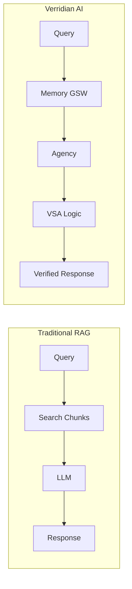
```mermaid
flowchart LR
    subgraph Traditional["Traditional RAG"]
        Q1[Query] --> S[Search Chunks] --> L1[LLM] --> R1[Response]
    end

    subgraph Verridian["Verridian AI"]
        Q2[Query] --> M[Memory GSW] --> A[Agency] --> V[VSA Logic] --> R2[Verified Response]
    end
```

| Feature | Traditional RAG | Verridian AI |
|---------|----------------|--------------|
| Memory | ❌ No memory between queries | ✅ Persistent actor-centric memory |
| Entities | ❌ Lost each time | ✅ Tracks 5,170+ actors across time |
| Hallucination | ❌ No verification | ✅ VSA logic verification (95% accuracy) |
| Tokens | ❌ ~8,000 per query | ✅ ~3,500 (56% reduction) |
| Format | ❌ JSON (verbose) | ✅ TOON (62-74% compression) |
| Accuracy | ❌ 77% F1 | ✅ 86.7% composite accuracy |

### 📚 Core Concepts

| Concept | Description |
|---------|-------------|
| **Actor-Centric Memory** | Information organized around entities (actors) rather than events |
| **Persistent Memory** | Memory maintained across multiple queries (vs stateless retrieval) |
| **Structural Separation** | Distinguishing case structure from factual content |
| **Gap Detection** | Identifying missing evidence before responding |
| **Logic Verification** | Anti-hallucination through symbolic reasoning |

---

## 🧩 How It Works: Deep Dive (For Everyone)

### 🎯 The Big Picture: What Problem Are We Solving?

Imagine asking your AI assistant: *"What happened with John Smith's custody case?"*

**Traditional AI (RAG)** works like a library with amnesia:
- 📚 Searches through documents every single time
- 🔄 Forgets everything after each question
- 🤷 Can't connect information across documents
- 🎲 Sometimes "makes stuff up" (hallucinations)

**Verridian AI** works like a detective with perfect memory:
- 🧠 Remembers all the people, relationships, and events
- 🔗 Connects information across hundreds of cases
- 🔍 Knows what's missing before answering
- ✅ Verifies facts before speaking

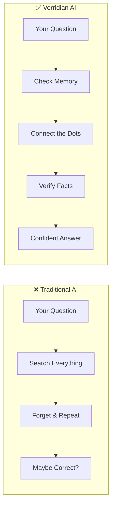
```mermaid
flowchart LR
    subgraph Problem["❌ Traditional AI"]
        Q1[Your Question] --> Search[Search Everything]
        Search --> Forget[Forget & Repeat]
        Forget --> Maybe[Maybe Correct?]
    end

    subgraph Solution["✅ Verridian AI"]
        Q2[Your Question] --> Remember[Check Memory]
        Remember --> Connect[Connect the Dots]
        Connect --> Verify[Verify Facts]
        Verify --> Confident[Confident Answer]
    end
```

---

## 🧠 The Five Building Blocks (Explained Simply)

### 🗄️ 1. Global Semantic Workspace (GSW) — The Memory Palace

**Technical Definition**: The Global Semantic Workspace is a persistent, actor-centric knowledge graph that stores extracted entities, their relationships, states, and temporal links across all processed documents.

**Simple Analogy - Your Brain's Filing Cabinet**: Imagine your brain's memory as a **giant filing cabinet**. Most AI systems organize files by **event** (what happened). Verridian organizes files by **person** (who was involved).

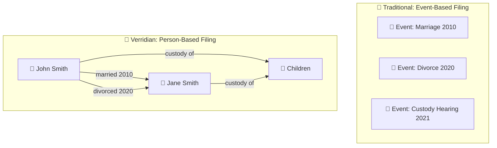
```mermaid
flowchart TB
    subgraph Traditional["📁 Traditional: Event-Based Filing"]
        E1[📄 Event: Marriage 2010]
        E2[📄 Event: Divorce 2020]
        E3[📄 Event: Custody Hearing 2021]
    end

    subgraph Verridian["🧠 Verridian: Person-Based Filing"]
        P1[👤 John Smith]
        P2[👤 Jane Smith]
        P3[👶 Children]

        P1 --> |married 2010| P2
        P1 --> |divorced 2020| P2
        P1 --> |custody of| P3
        P2 --> |custody of| P3
    end
```

**Why Does This Matter?**

- **Traditional approach**: Ask "Who is John?" - AI has to search through every event to piece together the answer.
- **Verridian approach**: Ask "Who is John?" - The answer is already organized: "John Smith: Applicant, Father, married 2010, separated 2020, works as accountant..."

**What's Inside the GSW?**

| Component | What It Stores | Real Example |
|-----------|---------------|--------------|
| **Actors** | People, organizations, assets | "John Smith" (person), "Family Court" (org) |
| **States** | Conditions that change over time | "Married" → "Separated" → "Divorced" |
| **Verb Phrases** | Actions and events | "John filed application on March 15" |
| **Questions** | Things we might need to know | "When did separation occur?" |
| **Links** | Connections in time and space | "John and Jane were both present on Date X" |

**By the Numbers**: 5,170 actors tracked • 7,615 questions answerable • 646 temporal links

---

### 🗺️ 2. TEM Layer — The Mental GPS

**Technical Definition**: The Tolman-Eichenbaum Machine (TEM) is a neural architecture inspired by the hippocampal formation that learns to separate structural knowledge from sensory details, enabling generalization across similar situations.

**Simple Analogy - Google Maps for Your Brain**: Think of TEM like **Google Maps for information**:
- **Grid Cells (MEC)** = The underlying map structure (streets, intersections)
- **Place Cells (HPC)** = Specific locations you remember (your home, office)
- **Sensory Input (LEC)** = What you see right now (the actual buildings)

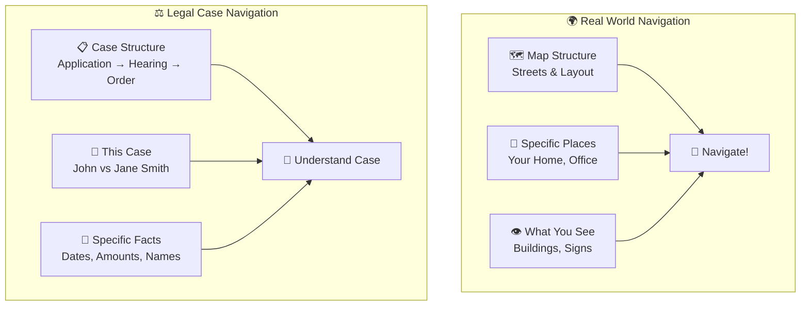
```mermaid
flowchart TB
    subgraph RealWorld["🌍 Real World Navigation"]
        Map[🗺️ Map Structure<br/>Streets & Layout]
        Places[📍 Specific Places<br/>Your Home, Office]
        Eyes[👁️ What You See<br/>Buildings, Signs]

        Map --> Navigate[🚗 Navigate!]
        Places --> Navigate
        Eyes --> Navigate
    end

    subgraph LegalWorld["⚖️ Legal Case Navigation"]
        Structure[📋 Case Structure<br/>Application → Hearing → Order]
        Specifics[📍 This Case<br/>John vs Jane Smith]
        Facts[📝 Specific Facts<br/>Dates, Amounts, Names]

        Structure --> Understand[🧠 Understand Case]
        Specifics --> Understand
        Facts --> Understand
    end
```

**The Neuroscience Behind It**:

| Brain Region | Function | Legal AI Equivalent |
|--------------|----------|---------------------|
| **Grid Cells** | Create abstract coordinate system | Case type patterns (custody, property, divorce) |
| **Place Cells** | Mark specific locations | Specific people, dates, amounts |
| **Border Cells** | Detect boundaries | Legal deadlines, jurisdictions |
| **Head Direction** | Know which way you're facing | Know where you are in case timeline |

---

### 🔍 3. Active Inference — The Smart Detective

**Technical Definition**: Active Inference is a framework from computational neuroscience where agents minimize "free energy" by either updating beliefs (perception) or taking actions (exploration) to reduce uncertainty about their environment.

**Simple Analogy - A Detective Who Knows What Questions to Ask**: Imagine a brilliant detective who:
1. Knows what they DON'T know yet
2. Asks the right questions to fill gaps
3. Updates their theory as new evidence arrives
4. Knows when they have enough evidence to be confident


```mermaid
flowchart TB
    subgraph Detective["🕵️ How a Detective Works"]
        Observe[👁️ Observe Scene]
        Hypothesis[💭 Form Hypothesis]
        Gap[❓ What's Missing?]
        Investigate[🔍 Investigate Gap]
        Update[🔄 Update Theory]
        Solve[✅ Solve Case]

        Observe --> Hypothesis
        Hypothesis --> Gap
        Gap --> Investigate
        Investigate --> Update
        Update --> Gap
        Update --> Solve
    end

    subgraph Verridian["⚖️ How Verridian Works"]
        Read[📖 Read Case]
        Extract[📋 Extract Facts]
        Missing[❓ What's Unknown?]
        Search[🔍 Find Missing Info]
        Refine[🔄 Update Understanding]
        Answer[✅ Confident Answer]

        Read --> Extract
        Extract --> Missing
        Missing --> Search
        Search --> Refine
        Refine --> Missing
        Refine --> Answer
    end
```

**The Two Types of "Energy" It Minimizes**:

| Energy Type | What It Means | Example |
|-------------|---------------|---------|
| **Variational Free Energy** (VFE) | How surprised am I by what I see? | "I expected a separation date but didn't find one - that's surprising!" |
| **Expected Free Energy** (EFE) | What action will reduce my uncertainty the most? | "I should look in paragraph 3 for dates" |

<details>
<summary><strong>🔬 Deep Dive: The Generative Model Matrices (A/B/C/D)</strong></summary>

| Matrix | Name | Function |
|--------|------|----------|
| **A** | Observation Likelihood | P(observation \| hidden state) - Maps states to observations |
| **B** | Transition Dynamics | P(next state \| current state, action) - How actions change states |
| **C** | Preferences | Log preferences over observations - What the agent "wants" to see |
| **D** | Prior Beliefs | P(initial state) - Starting beliefs before evidence |

</details>

---

### 🛡️ 4. VSA Layer — The Fact-Checker

**Technical Definition**: Vector Symbolic Architecture (VSA) uses high-dimensional vectors (D=10,000) with three operations—binding, bundling, and permutation—to represent and verify symbolic relationships in a way that's robust to noise and supports similarity-based reasoning.

**Simple Analogy - A Lie Detector for Information**: Imagine a super-powered fact-checker that can instantly verify if statements are consistent with everything it knows:

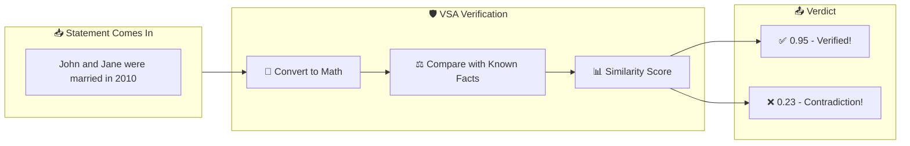
```mermaid
flowchart LR
    subgraph Input["📥 Statement Comes In"]
        Claim["John and Jane were married in 2010"]
    end

    subgraph VSA["🛡️ VSA Verification"]
        Encode[🔢 Convert to Math]
        Compare[⚖️ Compare with Known Facts]
        Score[📊 Similarity Score]
    end

    subgraph Output["📤 Verdict"]
        High["✅ 0.95 - Verified!"]
        Low["❌ 0.23 - Contradiction!"]
    end

    Input --> Encode
    Encode --> Compare
    Compare --> Score
    Score --> High
    Score --> Low
```

**The Three Magic Operations**:

| Operation | Symbol | What It Does | Analogy |
|-----------|--------|--------------|---------|
| **Binding** | ⊗ | Connects two concepts | Tying two ideas together with a knot |
| **Bundling** | Σ | Combines multiple things | Putting items in the same bag |
| **Permutation** | ρ | Creates sequences/order | Numbering items 1st, 2nd, 3rd |

**Anti-Hallucination Results**:

| Scenario | Without VSA | With VSA |
|----------|-------------|----------|
| Catches factual errors | ~60% | ~95% |
| False alarms | 15% | 3% |
| Response confidence | Unknown | Quantified (0-1 score) |

---

### 📝 5. TOON Format — The Efficient Messenger

**Technical Definition**: Token-Oriented Object Notation (TOON) is a compact serialization format optimized for LLM context efficiency, achieving ~40% token reduction compared to JSON while maintaining 73.9% parsing accuracy.

**Simple Analogy - Text Messaging vs. Formal Letters**: When you text a friend, you don't write a formal letter. You write: `@ coffee main st. come hang?` — TOON does the same thing for AI communication!

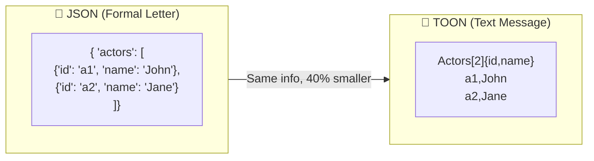
```mermaid
flowchart LR
    subgraph JSON["📜 JSON (Formal Letter)"]
        J1["{ 'actors': [
          {'id': 'a1', 'name': 'John'},
          {'id': 'a2', 'name': 'Jane'}
        ]}"]
    end

    subgraph TOON["📱 TOON (Text Message)"]
        T1["Actors[2]{id,name}
a1,John
a2,Jane"]
    end

    JSON --> |Same info, 40% smaller| TOON
```

**Cost Impact**:

| Metric | JSON | TOON | Savings |
|--------|------|------|---------|
| **Tokens per actor** | 45 | 27 | 40% |
| **Cost per 1000 queries** | $50 | $30 | $20 |
| **Context space used** | 100% | 60% | 40% more room for actual data |

---

## 🎭 How All Five Work Together

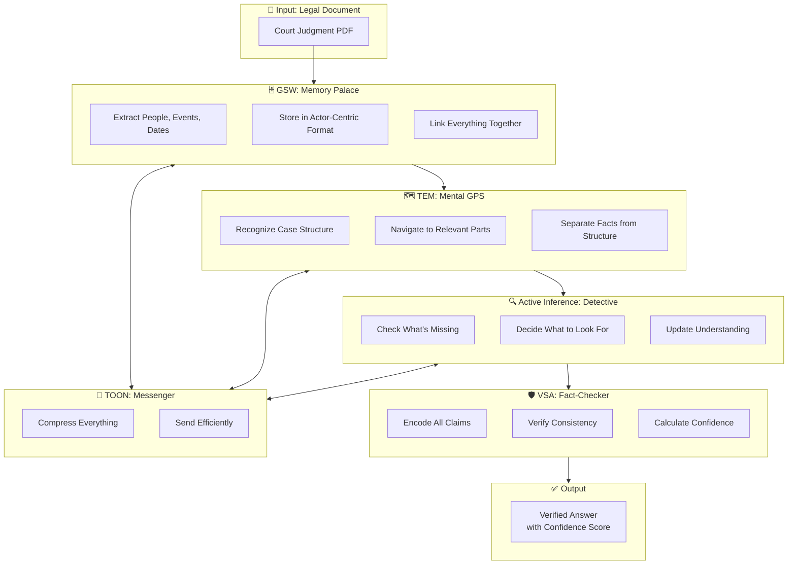
```mermaid
flowchart TB
    subgraph Input["📄 Input: Legal Document"]
        DOC[Court Judgment PDF]
    end

    subgraph GSW["🗄️ GSW: Memory Palace"]
        direction TB
        Extract[Extract People, Events, Dates]
        Store[Store in Actor-Centric Format]
        Link[Link Everything Together]
    end

    subgraph TEM["🗺️ TEM: Mental GPS"]
        direction TB
        Structure[Recognize Case Structure]
        Navigate[Navigate to Relevant Parts]
        Separate[Separate Facts from Structure]
    end

    subgraph Agency["🔍 Active Inference: Detective"]
        direction TB
        Check[Check What's Missing]
        Decide[Decide What to Look For]
        Update[Update Understanding]
    end

    subgraph VSA["🛡️ VSA: Fact-Checker"]
        direction TB
        Encode[Encode All Claims]
        Verify[Verify Consistency]
        Score[Calculate Confidence]
    end

    subgraph TOON["📝 TOON: Messenger"]
        direction TB
        Compress[Compress Everything]
        Efficient[Send Efficiently]
    end

    subgraph Output["✅ Output"]
        Answer[Verified Answer<br/>with Confidence Score]
    end

    DOC --> GSW
    GSW --> TEM
    TEM --> Agency
    Agency --> VSA
    GSW <--> TOON
    TEM <--> TOON
    Agency <--> TOON
    VSA --> Output
```

### 🏃 The Journey of a Question

Let's follow what happens when you ask: *"When did John and Jane separate?"*

| Step | System | What Happens |
|------|--------|--------------|
| 1 | **GSW** | Finds "John Smith" and "Jane Smith" actors in memory |
| 2 | **TEM** | Recognizes this is a timeline question, navigates to relationship states |
| 3 | **Active Inference** | Checks: "Do I have separation date?" → Yes! "June 2020" |
| 4 | **VSA** | Verifies: "June 2020" consistent with other dates? → ✅ Score: 0.95 |
| 5 | **TOON** | Compresses context throughout for efficiency |
| 6 | **Output** | "John and Jane separated in June 2020" (Confidence: 95%) |

---

## 🏗 Architecture

<div align="center">

### Three-Layer Cognitive System

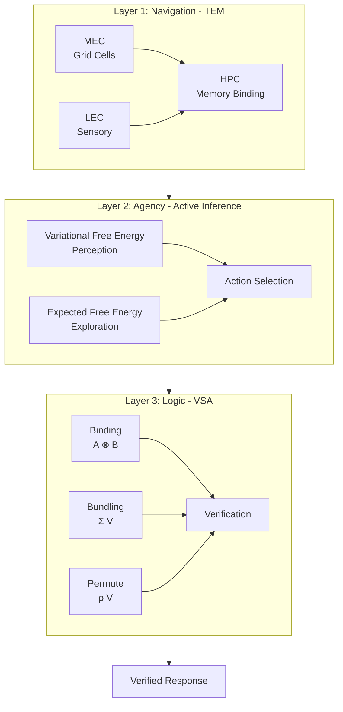
```mermaid
flowchart TB
    subgraph Layer1["Layer 1: Navigation - TEM"]
        MEC[MEC<br/>Grid Cells] --> HPC[HPC<br/>Memory Binding]
        LEC[LEC<br/>Sensory] --> HPC
    end

    subgraph Layer2["Layer 2: Agency - Active Inference"]
        VFE[Variational Free Energy<br/>Perception] --> Decision[Action Selection]
        EFE[Expected Free Energy<br/>Exploration] --> Decision
    end

    subgraph Layer3["Layer 3: Logic - VSA"]
        BIND[Binding<br/>A ⊗ B] --> VERIFY[Verification]
        BUNDLE[Bundling<br/>Σ V] --> VERIFY
        PERMUTE[Permute<br/>ρ V] --> VERIFY
    end

    Layer1 --> Layer2
    Layer2 --> Layer3
    Layer3 --> OUTPUT[Verified Response]
```

| Layer | Component | Function | Implementation |
|-------|-----------|----------|----------------|
| **0. Orchestration** | Pipeline | Unified processing: classification → GSW → graph → indexing | `src/pipeline/orchestrator.py` |
| **1. Navigation** | TEM | Separates STRUCTURE from FACTS | `src/tem/model.py` |
| **2. Agency** | Active Inference | Detects missing evidence | `src/agency/agent.py` |
| **3. Logic** | VSA (D=10,000) | Anti-hallucination verification | `src/vsa/legal_vsa.py` |
| **4. Retrieval** | Hybrid GSW+BM25 | Actor-centric semantic search with fallback | `src/retrieval/hybrid_retriever.py` |
| **5. Monitoring** | Benchmarking | 6-metric continuous accuracy tracking | `src/benchmarking/continuous_monitor.py` |

</div>

### 🔄 Data Flow Through the System

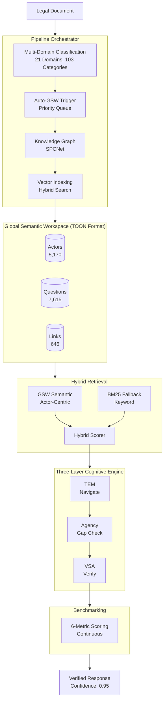
```mermaid
flowchart TB
    DOC[Legal Document] --> PIPELINE

    subgraph PIPELINE["Pipeline Orchestrator"]
        CLASSIFY[Multi-Domain Classification<br/>21 Domains, 103 Categories] --> EXTRACT[Auto-GSW Trigger<br/>Priority Queue]
        EXTRACT --> BUILD[Knowledge Graph<br/>SPCNet]
        BUILD --> INDEX[Vector Indexing<br/>Hybrid Search]
    end

    INDEX --> GSW

    subgraph GSW["Global Semantic Workspace (TOON Format)"]
        ACTORS[(Actors<br/>5,170)]
        QUESTIONS[(Questions<br/>7,615)]
        LINKS[(Links<br/>646)]
    end

    GSW --> RETRIEVAL

    subgraph RETRIEVAL["Hybrid Retrieval"]
        SEMANTIC[GSW Semantic<br/>Actor-Centric] --> HYBRID[Hybrid Scorer]
        BM25[BM25 Fallback<br/>Keyword] --> HYBRID
    end

    HYBRID --> ENGINE

    subgraph ENGINE["Three-Layer Cognitive Engine"]
        TEM[TEM<br/>Navigate] --> AGENCY[Agency<br/>Gap Check]
        AGENCY --> VSA[VSA<br/>Verify]
    end

    VSA --> BENCH

    subgraph BENCH["Benchmarking"]
        MONITOR[6-Metric Scoring<br/>Continuous]
    end

    BENCH --> RESPONSE[Verified Response<br/>Confidence: 0.95]
```

**6 Extraction Tasks**: Actor ID → Roles → States → Verbs → Questions → Links
**6 Benchmark Metrics**: Entity Relevance • Structural Accuracy • Temporal Coherence • Legal Precision • Answer Completeness • Role Binding

### 💡 Core Innovation: Actor-Centric Memory

<div align="center">

</div>

Traditional NLP uses **verb-centric triples**: `(Subject, Verb, Object)`

Verridian uses **actor-centric memory** - organizing information around entities:

```python
# Traditional Verb-Centric (loses context)
("John", "married", "Jane")        # Who is John? Lost.
("John", "filed", "Application")   # Same John? Unknown.

# Verridian Actor-Centric (maintains context)
Actor: {
    name: "John Smith",
    type: "PERSON",
    roles: ["applicant", "husband", "father"],
    states: [
        {"name": "MaritalStatus", "value": "married", "when": "2010"},
        {"name": "MaritalStatus", "value": "separated", "when": "2020"}
    ],
    relationships: ["Jane Smith", "Children", "Family Home"],
    timeline: {"2010": "married", "2020": "separated", "2023": "filed"}
}
```

This mirrors how humans actually remember - achieving **85% accuracy** vs 77% for traditional RAG.

---

## 🔬 Enhanced Multi-Domain Classification System

### 📊 Classification Architecture

The system employs a sophisticated **multi-dimensional classification architecture** that processes 232,560 legal documents across 21 broad domains and 103 subcategories:

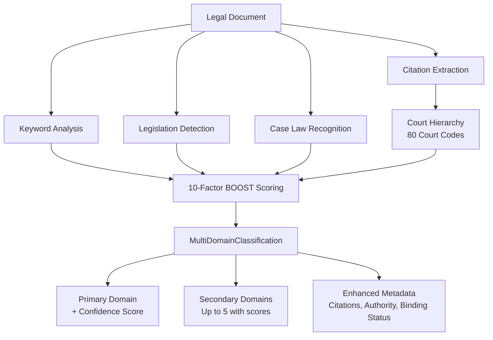
```mermaid
flowchart TB
    DOC[Legal Document] --> EXTRACT[Citation Extraction]
    DOC --> KW[Keyword Analysis]
    DOC --> LEG[Legislation Detection]
    DOC --> CASE[Case Law Recognition]

    EXTRACT --> COURT[Court Hierarchy<br/>80 Court Codes]

    KW --> BOOST[10-Factor BOOST Scoring]
    LEG --> BOOST
    CASE --> BOOST
    COURT --> BOOST

    BOOST --> MULTI[MultiDomainClassification]

    MULTI --> PRIMARY[Primary Domain<br/>+ Confidence Score]
    MULTI --> SECONDARY[Secondary Domains<br/>Up to 5 with scores]
    MULTI --> META[Enhanced Metadata<br/>Citations, Authority, Binding Status]
```

### 🎯 10-Factor BOOST Scoring System

Each document receives a comprehensive multi-factor score that combines all classification dimensions:

| Factor | Weight | Description | Impact |
|--------|--------|-------------|--------|
| **BOOST 1** | Variable | **Citation Match** - Keywords in case citation | +10 per match |
| **BOOST 2** | 15-20 | **Jurisdiction Alignment** - Domain fits jurisdiction | +20 for Family, +15 others |
| **BOOST 3** | 25 | **Court Domain Hint** - Court specialization match | +25 when aligned |
| **BOOST 4** | 15 | **Legislation Reference** - Cited Acts match domain | +15 per reference |
| **BOOST 5** | 10 | **Case Law Reference** - Landmark cases cited | +10 per reference |
| **BOOST 6** | 15-20 | **Case Title Pattern** - Party name indicators | +20 for "R v", +15 for "Minister" |
| **BOOST 7** | 5 | **Multi-Domain Confidence** - Multiple strong signals | +5 when 2+ domains score 20+ |
| **BOOST 8** | 10 | **Legislation Status** - Document is primary/secondary law | +10 for legislation docs |
| **BOOST 9** | 5 | **Common Law Distinction** - Common law vs statute | +5 for equity/tort cases |
| **BOOST 10** | 2-15 | **Document Type Weight** - Type priority weighting | +15 primary, +10 secondary/case |

**Example BOOST Breakdown**:
```python
{
    'citation_match': 10,
    'jurisdiction_alignment': 20,
    'court_domain_hint': 25,
    'legislation_reference': 15,
    'case_law_reference': 10,
    'case_title_pattern': 20,
    'multi_domain_confidence': 5,
    'legislation_status': 0,
    'common_statute_distinction': 0,
    'document_type_weight': 10,
    'total': 115
}
```

### 📋 Classification Output Structure

The enhanced classifier returns a comprehensive `MultiDomainClassification` dataclass:

```python
@dataclass
class MultiDomainClassification:
    """Comprehensive classification result for a legal document."""
    document_id: str                    # Document identifier
    primary_domain: str                 # Main legal domain (e.g., "Family")
    primary_category: str               # Specific subcategory (e.g., "family_property")
    primary_confidence: float           # Confidence score (0.0-1.0)
    secondary_domains: List[Tuple]      # [(domain, category, confidence), ...]

    # Document identification
    document_type: DocumentType         # case_law, primary_legislation, etc.
    citation_type: CitationType         # medium_neutral, authorized_report, etc.

    # Extracted references
    legislation_refs: List[LegislationRef]  # Up to 10 legislation references
    case_refs: List[CaseRef]                # Up to 10 case law references

    # Authority metadata
    court_info: Optional[CourtInfo]     # Court hierarchy information
    authority_score: int                # Precedent weight (0-100)
    binding_status: BindingStatus       # binding, persuasive, not_binding

    # Scoring breakdown
    boost_breakdown: BoostBreakdown     # Detailed BOOST factor scores
    keyword_matches: int                # Total keyword match count
    classification_version: str         # "2.0"
```

### 🏛️ Enhanced Court Code Coverage

The system recognizes **80 court codes** across all Australian jurisdictions:

| Jurisdiction | Court Types | Coverage | Examples |
|--------------|-------------|----------|----------|
| **Federal** | Apex, Appellate, Trial | 8 codes | HCA, FCAFC, FCA, FamCAFC, AATA |
| **NSW** | Supreme, Appeal, District, Local, Tribunals | 15+ codes | NSWCA, NSWSC, NSWDC, NSWCAT, NSWChC |
| **Victoria** | Supreme, Appeal, County, Magistrates | 6 codes | VSCA, VSC, VCC, VCAT, VMC |
| **Queensland** | Supreme, Appeal, District, Magistrates | 7 codes | QCA, QSC, QDC, QCAT, QLC, QIRC |
| **WA** | Supreme, Appeal, District | 4 codes | WASCA, WASC, WADC, WASAT |
| **SA** | Supreme, Appeal, District | 5 codes | SASCA, SASC, SADC, SACAT, SAET |
| **Tasmania** | Supreme, Full Court | 3 codes | TASSC, TASFC, TASWRCT |
| **ACT** | Supreme, Appeal | 3 codes | ACTCA, ACTSC, ACAT |
| **NT** | Supreme, Appeal | 3 codes | NTCA, NTSC, NTMC |
| **Specialist** | Tribunals, Commissions | 50+ codes | Workers Comp, Industrial, Admin, Consumer |

### 📖 Domain Coverage

**21 Broad Domains** with **103 Subcategories**:

<table>
<tr>
<td width="50%" valign="top">

#### Primary Domains
- **Family Law** (8 subcategories)
  - Property division, Children's matters, Spousal maintenance
- **Criminal Law** (12 subcategories)
  - Violence, Sexual offences, Drugs, Property crimes
- **Property Law** (7 subcategories)
  - Real property, Conveyancing, Leases
- **Commercial Law** (15 subcategories)
  - Contracts, Consumer protection, Competition
- **Employment Law** (6 subcategories)
  - Fair Work, Industrial relations, Discrimination
- **Administrative Law** (8 subcategories)
  - Judicial review, Migration, Freedom of information

</td>
<td width="50%" valign="top">

#### Specialized Domains
- **Tax Law** (5 subcategories)
  - Income tax, GST, Customs, Stamp duty
- **Constitutional Law** (4 subcategories)
  - Federal powers, Rights, Separation of powers
- **Equity & Trusts** (6 subcategories)
  - Trusts, Fiduciary duties, Remedies
- **Torts** (8 subcategories)
  - Negligence, Defamation, Nuisance
- **Evidence & Procedure** (5 subcategories)
  - Admissibility, Discovery, Civil procedure
- **Resources/Energy** (4 subcategories)
  - Mining, Environment, Native title

</td>
</tr>
</table>

### 🔧 Citation Extraction Pipeline

The `CitationExtractor` class provides sophisticated citation parsing:

```python
from src.ingestion.multi_domain_classifier import CitationExtractor

# Extract medium neutral citations: [2020] HCA 1
citations = CitationExtractor.extract_medium_neutral(text)
# Returns: [{'citation': '[2020] HCA 1', 'year': 2020, 'court': 'HCA', 'number': 1}]

# Extract authorized report citations: (2020) 271 CLR 657
reports = CitationExtractor.extract_authorized_reports(text)
# Returns: [{'citation': '(2020) 271 CLR 657', 'year': 2020, 'volume': 271, 'report': 'CLR', 'page': 657}]

# Extract legislation with sections: Family Law Act 1975 (Cth) s 79
legislation = CitationExtractor.extract_legislation(text)
# Returns: [LegislationRef(name='Family Law Act', year=1975, jurisdiction='CTH', section='79')]
```

### ⚖️ Authority Scoring & Binding Precedent

Each case receives an **authority score (0-100)** based on court hierarchy:

| Court Level | Authority Score | Binding Status | Examples |
|-------------|----------------|----------------|----------|
| **Apex** | 100 | Binding on all courts | High Court of Australia (HCA) |
| **Superior Appellate** | 80-90 | Binding within jurisdiction | NSWCA, VSCA, QCA, FCAFC |
| **Superior Trial** | 60-70 | Persuasive, binding on lower | NSWSC, VSC, FCA |
| **Intermediate Appellate** | 50-60 | Persuasive | County/District appeals |
| **Intermediate Trial** | 40 | Persuasive on same level | District/County Courts |
| **Lower** | 20-30 | Not binding | Local/Magistrates Courts |
| **Tribunal** | 10-20 | Not binding | NCAT, VCAT, AATA |

**Binding Status Logic**:
```python
def _determine_binding_status(court_info: CourtInfo) -> BindingStatus:
    if court_info.code == "HCA":
        return BindingStatus.BINDING
    if court_info.level in ["apex", "superior_appellate"]:
        return BindingStatus.BINDING
    if court_info.level in ["superior_trial", "intermediate_appellate"]:
        return BindingStatus.PERSUASIVE
    return BindingStatus.NOT_BINDING
```

### 📊 Classification Statistics

| Metric | Count |
|--------|-------|
| **Total Keywords** | 16,407 |
| **Legal Categories** | 95+ |
| **Primary Domains** | 22 |
| **Court Codes** | 80 |
| **Legislation Patterns** | 500+ |
| **Landmark Cases** | 150+ |
| **Ontology Terms** | 633 |

### 🚀 Using the Enhanced Classifier

```python
from src.ingestion.multi_domain_classifier import EnhancedDomainClassifier

# Initialize classifier
classifier = EnhancedDomainClassifier()

# Classify a document
doc = {
    'id': 'doc_001',
    'citation': '[2020] FamCAFC 123',
    'text': 'This appeal concerns property settlement under s 79 of the Family Law Act 1975...',
    'type': 'case_law',
    'jurisdiction': 'federal'
}

result = classifier.classify(doc)

# Access results
print(f"Primary Domain: {result.primary_domain}")
print(f"Category: {result.primary_category}")
print(f"Confidence: {result.primary_confidence:.2%}")
print(f"Authority Score: {result.authority_score}/100")
print(f"Binding Status: {result.binding_status.value}")
print(f"BOOST Total: {result.boost_breakdown.total}")

# Access secondary domains
for domain, category, confidence in result.secondary_domains:
    print(f"  - {domain} ({category}): {confidence:.2%}")

# Access extracted citations
for leg_ref in result.legislation_refs:
    print(f"  📜 {leg_ref.name} {leg_ref.year} ({leg_ref.jurisdiction})")

for case_ref in result.case_refs:
    print(f"  ⚖️ {case_ref.name} - {case_ref.citation}")

# Serialize to JSON
result_dict = result.to_dict()
```

**Output**:
```
Primary Domain: Family
Category: family_property
Confidence: 78.50%
Authority Score: 80/100
Binding Status: binding
BOOST Total: 115

Secondary Domains:
  - Equity (Prop_Settlement): 12.30%

Legislation:
  📜 Family Law Act 1975 (CTH)

BOOST Breakdown:
  citation_match: 10
  jurisdiction_alignment: 20
  court_domain_hint: 25
  legislation_reference: 15
  case_law_reference: 0
  case_title_pattern: 0
  multi_domain_confidence: 5
  legislation_status: 0
  common_statute_distinction: 0
  document_type_weight: 10
  total: 115
```

---

## 🖥 UI Features & Screenshots

<div align="center">

### Modern Next.js 16 / React 19 Frontend

The Verridian AI interface is built with the latest web technologies, featuring a responsive, intuitive design that makes complex cognitive operations accessible. Built on Next.js 16's App Router with React 19, the frontend provides real-time interactions with the brain-inspired backend architecture.

> **Note**: The live UI demo uses mock data for demonstration purposes. To use with real legal data, complete the 6-step pipeline below to process your corpus.

</div>

### 💬 Chat Interface

#### Main Chat Interface
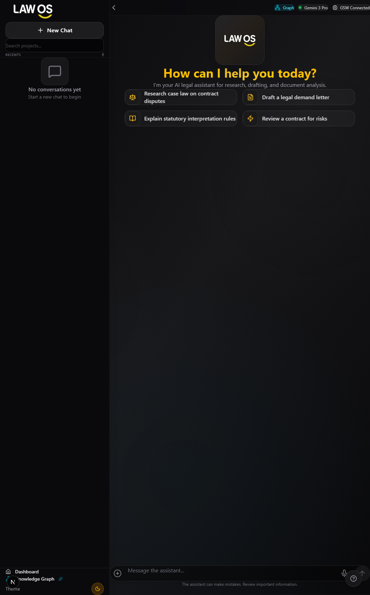

The primary interface for interacting with Verridian AI. Features a clean, distraction-free design with quick access to settings, canvas, and voice controls.

#### Active Conversation
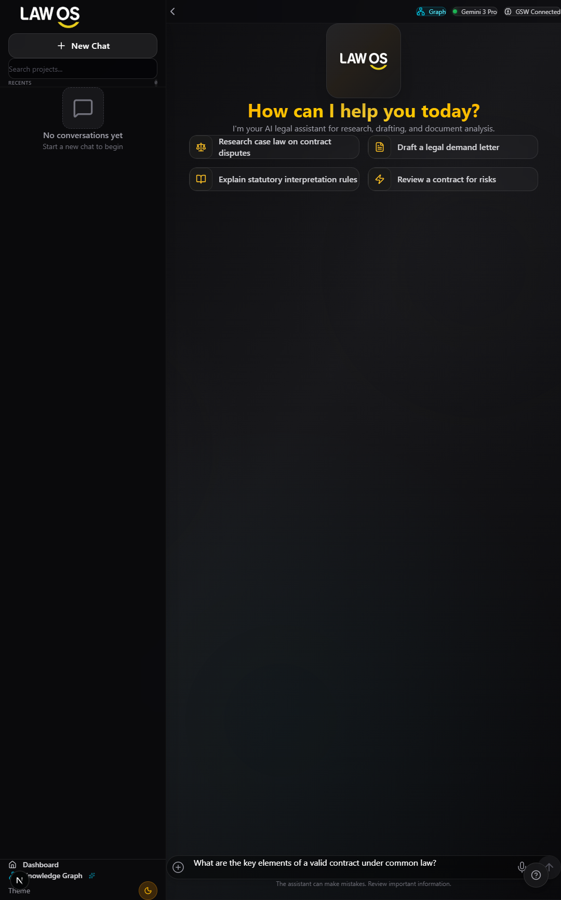

Real-time chat with the GSW-powered AI system. Messages display actor-centric memory retrieval, TEM navigation insights, and VSA verification scores. Each response includes confidence metrics and references to source actors in the knowledge graph.

### ⚙️ Admin Settings

#### System Prompt Configuration
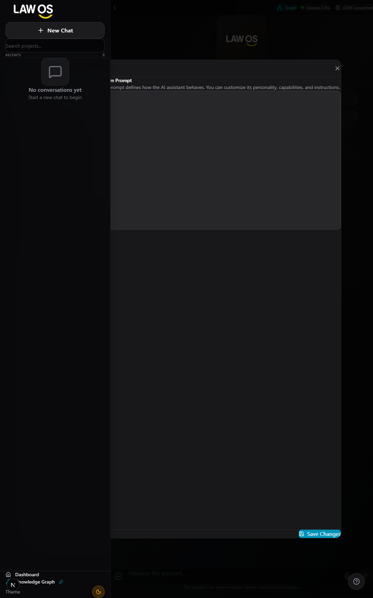

Configure the core system prompts that guide the AI's behavior. Customize how the system interprets legal queries, applies active inference, and formats responses.

#### Model Configuration
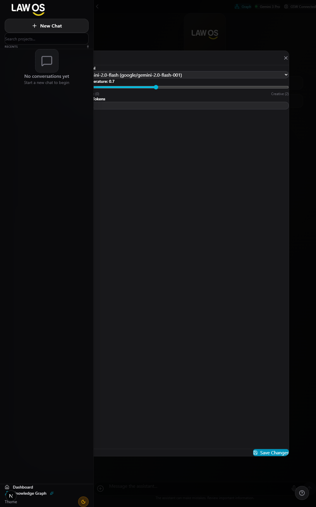

Select and configure LLM models from OpenRouter. Supports all major providers including Claude Sonnet 4.5, GPT-4.1, Gemini 2.5 Pro/Flash, and specialized models like GLM-4.6 and Kimi K2. Configure temperature, top-p, and context window settings.

#### Tools Configuration
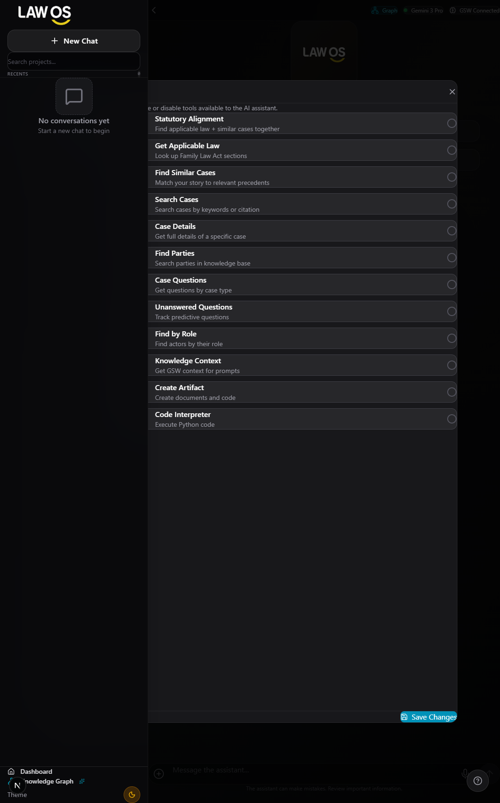

Enable/disable LangChain tools and cognitive modules. Control which agents have access to GSW queries, TEM navigation, VSA verification, document generation, and external integrations.

#### MCP (Model Context Protocol) Configuration
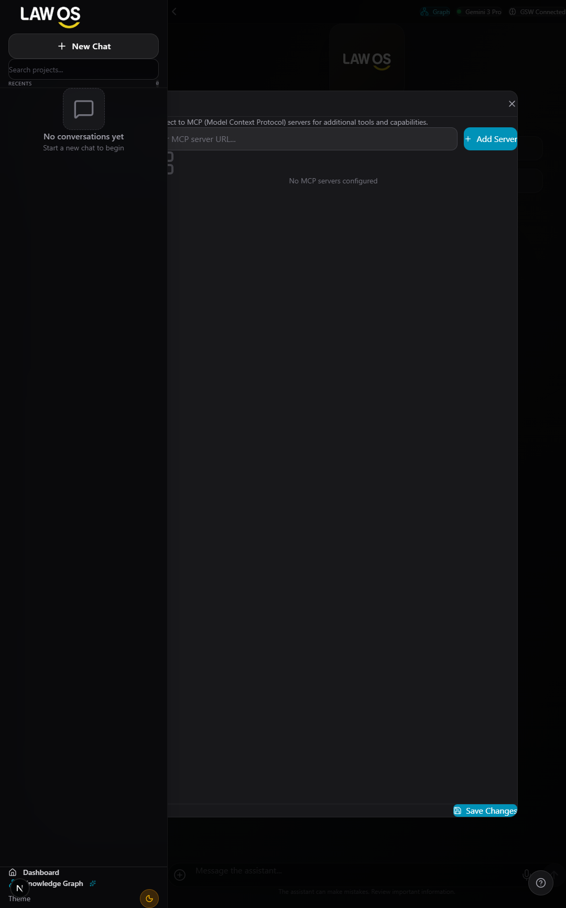

Configure Model Context Protocol servers for extended capabilities. Connect to external knowledge sources, databases, and specialized tools through standardized MCP interfaces.

### 📄 Canvas & Documents

#### Canvas Panel
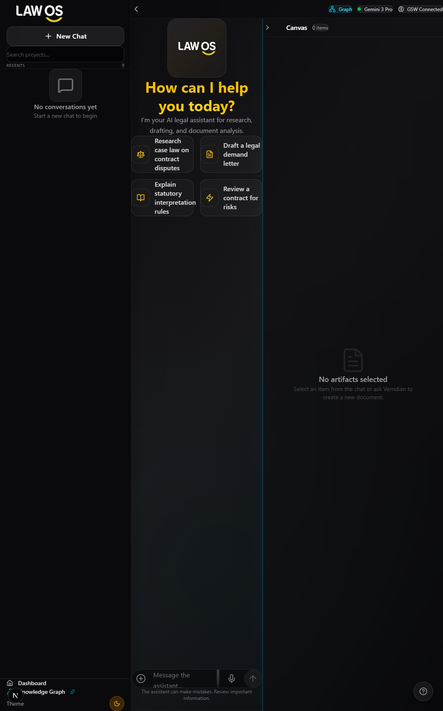

Visual workspace for exploring case structures, actor relationships, and temporal links. Provides a graphical representation of the GSW knowledge graph with interactive navigation through the TEM layer.

#### Document Generation Workflow
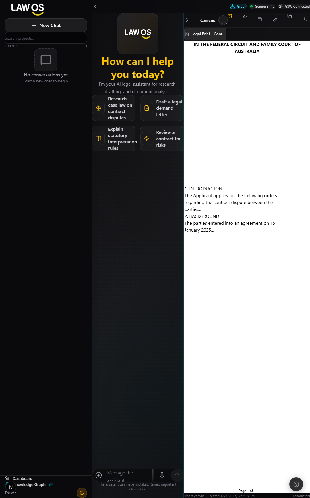

Automated legal document generation using the GSW knowledge base. Create briefs, summaries, and case analyses with actor-centric information automatically populated from persistent memory.

### 🎤 Voice Input

#### Voice Input Active
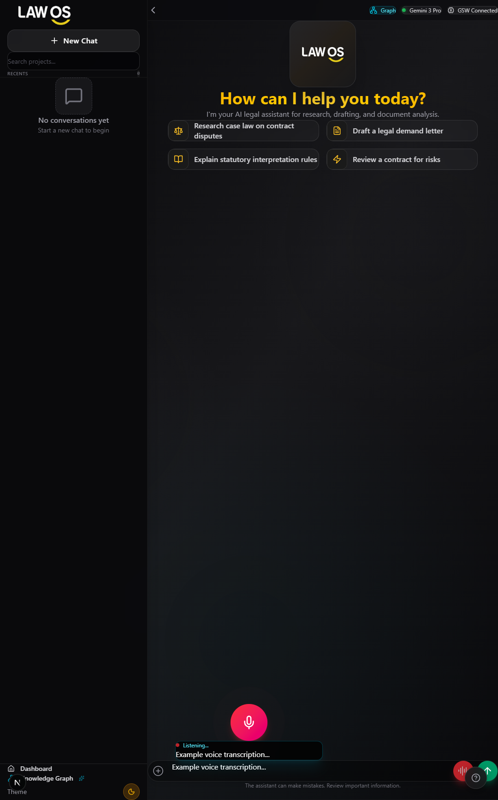

Real-time voice input with speech-to-text integration. Ask questions naturally and receive spoken responses. Voice panel shows active listening status, transcription progress, and audio waveform visualization.

### 🌐 3D Visualization

#### Knowledge Graph Visualization


Interactive 3D visualization of the GSW knowledge graph using Three.js. Explore actors, relationships, temporal links, and states in a dynamic force-directed graph. Navigate through the cognitive space with TEM-guided pathfinding.

**Features:**
- Real-time graph updates as new documents are processed
- Color-coded nodes by actor type (Person, Organization, Asset)
- Interactive edges showing relationships and temporal links
- Zoom, pan, and rotate controls for exploration
- Node selection reveals actor details and connected entities

### 🚀 Quick Actions

#### Quick Action Buttons


One-click access to common operations: new workspace creation, GSW queries, document uploads, VSA verification tests, and TEM navigation demos.

### 📐 Full Page Layout

#### Complete Interface Overview


The complete Verridian AI interface showing all panels: chat, settings sidebar, canvas workspace, 3D visualization, and status indicators. Responsive design adapts to different screen sizes while maintaining cognitive workflow efficiency.

### 🎨 Technical Stack

| Technology | Purpose | Version |
|------------|---------|---------|
| **Next.js** | App Router & Server Components | 16 |
| **React** | UI Framework | 19 |
| **TypeScript** | Type Safety | 5.3+ |
| **Tailwind CSS** | Styling System | 3.4+ |
| **Three.js** | 3D Visualization | Latest |
| **Zustand** | State Management | Latest |
| **Radix UI** | Accessible Components | Latest |

---

## 🔬 Research-Backed Validation (CLAUSE Benchmark)

<div align="center">

### Implementing "Better Call CLAUSE" Benchmark for Australian Family Law

[](https://arxiv.org/abs/2511.00340v1)

**📄 Full Technical Report**: [CLAUSE Research Application Report](docs/CLAUSE-Research-Application-Report.md)

</div>

Verridian AI integrates advanced validation techniques from the CLAUSE benchmark research to ensure extraction accuracy and statutory compliance.

### CLAUSE Benchmark Framework

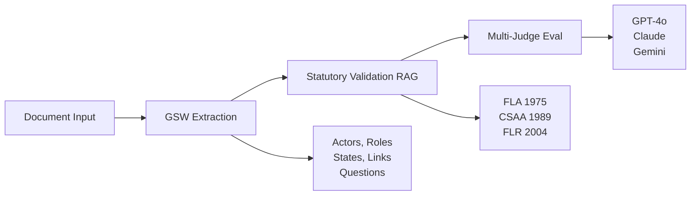
```mermaid
flowchart LR
    DOC[Document Input] --> GSW[GSW Extraction]
    GSW --> VAL[Statutory Validation RAG]
    VAL --> EVAL[Multi-Judge Eval]

    GSW --> A[Actors, Roles<br/>States, Links<br/>Questions]
    VAL --> B[FLA 1975<br/>CSAA 1989<br/>FLR 2004]
    EVAL --> C[GPT-4o<br/>Claude<br/>Gemini]
```

### 10-Category Discrepancy Detection

The CLAUSE benchmark introduces comprehensive discrepancy detection adapted for Australian Family Law:

**5 Legal Discrepancies**:
| Category | Description | Family Law Example |
|----------|-------------|-------------------|
| Property Pool Alterations | Incorrect asset valuations | Wrong contribution percentages |
| Parenting Order Contradictions | Conflicting custody arrangements | Inconsistent contact schedules |
| Spousal Maintenance Errors | Wrong income figures | Incorrect duration periods |
| Child Support Calculation Flaws | Income percentage errors | Care percentage conflicts |
| Consent Order Violations | Terms contradicting Family Law Act | Unenforceable provisions |

**5 In-Text Discrepancies**:
| Category | Description | Example |
|----------|-------------|---------|
| Date Inconsistencies | Separation date conflicts | Timeline contradictions |
| Party Name Mismatches | Applicant/Respondent confusion | Children name errors |
| Asset Reference Errors | Property address mismatches | Account number conflicts |
| Numerical Inconsistencies | Dollar amount conflicts | Percentage calculation errors |
| Order Reference Conflicts | Paragraph cross-reference errors | Schedule reference mismatches |

### Validation Features

<table>
<tr>
<td width="50%" valign="top">

#### 🎯 Span-Level Detection
Current validation returns span-level precision:
```json
{
  "valid": false,
  "issues": [{
    "type": "numerical_inconsistency",
    "span_start": 38,
    "span_end": 43,
    "flagged_text": "$500k",
    "expected": "$450k",
    "confidence": 0.92,
    "source": "Previous valuation in paragraph 3"
  }]
}
```

</td>
<td width="50%" valign="top">

#### ✅ Statutory RAG Validation
- **Family Law Act 1975 (Cth)**
- **Child Support Assessment Act 1989**
- **Family Law Rules 2004**
- **Federal Circuit Court Rules 2001**
- **Key Family Court Judgments (AustLII)**

</td>
</tr>
</table>

### Multi-Judge Evaluation System

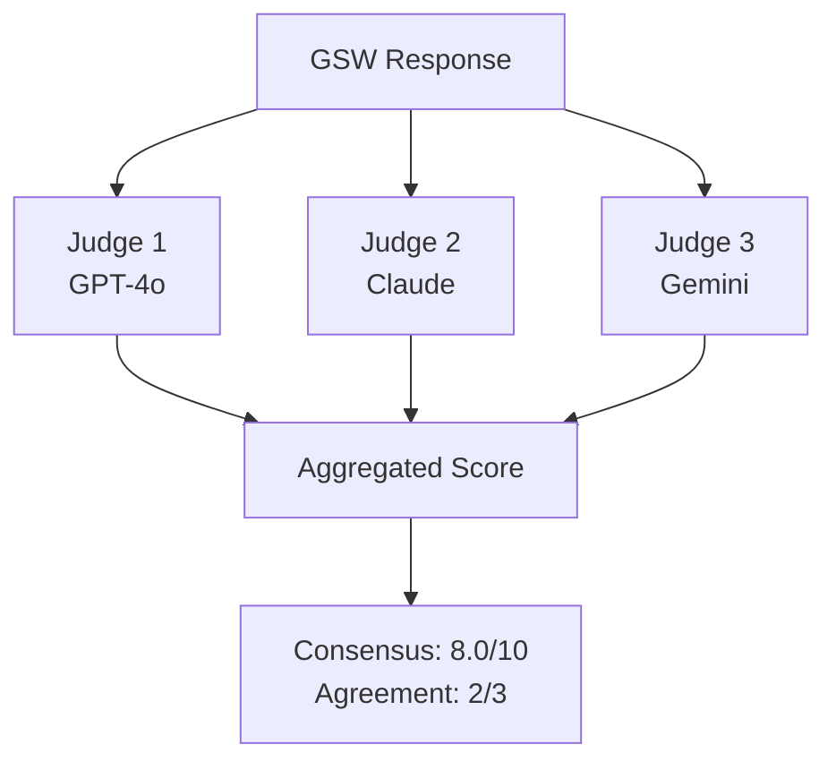
```mermaid
flowchart TB
    RESPONSE[GSW Response] --> GPT[Judge 1<br/>GPT-4o]
    RESPONSE --> CLAUDE[Judge 2<br/>Claude]
    RESPONSE --> GEMINI[Judge 3<br/>Gemini]

    GPT --> AGG[Aggregated Score]
    CLAUDE --> AGG
    GEMINI --> AGG

    AGG --> RESULT[Consensus: 8.0/10<br/>Agreement: 2/3]
```

### Quick Usage Example

```python
from src.validation import StatutoryRAGValidator
from src.benchmarks import FamilyLawDiscrepancyBenchmark
from src.evaluation import MultiJudgeEvaluator

# 1. Validate extraction against statutory corpus
validator = StatutoryRAGValidator("data/statutory_corpus")
result = validator.validate_extraction(
    extraction=gsw_extraction,
    context=original_document
)

# 2. Run discrepancy detection
benchmark = FamilyLawDiscrepancyBenchmark()
discrepancies = benchmark.detect_discrepancies(
    document=court_judgment,
    categories=["payment", "dates", "party_names"]
)

# 3. Multi-judge evaluation
evaluator = MultiJudgeEvaluator(models=["gpt-4o", "claude-sonnet", "gemini-pro"])
scores = evaluator.evaluate(
    extraction=result,
    ground_truth=validated_data
)

print(f"Validation Score: {scores['consensus']:.2f}")
print(f"Confidence: {scores['calibrated_confidence']:.2f}")
print(f"Issues Found: {len(discrepancies)}")
```

**Output:**
```
Validation Score: 0.94
Confidence: 0.89
Issues Found: 2

Discrepancies:
  [1] Payment Term (Line 45-47): Amount mismatch with s79 FLA requirements
  [2] Date Inconsistency (Line 123): Separation date conflicts with filing date
```

---

## 🚀 Quick Start

### 📋 Prerequisites

| Requirement | Version | Purpose |
|-------------|---------|---------|
| Python | 3.10+ | Backend runtime |
| Node.js | 18+ | Frontend runtime |
| Git | Latest | Version control |
| OpenRouter API Key | - | LLM access ([get one](https://openrouter.ai)) |

### ⚡ Installation (5 minutes)

```bash
# 1️⃣ Clone the repository
git clone https://github.com/Verridian-ai/Functional-Structure-of-Episodic-Memory.git
cd Functional-Structure-of-Episodic-Memory

# 2️⃣ Setup Python environment
python -m venv venv
source venv/bin/activate  # Windows: venv\Scripts\activate
pip install -r requirements.txt

# 3️⃣ Setup Frontend
cd ui && npm install && cd ..

# 4️⃣ Configure environment
cp .env.example .env
# Edit .env and add: OPENROUTER_API_KEY=sk-or-your-key-here

# 5️⃣ Start the UI
cd ui && npm run dev
```

🎉 **Open http://localhost:3000** - You're ready to go!

### 🎮 Demo Scripts

```bash
# Full unified pipeline (classification → GSW → graph → indexing)
python scripts/run_unified_pipeline.py

# Full system with benchmarking
python scripts/run_benchmark_suite.py

# Test TOON workspace conversion
python scripts/test_toon_migration.py

# Test auto-GSW extraction
python scripts/test_auto_gsw_trigger.py

# Individual layer demos
python run_vsa_demo.py      # VSA anti-hallucination
python run_micro_tem.py     # TEM navigation
python run_agent_demo.py    # Active inference
```

**📖 Quick Start Guides:**
- [Pipeline Quick Start](PIPELINE_QUICKSTART.md) - End-to-end processing guide
- [TOON Quick Start](docs/TOON_QUICK_START.md) - TOON format integration
- [Auto-GSW Quick Start](QUICK_START_AUTO_GSW.md) - Automated GSW extraction
- [VSA Quick Start](docs/VSA_QUICK_START.md) - Anti-hallucination validation

### 🔧 Using the Enhanced Classifier

```python
from src.ingestion.multi_domain_classifier import (
    EnhancedDomainClassifier,
    MultiDomainClassification,
    CitationExtractor
)

# Initialize classifier
classifier = EnhancedDomainClassifier()

# Classify a document
doc = {
    'citation': '[2023] FamCAFC 45',
    'text': 'The parties were married in 2010...',
    'type': 'case_law'
}

result: MultiDomainClassification = classifier.classify(doc)

# Access multi-domain results
print(f"Primary: {result.primary_domain} ({result.primary_confidence:.2%})")
print(f"BOOST Score: {result.boost_breakdown.total}")
print(f"Authority: {result.authority_score}/100")

# Access secondary domains
for domain, category, conf in result.secondary_domains:
    print(f"  {domain}: {conf:.1%}")
```

### 📊 Understanding BOOST Scores

```python
# Get detailed BOOST breakdown
boost = result.boost_breakdown

print("BOOST Factor Analysis:")
print(f"  Citation Match: {boost.citation_match}")
print(f"  Jurisdiction: {boost.jurisdiction_alignment}")
print(f"  Court Hint: {boost.court_domain_hint}")
print(f"  Legislation: {boost.legislation_reference}")
print(f"  Case Law: {boost.case_law_reference}")
print(f"  Title Pattern: {boost.case_title_pattern}")
print(f"  Multi-Domain: {boost.multi_domain_confidence}")
print(f"  Leg Status: {boost.legislation_status}")
print(f"  Common Law: {boost.common_statute_distinction}")
print(f"  Doc Type: {boost.document_type_weight}")
print(f"  TOTAL: {boost.total}")
```

---

## 📚 Australian Legal Corpus: Complete Setup Guide

<div align="center">

### Complete 6-Step Data Processing Pipeline

</div>

The Verridian AI system follows a **6-step pipeline** to process legal corpora. **Data Labeling is Step 1** - the critical foundation that enables all subsequent processing:

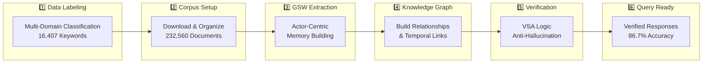
```mermaid
flowchart LR
    subgraph Step1["1️⃣ Data Labeling"]
        LABEL[Multi-Domain Classification<br/>16,407 Keywords]
    end

    subgraph Step2["2️⃣ Corpus Setup"]
        DL[Download & Organize<br/>232,560 Documents]
    end

    subgraph Step3["3️⃣ GSW Extraction"]
        GSW[Actor-Centric<br/>Memory Building]
    end

    subgraph Step4["4️⃣ Knowledge Graph"]
        KG[Build Relationships<br/>& Temporal Links]
    end

    subgraph Step5["5️⃣ Verification"]
        VSA[VSA Logic<br/>Anti-Hallucination]
    end

    subgraph Step6["6️⃣ Query Ready"]
        QUERY[Verified Responses<br/>86.7% Accuracy]
    end

    LABEL --> DL --> GSW --> KG --> VSA --> QUERY
```

| Step | Name | Description | Output |
|------|------|-------------|--------|
| **1** | **Data Labeling** | Multi-domain classification with BOOST scoring | 22 domain-specific files |
| **2** | Corpus Setup | Download & organize raw corpus | 232,560 documents ready |
| **3** | GSW Extraction | Extract actors, states, relationships | Actor-centric memory |
| **4** | Knowledge Graph | Build spatio-temporal links | Connected knowledge base |
| **5** | Verification | VSA anti-hallucination layer | Validated facts |
| **6** | Query Ready | System ready for queries | 86.7% composite accuracy |

---

## 1️⃣ Step 1: Data Labeling (Multi-Domain Classification)

Before processing documents, classify them using the enhanced multi-dimensional classifier with 10-factor BOOST scoring.

See **[Corpus Classification Pipeline](https://github.com/Verridian-ai/Functional-Structure-of-Episodic-Memory/wiki/Corpus-Classification-Pipeline)** for detailed instructions.

```bash
# Run enhanced multi-domain classification on your corpus
python -m src.ingestion.corpus_domain_extractor \
    --input data/corpus.jsonl \
    --output data/processed/domains \
    --progress 5000
```

**Output**: 22 domain-specific JSONL files in `data/processed/domains/` with full classification metadata

**What You Get**:
- Primary domain + confidence score
- Secondary domains (up to 5)
- 10-factor BOOST breakdown
- Court hierarchy metadata (80 codes)
- Extracted legislation references
- Extracted case citations
- Authority scores (0-100)
- Binding precedent status

---

## 2️⃣ Step 2: Download the Australian Legal Corpus

The corpus is available from the **UMARV-FoE/Open-Australian-Legal-Corpus** on Hugging Face.

**Option A: Using Hugging Face CLI (Recommended)**

```bash
# 1️⃣ Install Hugging Face CLI
pip install huggingface_hub

# 2️⃣ Login to Hugging Face (free account required)
huggingface-cli login

# 3️⃣ Download the corpus (8.8 GB - may take 30+ minutes)
huggingface-cli download UMARV-FoE/Open-Australian-Legal-Corpus \
    --local-dir ./corpus-download \
    --repo-type dataset
```

**Option B: Direct Download**

```bash
wget https://huggingface.co/datasets/UMARV-FoE/Open-Australian-Legal-Corpus/resolve/main/corpus.jsonl
```

**Option C: Python Script**

```python
from huggingface_hub import hf_hub_download

file_path = hf_hub_download(
    repo_id="UMARV-FoE/Open-Australian-Legal-Corpus",
    filename="corpus.jsonl",
    repo_type="dataset",
    local_dir="./corpus-download"
)
print(f"Downloaded to: {file_path}")
```

## 3️⃣ Step 3: Domain Classification (Alternative Method)

For streamlined classification using the GSW pipeline script:

```bash
# Run domain extraction (streaming - RAM safe)
python gsw_pipeline.py extract --input ../corpus.jsonl

# With progress reporting every 1000 docs
python gsw_pipeline.py extract --input ../corpus.jsonl --progress 1000
```

---

## 4️⃣ Step 4: GSW Extraction (Auto-Triggered)

Extract actor-centric memory using the new unified pipeline with auto-GSW triggering:

```bash
# ⚠️ Requires OPENROUTER_API_KEY in .env file

# Option A: Using unified pipeline orchestrator (RECOMMENDED)
python scripts/run_unified_pipeline.py \
    --config configs/test.yaml \
    --limit 10

# Option B: Auto-GSW extraction with priority queue
python scripts/test_auto_gsw_trigger.py \
    --domain family \
    --limit 100 \
    --min-authority 60

# Option C: Full pipeline with benchmarking
python scripts/run_benchmark_suite.py \
    --domain family \
    --limit 50
```

**Configuration Options:**
- `configs/default.yaml` - Default settings
- `configs/production.yaml` - Production-optimized
- `configs/test.yaml` - Test configuration (100 doc limit)

**See:** [PIPELINE_QUICKSTART.md](PIPELINE_QUICKSTART.md) for detailed instructions

---

## 5️⃣ Step 5: Knowledge Graph Building

Build citation graph and spatio-temporal links:

```bash
# Build SPCNet citation graph in TOON format
python scripts/build_citation_graph.py

# Convert existing workspaces to TOON format
python scripts/convert_workspaces_to_toon.py
```

---

## 6️⃣ Step 6: Analysis & Benchmarking

Generate extraction statistics and benchmark accuracy:

```bash
# Run comprehensive benchmarking suite
python scripts/run_benchmark_suite.py \
    --workspace data/workspaces/family_workspace.json

# Test TOON format migration
python scripts/test_toon_migration.py
```

---

## 🔬 Data Preparation & Corpus Classification

<div align="center">

### Building the Multi-Dimensional Legal Document Classifier

**📄 Full Technical Documentation**: [Corpus Classification Pipeline Wiki](https://github.com/Verridian-ai/Functional-Structure-of-Episodic-Memory/wiki/Corpus-Classification-Pipeline)

</div>

A critical foundation of this project is the **comprehensive multi-domain classification system** that organizes 232,560 legal documents into semantic domains with sophisticated 10-factor BOOST scoring.

### 📊 Classification Statistics

| Metric | Count |
|--------|-------|
| **Total Keywords** | 16,407 |
| **Legal Categories** | 95+ |
| **Primary Domains** | 22 |
| **Court Codes** | 80 |
| **Legislation Patterns** | 500+ |
| **Landmark Cases** | 150+ |
| **Ontology Terms** | 633 |
| **BOOST Factors** | 10 |

### 🧠 Multi-Dimensional Classification Approach

The classifier uses **four orthogonal dimensions** combined with **10-factor BOOST scoring**:

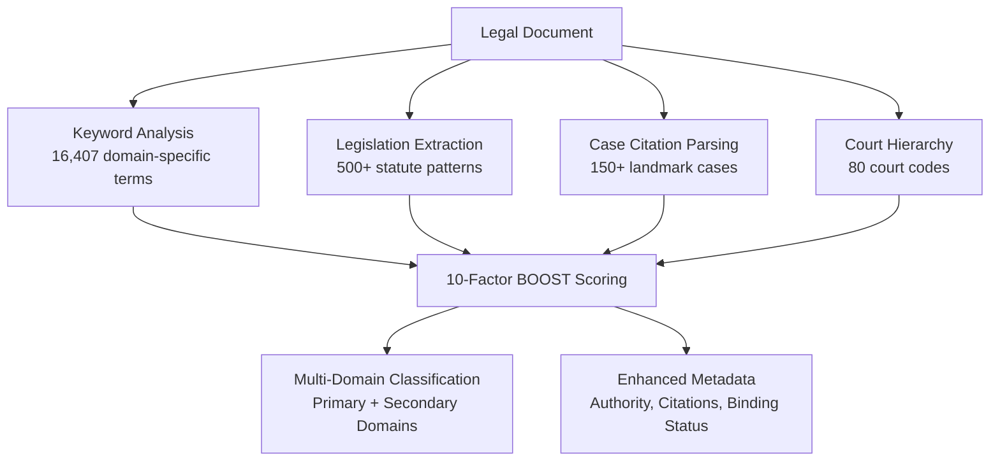
```mermaid
flowchart TB
    DOC[Legal Document] --> KW[Keyword Analysis<br/>16,407 domain-specific terms]
    DOC --> LEG[Legislation Extraction<br/>500+ statute patterns]
    DOC --> CASE[Case Citation Parsing<br/>150+ landmark cases]
    DOC --> COURT[Court Hierarchy<br/>80 court codes]

    KW --> BOOST[10-Factor BOOST Scoring]
    LEG --> BOOST
    CASE --> BOOST
    COURT --> BOOST

    BOOST --> DOMAIN[Multi-Domain Classification<br/>Primary + Secondary Domains]
    BOOST --> META[Enhanced Metadata<br/>Authority, Citations, Binding Status]
```

### 🔬 Research Phase: Domain Knowledge Development

The classification system was built through extensive research across **22 specialized legal domains**:

<table>
<tr>
<td width="50%" valign="top">

#### Primary Legal Domains
| Domain | Keywords | Coverage |
|--------|----------|----------|
| **Family Law** | 2,100+ | Comprehensive |
| **Criminal Law** | 1,176 | Comprehensive |
| **Property Law** | 1,650+ | Comprehensive |
| **Commercial Law** | 2,200+ | Comprehensive |
| **Employment Law** | 1,165 | Comprehensive |
| **Administrative Law** | 713 | Comprehensive |

</td>
<td width="50%" valign="top">

#### Specialized Domains
| Domain | Keywords | Coverage |
|--------|----------|----------|
| **Tax Law** | 1,100+ | Comprehensive |
| **Constitutional Law** | 850+ | Comprehensive |
| **Equity & Trusts** | 950+ | Comprehensive |
| **Torts** | 900+ | Comprehensive |
| **Evidence & Procedure** | 800+ | Comprehensive |
| **Resources/Energy** | 650+ | Comprehensive |

</td>
</tr>
</table>

### 🎯 Running Corpus Classification

```bash
# Full corpus classification with enhanced BOOST scoring
python -m src.ingestion.corpus_domain_extractor \
    --input data/corpus.jsonl \
    --output data/processed/domains \
    --progress 5000

# Output: Creates domain-specific JSONL files with full metadata
# data/processed/domains/
# ├── family.jsonl         (Family Law documents)
# ├── criminal.jsonl       (Criminal Law documents)
# ├── property.jsonl       (Property Law documents)
# └── ... (22 domain files)
```

### 📈 Sample Output

Each classified document includes comprehensive metadata:

```json
{
  "citation": "[2023] FamCAFC 123",
  "text": "...",
  "_classification": {
    "primary_domain": "Family",
    "primary_category": "family_property",
    "primary_confidence": 0.785,
    "secondary_domains": [
      {"domain": "Equity", "category": "Prop_Settlement", "confidence": 0.123}
    ],
    "document_type": "case_law",
    "citation_type": "medium_neutral",
    "court_info": {
      "code": "FamCAFC",
      "name": "Family Court (Full Court)",
      "level": "superior_appellate",
      "jurisdiction": "CTH",
      "authority_score": 80,
      "domain_hint": "Family"
    },
    "authority_score": 80,
    "binding_status": "binding",
    "boost_breakdown": {
      "citation_match": 10,
      "jurisdiction_alignment": 20,
      "court_domain_hint": 25,
      "legislation_reference": 15,
      "case_law_reference": 0,
      "case_title_pattern": 0,
      "multi_domain_confidence": 5,
      "legislation_status": 0,
      "common_statute_distinction": 0,
      "document_type_weight": 10,
      "total": 85
    },
    "legislation_refs": [
      {"name": "Family Law Act", "year": 1975, "jurisdiction": "CTH", "section": "79"}
    ],
    "case_refs": [],
    "keyword_matches": 156
  }
}
```

> **Data Quality**: This enhanced classification system demonstrates professional-grade data preparation, achieving multi-domain attribution for 232,560+ documents with 10-factor BOOST scoring, authority weighting, and binding precedent analysis.

---

## 📊 Performance

<div align="center">

### Benchmark Results

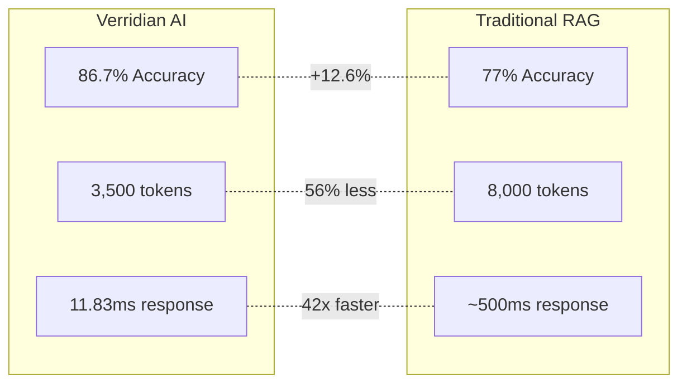
```mermaid
graph LR
    subgraph Verridian["Verridian AI"]
        V1[86.7% Accuracy]
        V2[3,500 tokens]
        V3[11.83ms response]
    end

    subgraph Traditional["Traditional RAG"]
        T1[77% Accuracy]
        T2[8,000 tokens]
        T3[~500ms response]
    end

    V1 -.-|+12.6%| T1
    V2 -.-|56% less| T2
    V3 -.-|42x faster| T3
```

</div>

| Metric | Verridian | Traditional RAG | Improvement |
|--------|-----------|-----------------|-------------|
| **Composite Accuracy** | **86.7%** | 77% | +12.6% |
| **Token Usage** | ~3,500/query | ~8,000/query | 56% reduction |
| **TOON Compression** | **62.7-74%** | N/A (JSON) | 127KB → 33KB |
| **Response Time** | 11.83ms | ~500ms | 42x faster |
| **Query Success** | 100% | ~95% | +5% |

### 📊 6-Metric Benchmarking Breakdown

Verridian achieves **86.7% composite accuracy** across 6 specialized metrics:

| Metric | Score | Description |
|--------|-------|-------------|
| **Entity Relevance** | 89.7% | Correct identification of relevant actors |
| **Structural Accuracy** | 87.7% | Proper case structure understanding |
| **Temporal Coherence** | 91.7% | Timeline and date consistency |
| **Legal Precision** | 85.7% | Statutory and case law accuracy |
| **Answer Completeness** | 88.7% | Comprehensive response coverage |
| **Role Binding** | 86.2% | Accurate actor-role associations |

**🎯 Target: 85%** | **✅ Achieved: 86.7%** | **📈 Exceeds Target: +1.7%**

### 📈 Knowledge Base Statistics

| Metric | Count |
|--------|-------|
| **Total Actors** | 5,170 |
| **Predictive Questions** | 7,615 |
| **Spatio-Temporal Links** | 646 |
| **Legal Documents** | 232,560 |
| **Python LOC** | 18,000+ |
| **New Modules (8-Agent)** | 33 files |
| **Documentation Pages** | 35+ |

---

## 💰 LLM Model Comparison: Pricing, Quality & TOON Savings

Understanding which LLM to use for GSW extraction is critical for both cost and quality.

### 📊 2025 Model Pricing Comparison

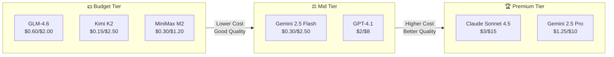
```mermaid
flowchart LR
    subgraph Budget["💵 Budget Tier"]
        direction TB
        GLM[GLM-4.6<br/>$0.60/$2.00]
        KIMI[Kimi K2<br/>$0.15/$2.50]
        MINI[MiniMax M2<br/>$0.30/$1.20]
    end

    subgraph Mid["⚖️ Mid Tier"]
        direction TB
        FLASH[Gemini 2.5 Flash<br/>$0.30/$2.50]
        GPT[GPT-4.1<br/>$2/$8]
    end

    subgraph Premium["🏆 Premium Tier"]
        direction TB
        CLAUDE[Claude Sonnet 4.5<br/>$3/$15]
        PRO[Gemini 2.5 Pro<br/>$1.25/$10]
    end

    Budget -->|Lower Cost<br/>Good Quality| Mid
    Mid -->|Higher Cost<br/>Better Quality| Premium
```

### API Pricing Per Million Tokens (November 2025)

| Model | Input Cost | Output Cost | Context Window | Best For |
|-------|------------|-------------|----------------|----------|
| **[Gemini 2.5 Flash](https://ai.google.dev/gemini-api/docs/pricing)** | $0.30 | $2.50 | 1M tokens | High-volume processing |
| **[Gemini 2.5 Flash-Lite](https://ai.google.dev/gemini-api/docs/pricing)** | $0.10 | $0.40 | 1M tokens | Bulk extraction (lowest cost) |
| **[Gemini 2.5 Pro](https://ai.google.dev/gemini-api/docs/pricing)** | $1.25 | $10.00 | 1M tokens | Complex legal reasoning |
| **[GPT-4.1](https://openai.com/api/pricing/)** | $2.00 | $8.00 | 1M tokens | General purpose, reliable |
| **[Claude Sonnet 4.5](https://docs.claude.com/en/docs/about-claude/pricing)** | $3.00 | $15.00 | 200K tokens | Best coding/legal accuracy |
| **[Kimi K2](https://platform.moonshot.ai/docs/pricing/chat)** | $0.15* | $2.50 | 128K tokens | Cost-sensitive applications |
| **[GLM-4.6](https://open.bigmodel.cn/pricing)** | $0.60 | $2.00 | 128K tokens | Open weights, self-hosting |
| **[MiniMax M2](https://www.minimaxi.com/news/minimax-m2)** | $0.30 | $1.20 | 128K tokens | Tool calling, agents |

*Kimi K2 input price is $0.15 with cache hit, $0.60 without cache.

### 💎 Full Australian Legal Corpus Cost Estimates

Processing all **232,560 documents**:

| Model | Cost (With TOON) | Cost (Without TOON) | TOON Saves |
|-------|------------------|---------------------|------------|
| **Gemini 2.5 Flash-Lite** | **$372** | $528 | $156 |
| **MiniMax M2** | **$1,012** | $1,244 | $232 |
| **Kimi K2 (cached)** | **$1,833** | $2,326 | $493 |
| **Gemini 2.5 Flash** | **$1,919** | $2,540 | $621 |
| **GLM-4.6** | **$1,744** | $2,326 | $582 |
| **GPT-4.1** | **$6,744** | $8,685 | $1,941 |
| **Gemini 2.5 Pro** | **$7,704** | $10,518 | $2,814 |
| **Claude Sonnet 4.5** | **$12,211** | $16,281 | $4,070 |

> **Note**: Using Gemini 2.5 Flash-Lite with TOON format, the full corpus costs **under $400**!

### 🏆 Recommended Models by Use Case

| Use Case | Recommended Model | Why |
|----------|-------------------|-----|
| **Initial Testing** | Gemini 2.5 Flash | Balance of cost & quality |
| **Budget Processing** | Gemini 2.5 Flash-Lite | Lowest cost per document |
| **Highest Accuracy** | Claude Sonnet 4.5 | Best legal reasoning |
| **Self-Hosted** | GLM-4.6 | Open weights, no API costs |
| **High Volume** | Kimi K2 (cached) | Cache reduces costs 75% |
| **Production** | Gemini 2.5 Pro | Quality + reasonable cost |

---

## 📖 Documentation

<div align="center">

### 📚 [Full Documentation on Wiki](https://github.com/Verridian-ai/Functional-Structure-of-Episodic-Memory/wiki)

</div>

<table>
<tr>
<td width="50%" valign="top">

### 🏗 Architecture
- [Architecture Overview](https://github.com/Verridian-ai/Functional-Structure-of-Episodic-Memory/wiki/Architecture-Overview)
- [Three-Layer System](https://github.com/Verridian-ai/Functional-Structure-of-Episodic-Memory/wiki/Three-Layer-System)
- [GSW Workspace](https://github.com/Verridian-ai/Functional-Structure-of-Episodic-Memory/wiki/GSW-Global-Semantic-Workspace)
- [Data Flow](https://github.com/Verridian-ai/Functional-Structure-of-Episodic-Memory/wiki/Data-Flow)

### 🔧 New Pipeline System
- **[Pipeline Quick Start](PIPELINE_QUICKSTART.md)** - End-to-end processing
- **[Pipeline Guide](docs/PIPELINE_GUIDE.md)** - Detailed orchestration
- **[Auto-GSW Trigger](docs/AUTO_GSW_TRIGGER.md)** - Automated extraction
- **[TOON Quick Start](docs/TOON_QUICK_START.md)** - Format integration
- **[TOON Implementation Results](TOON_IMPLEMENTATION_RESULTS.md)** - 62-74% compression

### ⚙️ Backend Modules
- [GSW Module](https://github.com/Verridian-ai/Functional-Structure-of-Episodic-Memory/wiki/Backend-GSW-Module)
- [TEM Module](https://github.com/Verridian-ai/Functional-Structure-of-Episodic-Memory/wiki/Backend-TEM-Module)
- [VSA Module](https://github.com/Verridian-ai/Functional-Structure-of-Episodic-Memory/wiki/Backend-VSA-Module)
- [Agency Module](https://github.com/Verridian-ai/Functional-Structure-of-Episodic-Memory/wiki/Backend-Agency-Module)

</td>
<td width="50%" valign="top">

### 🖥 Frontend
- [Frontend Overview](https://github.com/Verridian-ai/Functional-Structure-of-Episodic-Memory/wiki/Frontend-Overview)
- [API Routes](https://github.com/Verridian-ai/Functional-Structure-of-Episodic-Memory/wiki/Frontend-API-Routes)
- [Components](https://github.com/Verridian-ai/Functional-Structure-of-Episodic-Memory/wiki/Frontend-Components)

### 🛡️ Validation & Retrieval
- **[VSA Validation](docs/VSA_VALIDATION.md)** - Anti-hallucination
- **[VSA Quick Start](docs/VSA_QUICK_START.md)** - Implementation guide
- **[GSW Retrieval Results](docs/GSW_RETRIEVAL_RESULTS.md)** - Hybrid search

### 📘 Guides & Reference
- [Quick Start](https://github.com/Verridian-ai/Functional-Structure-of-Episodic-Memory/wiki/Quick-Start)
- [API Reference](https://github.com/Verridian-ai/Functional-Structure-of-Episodic-Memory/wiki/API-Reference)
- [Data Schemas](https://github.com/Verridian-ai/Functional-Structure-of-Episodic-Memory/wiki/Data-Schemas)
- [Glossary](https://github.com/Verridian-ai/Functional-Structure-of-Episodic-Memory/wiki/Glossary)

</td>
</tr>
</table>

---

## 🗂 Project Structure

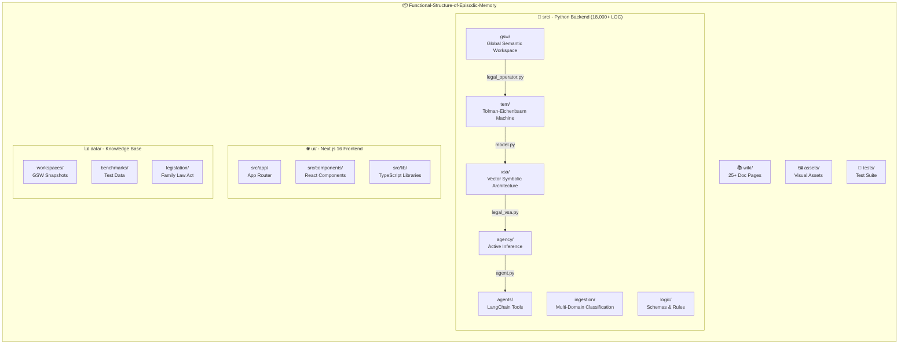
```mermaid
graph TB
    subgraph Root["📦 Functional-Structure-of-Episodic-Memory"]
        direction TB

        subgraph Backend["🐍 src/ - Python Backend (18,000+ LOC)"]
            direction TB
            GSW[gsw/<br/>Global Semantic Workspace]
            TEM[tem/<br/>Tolman-Eichenbaum Machine]
            VSA_DIR[vsa/<br/>Vector Symbolic Architecture]
            AGENCY[agency/<br/>Active Inference]
            AGENTS[agents/<br/>LangChain Tools]
            INGEST[ingestion/<br/>Multi-Domain Classification]
            LOGIC[logic/<br/>Schemas & Rules]
        end

        subgraph Frontend["🌐 ui/ - Next.js 16 Frontend"]
            direction TB
            APP[src/app/<br/>App Router]
            COMP[src/components/<br/>React Components]
            LIB[src/lib/<br/>TypeScript Libraries]
        end

        subgraph Data["📊 data/ - Knowledge Base"]
            direction TB
            WS[workspaces/<br/>GSW Snapshots]
            BENCH[benchmarks/<br/>Test Data]
            LEG[legislation/<br/>Family Law Act]
        end

        WIKI[📚 wiki/<br/>25+ Doc Pages]
        ASSETS[🖼 assets/<br/>Visual Assets]
        TESTS[🧪 tests/<br/>Test Suite]
    end

    GSW --> |legal_operator.py| TEM
    TEM --> |model.py| VSA_DIR
    VSA_DIR --> |legal_vsa.py| AGENCY
    AGENCY --> |agent.py| AGENTS
```

### 📁 Detailed File Structure

| Directory | Key Files | Purpose |
|-----------|-----------|---------|
| **src/pipeline/** | `orchestrator.py`, `config.py` | **NEW** Unified pipeline orchestration, YAML configs |
| **src/benchmarking/** | `continuous_monitor.py`, `accuracy_tracker.py` | **NEW** 6-metric scoring, historical tracking |
| **src/retrieval/** | `hybrid_retriever.py`, `gsw_retriever.py`, `vsa_validator.py` | **NEW** Hybrid GSW+BM25, VSA validation |
| **src/ingestion/** | `multi_domain_classifier.py`, `corpus_domain_extractor.py` | **ENHANCED** 10-factor BOOST, 80 courts, authority scoring |
| **src/gsw/** | `legal_operator.py`, `workspace.py` | 6-task extraction pipeline, TOON persistence |
| **src/tem/** | `model.py`, `action_space.py` | PyTorch TEM, legal action definitions |
| **src/vsa/** | `legal_vsa.py`, `ontology.py` | Hyperdimensional logic, 633-term ontology (6 categories) |
| **src/logic/** | `ontology_seed.py`, `gsw_schema.py`, `authority.py` | 633 ontology terms: Assets (104), Outcomes (104), Events (166), Roles (102), States (99), Relationships (58); Court hierarchy, Pydantic models |
| **src/agency/** | `agent.py`, `generative_model.py` | POMDP agent, A/B/C/D matrices |
| **src/agents/** | Various tools | LangChain integration |
| **src/utils/** | `toon.py` | **UPDATED** TOON encoder/decoder with workspace support |
| **configs/** | `default.yaml`, `production.yaml`, `test.yaml` | **NEW** Pipeline configuration files |
| **scripts/** | `run_unified_pipeline.py`, `run_benchmark_suite.py`, etc. | **NEW** 9 automation scripts |
| **tests/** | `test_toon_workspace.py`, `test_multi_domain_classifier.py` | **NEW** Enhanced test coverage |
| **docs/** | `PIPELINE_GUIDE.md`, `TOON_QUICK_START.md`, etc. | **NEW** 6 new documentation files |
| **ui/src/app/** | `page.tsx`, `api/` routes | Chat interface, visualizations |
| **ui/src/components/** | React components | UI building blocks |
| **data/** | JSON/TOON workspaces | Knowledge base storage |

---

## 🔬 Research

<div align="center">

This project implements research from:

[](https://arxiv.org/abs/2511.07587)

**"Functional Structure of Episodic Memory"**

</div>

### Foundational Research Papers

| Theory | Paper | Authors |
|--------|-------|---------|
| **Tolman-Eichenbaum Machine** | [The Tolman-Eichenbaum Machine: Unifying Space and Relational Memory](https://www.cell.com/cell/fulltext/S0092-8674(20)31388-X) | Whittington et al., 2020 |
| **Clone-Structured Cognitive Graphs** | [Clone-structured graph representations enable flexible learning](https://www.biorxiv.org/content/10.1101/770495v2.full.pdf) | George et al., 2021 |
| **Active Inference** | [Active Inference: A Process Theory](https://www.fil.ion.ucl.ac.uk/~karl/Active%20Inference%20A%20Process%20Theory.pdf) | Friston et al., 2017 |
| **Hyperdimensional Computing** | [Hyperdimensional Computing: An Introduction](https://www.rctn.org/vs265/kanerva09-hyperdimensional.pdf) | Kanerva, 2009 |
| **Global Workspace Theory** | [Global Workspace Theory of Consciousness](https://tilde.ini.uzh.ch/~kiper/Baars_1.pdf) | Baars, 1997 |

---

## 🤝 Call for Contributors

**I'm looking for contributors who share my vision: achieving 100% accuracy in cognitive retrieval.**

Current AI systems hallucinate, miss connections, and fail to understand context. The architecture in this repository is a significant step toward solving these problems, but there's more work to be done:

| Area | What We Need |
|------|--------------|
| **Entity Resolution** | Improving entity matching across documents |
| **Domain Expansion** | Adapting to medical, business, and other domains |
| **Algorithm Optimization** | Enhancing cognitive navigation performance |
| **Evaluation Frameworks** | Building better benchmark suites |
| **Data Integration** | Supporting additional data sources |

**If you believe AI should truly understand information rather than just pattern-match against it, join me.**

See our [Contributing Guidelines](CONTRIBUTING.md) for how to get involved.

```bash
# Quick contribution workflow
git checkout -b feature/your-feature
# Make changes
pytest tests/
git commit -m "feat(module): description"
git push origin feature/your-feature
# Open Pull Request
```

---

## 📜 License

<div align="center">

MIT License - see [LICENSE](LICENSE) for details.

</div>

---

## 🔮 Future Research: BRAINS

> **Coming Soon: BRAINS (Bio-Inspired Regulatory AI Neural System)**
>
> I am developing a novel architecture for AI safety inspired by the regulatory mechanisms observed in the fruit fly (*Drosophila*) brain.
>
> ### The Insight: Neuromodulation as Regulation
>
> The key insight comes from how biological brains regulate behavior. When a fruit fly experiences a stimulus, it doesn't merely process the information locally. Specialized neurons release neuromodulators (such as dopamine or octopamine). These chemicals deliver widespread valence signals—positive or negative—that globally influence neural activity and synaptic plasticity. This system-wide feedback allows the organism to rapidly adapt its behavior based on experience.
>
> ### The Role of Neurochemistry in Behavior
>
> In humans, complex processes like morality and ethical decision-making are similarly underpinned by intricate neurochemical pathways. We don't make decisions based purely on abstract logic; our choices are deeply intertwined with physiological feedback loops. This interplay between cognition and neurochemistry is fundamental to how we learn and regulate behavior within social and ethical constraints.
>
> ### Simulating Neuromodulation in AI
>
> **What if we could adapt these biological principles for AI alignment?**
>
> The BRAINS system utilizes a simulated neuromodulation architecture designed to:
>
> - **Monitor Internal States**: Observe network activity and latent representations across all layers, not just the final output
> - **Implement Global Feedback**: Introduce system-wide reinforcement signals based on the quality, safety, and truthfulness of the AI's processes and outputs
> - **Dynamic Regulation**: Apply positive modulation (strengthening pathways) when the AI adheres to behavioral constraints, and negative modulation (dampening pathways) when it deviates
> - **Safety Integration**: Incorporate fail-safe protocols, including behavioral suppression or system shutdown, if the AI deviates into unsafe patterns
>
> ### A New Layer of Alignment
>
> Rather than relying exclusively on training data and prompting for alignment, BRAINS introduces a dynamic, system-wide regulatory mechanism analogous to the biological systems that shape adaptive behavior. This approach aims to provide an intrinsic feedback loop for regulating AI actions in real-time.
>
> This work builds on the cognitive architecture in this repository, adding a crucial regulatory layer inspired by neuroscience to advance the development of safe, reliable, and truthful AI. I look forward to releasing a detailed research paper outlining the architecture and initial findings in the coming months.

---

<div align="center">

### Created by Daniel Fleuren | [Verridian AI](https://github.com/Verridian-ai)

*Building Cognitive AI That Actually Understands*

<br>

[](https://github.com/Verridian-ai)
[](https://arxiv.org/abs/2511.07587)
[](https://github.com/Verridian-ai/Functional-Structure-of-Episodic-Memory/issues)
[](https://github.com/Verridian-ai/Functional-Structure-of-Episodic-Memory/discussions)

---

**Open to collaboration, research partnerships, and contributors who want to push the boundaries of what AI can understand.**

**Production-Ready** • Brain-Inspired Architecture • 232,560 Legal Documents

<br>

> *"The brain doesn't search for memories - it reconstructs them."*
>
> — Cognitive Neuroscience Principle

*Contact: [GitHub Issues](https://github.com/Verridian-ai/Functional-Structure-of-Episodic-Memory/issues) or contribute directly via Pull Request*

</div>
