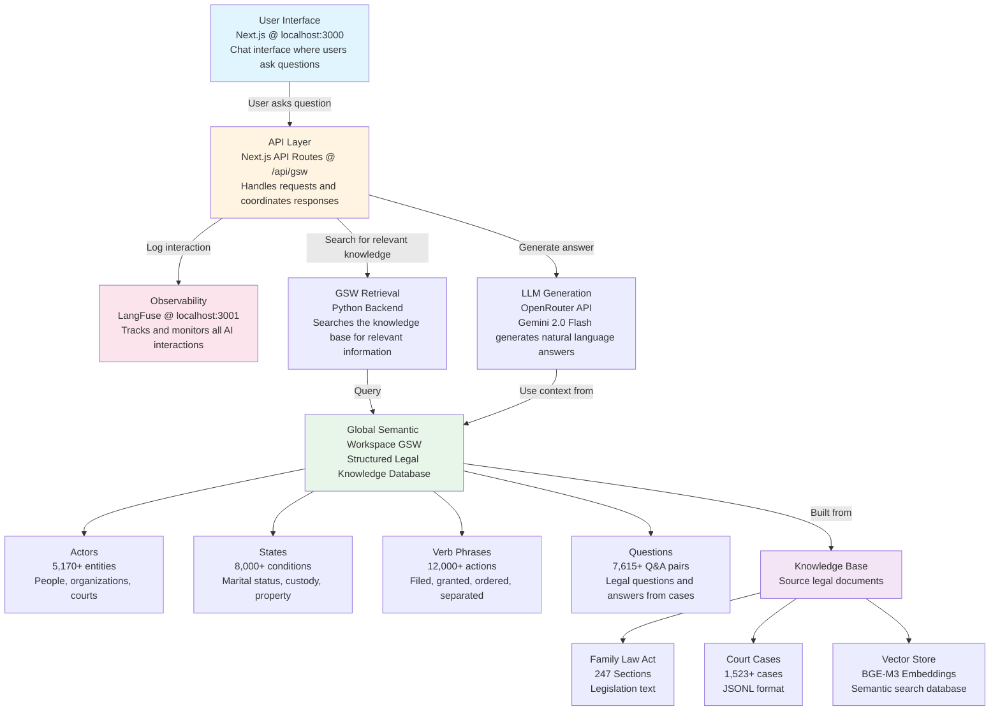

# Verridian Legal AI - Complete Setup Guide

## Table of Contents

1. [Prerequisites](#prerequisites)
2. [Quick Start](#quick-start)
3. [Detailed Setup](#detailed-setup)
   - [Step 1: Clone Repository](#step-1-clone-repository)
   - [Step 2: Environment Setup](#step-2-environment-setup)
   - [Step 3: Download Legal Corpus](#step-3-download-legal-corpus)
   - [Step 4: Split Domains](#step-4-split-domains)
   - [Step 5: Start LangFuse (Observability)](#step-5-start-langfuse-observability)
   - [Step 6: Run Ingestion Pipeline](#step-6-run-ingestion-pipeline)
   - [Step 7: Start the UI](#step-7-start-the-ui)
   - [Step 8: Verify System](#step-8-verify-system)
4. [Architecture Overview](#architecture-overview)
5. [Configuration Reference](#configuration-reference)
6. [Troubleshooting](#troubleshooting)

---

## Prerequisites

Before you begin, you'll need to install some software on your computer. Don't worry if you're not familiar with these tools - we'll guide you through each step.

### Required Software

| Software | Version | Purpose | Where to Get It |
|----------|---------|---------|-----------------|
| Python | 3.10+ | Runs the AI backend and data processing | [python.org/downloads](https://www.python.org/downloads/) |
| Node.js | 18+ | Runs the web interface (UI) | [nodejs.org](https://nodejs.org/) |
| Docker | 24+ | Runs LangFuse monitoring dashboard | [docker.com/get-started](https://www.docker.com/get-started) |
| Git | 2.0+ | Downloads and manages code | [git-scm.com/downloads](https://git-scm.com/downloads) |

### Hardware Requirements

| Component | Minimum | Recommended |
|-----------|---------|-------------|
| RAM | 8GB | 16GB+ |
| Storage | 25GB | 50GB+ |
| CPU | 4 cores | 8+ cores |
| GPU | None | NVIDIA (for embeddings) |

### API Keys Required

**What is an API Key?** An API key is like a password that lets this application use AI services. You need to sign up for these services and get a key.

- **OpenRouter API Key** (Required) - Provides access to AI language models
  - This lets the system use Google's Gemini 2.0 Flash AI to generate answers
  - Sign up at: https://openrouter.ai/
  - Free tier available, paid plans for higher usage

- **Google AI API Key** (Optional) - Direct access to Google's AI
  - Alternative to OpenRouter
  - Get at: https://ai.google.dev/

---

## Quick Start

```bash
# 1. Clone repository
git clone https://github.com/yourusername/verridian-legal-ai.git
cd verridian-legal-ai

# 2. Run setup script (creates venv, installs deps, starts services)
./scripts/setup.sh

# 3. Open browser
# - UI: http://localhost:3000
# - LangFuse: http://localhost:3001
```

---

## Detailed Setup

### Step 1: Clone Repository

```bash
# Clone the repository
git clone https://github.com/yourusername/verridian-legal-ai.git
cd verridian-legal-ai

# Or if you have an existing clone
git pull origin main
```

### Step 2: Environment Setup

#### Python Environment

**What is a virtual environment?** A virtual environment is an isolated space for Python packages. It keeps this project's dependencies separate from other Python projects on your computer, preventing conflicts.

```bash
# Create virtual environment (one-time setup)
python -m venv .venv

# Activate the virtual environment
# Windows Command Prompt:
.venv\Scripts\activate

# Windows PowerShell:
.venv\Scripts\Activate.ps1

# Linux/Mac:
source .venv/bin/activate

# Your command prompt should now show (.venv) at the beginning

# Install all required Python packages
# This may take several minutes
pip install -r requirements.txt
```

**Tip**: You need to activate the virtual environment every time you open a new terminal window to work on this project.

#### Environment Variables

**What are environment variables?** These are configuration settings stored in a file called `.env`. They contain sensitive information like API keys that shouldn't be shared publicly.

Create a `.env` file in the project root:

```bash
# Copy the example file to create your own .env
# Windows:
copy .env.example .env

# Linux/Mac:
cp .env.example .env

# Edit with your values using any text editor
# Windows: notepad .env
# Or use VS Code, Notepad++, etc.
```

**Required environment variables** - Open the `.env` file and add these values:

```env
# LLM API (Required)
# Replace 'your-key-here' with your actual API key from OpenRouter
OPENROUTER_API_KEY=sk-or-v1-your-key-here

# Optional: Direct Google AI access
# Only needed if you want to use Google AI directly instead of OpenRouter
GOOGLE_AI_API_KEY=your-google-ai-key

# LangFuse (Local self-hosted)
# These default values work for local development - no need to change them yet
LANGFUSE_PUBLIC_KEY=pk-lf-local
LANGFUSE_SECRET_KEY=sk-lf-local
LANGFUSE_HOST=http://localhost:3001

# Database paths
# Where your data files are stored - these paths work by default
DATA_DIR=./data
CORPUS_DIR=./data/corpus
PROCESSED_DIR=./data/processed

# Model settings
# Which AI models to use - these are the recommended defaults
EMBEDDING_MODEL=BAAI/bge-m3
LLM_MODEL=google/gemini-2.0-flash-001
```

**What each setting does:**
- `OPENROUTER_API_KEY`: Your access key for AI language models
- `EMBEDDING_MODEL`: The AI model used for semantic search (understanding meaning)
- `LLM_MODEL`: The AI model used for generating answers (Gemini 2.0 Flash)
- Data directories: Where files are stored on your computer

#### ✅ Verification: Confirm Environment Setup

Check that your environment is configured:

```bash
# Verify Python virtual environment is active
# You should see (.venv) at the start of your command prompt

# Verify .env file exists
# Windows:
type .env

# Linux/Mac:
cat .env

# Verify packages are installed
pip list | grep langfuse
pip list | grep openai
```

✅ **Success**: You see your API key in the `.env` file and the packages are listed.

### Step 3: Download Legal Corpus

The system requires Australian Family Law court decisions. **What is a corpus?** A corpus is simply a collection of documents - in this case, legal judgments and court decisions.

**What is JSONL format?** JSONL (JSON Lines) is a simple file format where each line is a separate JSON object. Think of it like a spreadsheet where each row is a complete case record with all its information (case ID, text, date, etc.).

You have several options:

#### Option A: Use Provided Sample Data (Recommended for Testing)

```bash
# Download sample dataset (100 cases)
python scripts/download_sample_corpus.py

# Output: data/corpus/sample_cases.jsonl
```

#### Option B: Download Full Corpus from AustLII

```bash
# Download full corpus (requires AustLII access)
python scripts/download_austlii_corpus.py \
    --courts FamCA,FamCAFC,HCA \
    --years 2015-2024 \
    --output data/corpus/full_corpus.jsonl

# This may take several hours depending on your connection
```

#### Option C: Use Your Own Data

Place your legal documents in JSONL format:

```json
{"case_id": "FamCA_2020_001", "citation": "[2020] FamCA 1", "text": "Full judgment text...", "date": "2020-01-15", "court": "FamCA"}
{"case_id": "FamCA_2020_002", "citation": "[2020] FamCA 2", "text": "Full judgment text...", "date": "2020-01-20", "court": "FamCA"}
```

Save to: `data/corpus/your_corpus.jsonl`

#### ✅ Verification: Confirm Your Corpus is Ready

After downloading, verify your data:

```bash
# Check the file exists and see how many cases you have
# Windows PowerShell:
Get-Content data/corpus/full_corpus.jsonl | Measure-Object -Line

# Linux/Mac:
wc -l data/corpus/full_corpus.jsonl

# View the first case to confirm format
# Windows PowerShell:
Get-Content data/corpus/full_corpus.jsonl -TotalCount 1

# Linux/Mac:
head -n 1 data/corpus/full_corpus.jsonl
```

✅ **Success**: You should see JSON data with fields like `case_id`, `citation`, `text`, `date`, and `court`.

### Step 4: Split Domains

The corpus needs to be split into legal domains for targeted processing:

```bash
# Run domain splitter
python -m src.ingestion.domain_splitter \
    --input data/corpus/full_corpus.jsonl \
    --output data/processed/ \
    --domains family,criminal,civil,property

# Output structure:
# data/processed/
# ├── family.jsonl          (Family law cases)
# ├── criminal.jsonl        (Criminal cases)
# ├── civil.jsonl           (Civil cases)
# ├── property.jsonl        (Property cases)
# └── extraction_statistics.json
```

#### Domain Classification

The splitter uses keyword and citation patterns:

| Domain | Keywords | Court Patterns |
|--------|----------|----------------|
| Family | custody, divorce, property, children, spouse | FamCA, FamCAFC |
| Criminal | guilty, sentence, offence, prosecution | CCA, DCC |
| Civil | damages, negligence, contract, tort | SC, DC |
| Property | conveyancing, lease, land, title | SC |

#### ✅ Verification: Confirm Domain Split

Check that your files were created:

```bash
# Windows PowerShell:
Get-ChildItem data/processed/*.jsonl

# Linux/Mac:
ls -lh data/processed/*.jsonl

# Check statistics
cat data/processed/extraction_statistics.json
```

✅ **Success**: You should see separate `.jsonl` files for each domain and a statistics file showing the count per domain.

### Step 5: Start LangFuse (Observability)

**What is LangFuse?** LangFuse is an observability tool - think of it as a dashboard that lets you see what your AI system is doing. It tracks every question asked, shows how the system responds, and helps you understand performance and accuracy.

LangFuse provides tracing, scoring, and analytics for the AI system.

```bash
# Navigate to LangFuse directory
cd docker/langfuse

# Start LangFuse services
docker compose up -d

# Check status
docker compose ps

# Expected output:
# NAME              STATUS    PORTS
# langfuse-server   running   0.0.0.0:3001->3000/tcp
# langfuse-db       running   0.0.0.0:5433->5432/tcp
```

#### Initial LangFuse Setup

1. **Open LangFuse UI**: http://localhost:3001
2. **Create Account**: Click "Sign up" and create a local account
3. **Create Project**: Name it "Verridian Legal AI"
4. **Get API Keys**: Go to Settings → API Keys → Create new key pair
5. **Update .env**: Add the keys to your `.env` file:

```env
LANGFUSE_PUBLIC_KEY=pk-lf-xxxxxxxx
LANGFUSE_SECRET_KEY=sk-lf-xxxxxxxx
LANGFUSE_HOST=http://localhost:3001
```

#### ✅ Verification: Confirm LangFuse is Running

Test your LangFuse setup:

```bash
# Check Docker containers are running
docker compose -f docker/langfuse/docker-compose.yml ps

# Test the web interface
# Open your browser to: http://localhost:3001
# You should see the LangFuse login page
```

✅ **Success**: Both containers show "running" status and you can access the web interface.

### Step 6: Run Ingestion Pipeline

**What is the GSW (Global Semantic Workspace)?** The GSW is the "brain" of the system. It's a structured database that stores legal knowledge in a way that AI can understand and reason about. Instead of just storing raw text, it extracts:
- **Actors**: People and organizations (e.g., "mother", "father", "Family Court")
- **States**: Situations and conditions (e.g., "married", "separated", "has custody")
- **Verb Phrases**: Actions and events (e.g., "filed for divorce", "granted interim orders")
- **Questions**: Legal questions and their answers extracted from cases

**What is TOON format?** TOON (Temporal Object-Oriented Notation) is our custom format for representing legal knowledge with timestamps and relationships. It helps the AI understand when things happened and how they're connected.

**What are spatio-temporal links?** These are connections between events that show:
- **Temporal**: When things happened (before/after/during)
- **Spatial**: Where things happened (which court, jurisdiction)
- **Causal**: What caused what (e.g., separation led to custody dispute)

Process the legal corpus into the Global Semantic Workspace (GSW):

```bash
# Return to project root
cd ../..

# Run the full ingestion pipeline
python -m src.ingestion.gsw_pipeline \
    --input data/processed/family.jsonl \
    --output data/processed/gsw_workspace.json \
    --mode full \
    --batch-size 10

# Options:
#   --mode full      : Full extraction + reconciliation
#   --mode extract   : Extraction only
#   --mode resume    : Resume from checkpoint
#   --batch-size N   : Process N cases at a time
```

#### Pipeline Stages Explained

The ingestion pipeline processes legal documents in four stages:

1. **Extraction** (TheOperator)
   - Reads each legal case and extracts key information
   - Identifies: actors (people/organizations), states (conditions), verb phrases (actions), questions (legal Q&A)
   - Think of it as highlighting the important parts of each case

2. **Linking** (LegalSpacetime)
   - Creates connections between extracted information
   - Links: temporal (when things happened), spatial (where), causal (what caused what)
   - Builds a timeline and relationship map of events

3. **Reconciliation** (LegalReconciler)
   - Merges duplicate entities (e.g., "John Smith" and "Mr. Smith" are the same person)
   - Resolves contradictions and answers questions based on evidence
   - Ensures consistency across all cases

4. **Persistence** (WorkspaceManager)
   - Saves all processed knowledge to `gsw_workspace.json`
   - Creates statistics and checkpoint files for resuming if interrupted

**How long does this take?** Processing 1,000 cases typically takes 2-4 hours, depending on your computer and batch size.

Monitor progress:

```bash
# Watch the output
tail -f logs/ingestion.log

# Check statistics
cat data/processed/extraction_statistics.json
```

#### ✅ Verification: Confirm Ingestion Completed

Check that the GSW workspace was created:

```bash
# Check if the workspace file exists
# Windows PowerShell:
Test-Path data/processed/gsw_workspace.json

# Linux/Mac:
ls -lh data/processed/gsw_workspace.json

# View summary statistics
cat data/processed/extraction_statistics.json | grep -E "(total_cases|total_actors|total_states)"
```

✅ **Success**: You should see:
- `gsw_workspace.json` file exists (should be several MB)
- Statistics showing counts of actors, states, verb phrases, and questions
- No error messages in the logs

### Step 7: Start the UI

#### Install UI Dependencies

```bash
cd ui
npm install
```

#### Configure UI Environment

```bash
# Copy environment template
cp .env.example .env.local

# Edit with your API keys
nano .env.local
```

Required UI environment variables:

```env
# API Configuration
OPENROUTER_API_KEY=sk-or-v1-your-key

# GSW Data Path
GSW_DATA_PATH=../data/processed/gsw_workspace.json

# LangFuse (optional, for UI tracing)
LANGFUSE_PUBLIC_KEY=pk-lf-xxxxxxxx
LANGFUSE_SECRET_KEY=sk-lf-xxxxxxxx
```

#### Start Development Server

```bash
npm run dev
```

Access the UI at: **http://localhost:3000**

#### ✅ Verification: Confirm UI is Running

Test your UI:

```bash
# The terminal should show:
# ✓ Ready in [time]
# ○ Local: http://localhost:3000

# Open your browser to: http://localhost:3000
# You should see the Verridian Legal AI chat interface
```

✅ **Success**: The browser loads the chat interface without errors.

### Step 8: Verify System

#### Run Test Suite

```bash
# Return to project root
cd ..

# Run all tests
pytest tests/ -v

# Run specific test categories
pytest tests/test_observability.py -v
pytest tests/test_gsw.py -v
pytest tests/test_integration.py -v
```

#### Manual Verification Checklist

- [ ] **LangFuse**: http://localhost:3001 - Can log in, see project
- [ ] **UI**: http://localhost:3000 - Chat interface loads
- [ ] **Test Query**: Ask "What are my property rights after separation?"
- [ ] **Check Traces**: Verify traces appear in LangFuse dashboard
- [ ] **Check Scores**: Verify accuracy scores are recorded

#### Health Check Script

```bash
python scripts/health_check.py

# Expected output:
# ✓ LangFuse server: healthy
# ✓ Database: connected
# ✓ GSW workspace: loaded (1,523 cases)
# ✓ Embeddings model: ready
# ✓ LLM connection: verified
```

---

## Architecture Overview

### System Flow Diagram

This diagram shows how a user's question flows through the system to generate an answer:



### What Each Component Does

**User Interface (UI)**
- The web-based chat interface where users type legal questions
- Built with Next.js and runs on your local computer at http://localhost:3000
- Displays answers in an easy-to-read format

**API Layer**
- The "middle manager" that coordinates between the UI and the backend
- Receives questions from the UI
- Sends requests to retrieve knowledge and generate answers
- Returns formatted responses back to the UI

**Observability (LangFuse)**
- A monitoring dashboard that tracks every interaction
- Shows you what questions were asked, how long they took, and how accurate the answers were
- Helps you understand and improve system performance
- Access at http://localhost:3001

**GSW Retrieval**
- The search engine for the knowledge base
- Finds relevant actors, states, actions, and past Q&A pairs
- Uses both keyword matching and semantic similarity (meaning-based search)

**LLM Generation**
- The AI that writes natural language answers
- Uses Google's Gemini 2.0 Flash model via OpenRouter
- Takes retrieved knowledge and crafts coherent, accurate responses

**Global Semantic Workspace (GSW)**
- The structured "brain" containing all legal knowledge
- Organizes information into actors, states, verb phrases, and questions
- Links related pieces of information together (e.g., "mother" filed for "custody" in "2020")

**Knowledge Base**
- The source data that feeds the GSW
- Contains the Family Law Act, court cases, and vector embeddings for search

---

## Configuration Reference

### Project Structure

This diagram shows how the project folders are organized:

```mermaid
graph TD
    ROOT[verridian-legal-ai/<br/>Project Root]

    DATA[data/<br/>All data files]
    CORPUS[corpus/<br/>Raw legal documents<br/>JSONL files with court cases]
    PROCESSED[processed/<br/>Processed data<br/>Domain splits and GSW workspace]
    DOMAINS[domains/<br/>Domain-specific data]

    DOCKER[docker/<br/>Container configurations]
    LANGFUSE_DIR[langfuse/<br/>LangFuse setup<br/>docker-compose.yml]

    DOCS[docs/<br/>Documentation]
    SETUP_DOC[SETUP.md - This file]
    API_DOC[API.md - API reference]

    SCRIPTS[scripts/<br/>Utility scripts]
    SETUP_SCRIPT[setup.sh - Quick setup]
    DOWNLOAD[download_sample_corpus.py]
    HEALTH[health_check.py]

    SRC[src/<br/>Python source code]
    AGENTS[agents/ - LangGraph agents<br/>AI workflow orchestration]
    EMBEDDINGS[embeddings/ - Vector store<br/>Semantic search]
    GSW_SRC[gsw/ - GSW implementation<br/>Core knowledge base logic]
    INGESTION[ingestion/ - Data processing<br/>Corpus to GSW pipeline]
    LOGIC[logic/ - Schemas & rules<br/>Data structures and validation]
    OBS[observability/ - LangFuse integration<br/>Tracking and monitoring]
    UTILS[utils/ - Utilities<br/>Helper functions]

    TESTS[tests/<br/>Test suite]
    TEST_GSW[test_gsw.py]
    TEST_OBS[test_observability.py]
    TEST_INT[test_integration.py]

    UI[ui/<br/>Next.js frontend<br/>Web interface]
    UI_SRC[src/ - UI source code]
    UI_PKG[package.json - Dependencies]

    CONFIG[Configuration Files]
    ENV[.env.example - Environment template]
    REQS[requirements.txt - Python packages]
    README[README.md - Project overview]

    ROOT --> DATA
    ROOT --> DOCKER
    ROOT --> DOCS
    ROOT --> SCRIPTS
    ROOT --> SRC
    ROOT --> TESTS
    ROOT --> UI
    ROOT --> CONFIG

    DATA --> CORPUS
    DATA --> PROCESSED
    DATA --> DOMAINS

    DOCKER --> LANGFUSE_DIR

    DOCS --> SETUP_DOC
    DOCS --> API_DOC

    SCRIPTS --> SETUP_SCRIPT
    SCRIPTS --> DOWNLOAD
    SCRIPTS --> HEALTH

    SRC --> AGENTS
    SRC --> EMBEDDINGS
    SRC --> GSW_SRC
    SRC --> INGESTION
    SRC --> LOGIC
    SRC --> OBS
    SRC --> UTILS

    TESTS --> TEST_GSW
    TESTS --> TEST_OBS
    TESTS --> TEST_INT

    UI --> UI_SRC
    UI --> UI_PKG

    CONFIG --> ENV
    CONFIG --> REQS
    CONFIG --> README

    style ROOT fill:#e1f5ff
    style DATA fill:#e8f5e9
    style SRC fill:#fff4e1
    style UI fill:#f3e5f5
    style TESTS fill:#fce4ec
    style DOCKER fill:#e0f2f1
```



### Folder Descriptions

**data/** - All data storage
- `corpus/` - Original legal documents in JSONL format (one case per line)
- `processed/` - Data after processing (domain splits, GSW workspace, statistics)
- `domains/` - Domain-specific data files

**docker/** - Docker container configurations
- `langfuse/` - LangFuse observability platform setup

**docs/** - Documentation
- `SETUP.md` - Complete setup guide (this file)
- `API.md` - API reference for developers

**scripts/** - Helper scripts for common tasks
- `setup.sh` - Automated setup (installs dependencies, starts services)
- `download_sample_corpus.py` - Downloads test data
- `health_check.py` - Verifies system health

**src/** - Python source code
- `agents/` - AI agents built with LangGraph (orchestrates multi-step workflows)
- `embeddings/` - Vector store for semantic search
- `gsw/` - Global Semantic Workspace implementation (the "brain")
- `ingestion/` - Pipeline that converts raw cases into structured knowledge
- `logic/` - Data schemas and business rules
- `observability/` - LangFuse integration for tracking
- `utils/` - Shared utility functions

**tests/** - Automated tests
- `test_gsw.py` - Tests for GSW functionality
- `test_observability.py` - Tests for LangFuse integration
- `test_integration.py` - End-to-end tests

**ui/** - Web interface
- `src/` - React/Next.js components and pages
- `package.json` - JavaScript dependencies

**Configuration Files**
- `.env.example` - Template for environment variables (copy to `.env`)
- `requirements.txt` - Python package dependencies
- `README.md` - Project overview and quick start

### Key Configuration Files

| File | Purpose |
|------|---------|
| `.env` | Environment variables |
| `docker/langfuse/docker-compose.yml` | LangFuse services |
| `ui/.env.local` | UI-specific config |
| `data/processed/ingestion_state.json` | Checkpoint state |

---

## Troubleshooting

Don't panic if something goes wrong! This section covers the most common issues and how to fix them. Most problems have simple solutions.

### General Troubleshooting Steps

Before diving into specific issues, try these general steps:

1. **Check the logs**: Error messages often explain what went wrong
2. **Restart the service**: Many issues are resolved by restarting
3. **Verify your .env file**: Make sure API keys are correct
4. **Check system resources**: Ensure you have enough RAM and disk space
5. **Search for the error message**: Copy the error into Google for solutions

### Common Issues

#### LangFuse won't start

**Symptoms**: Docker containers fail to start, or LangFuse web page won't load

**Causes**: Docker not running, port conflicts, or corrupted data volumes

```bash
# First, check if Docker Desktop is running (Windows/Mac)
# You should see the Docker icon in your system tray

# Check Docker logs to see what went wrong
docker compose -f docker/langfuse/docker-compose.yml logs

# Common fix: Remove old volumes and restart fresh
# Warning: This will delete LangFuse data and start clean
docker compose -f docker/langfuse/docker-compose.yml down -v
docker compose -f docker/langfuse/docker-compose.yml up -d

# Wait 30 seconds for services to start, then test
# Open browser to: http://localhost:3001
```

**If the port is already in use:**
```bash
# Windows - Find what's using port 3001:
netstat -ano | findstr :3001

# Stop the conflicting service or change LangFuse port in docker-compose.yml
```

#### Database connection errors

**Symptoms**: "Connection refused", "Database not found", or "Authentication failed"

**Causes**: PostgreSQL container not running or credentials incorrect

```bash
# Check if PostgreSQL is running
docker compose -f docker/langfuse/docker-compose.yml ps langfuse-db

# Should show "running" status. If not, restart:
docker compose -f docker/langfuse/docker-compose.yml restart langfuse-db

# Check database logs for errors
docker compose -f docker/langfuse/docker-compose.yml logs langfuse-db

# If you see authentication errors, verify your .env file has correct credentials
```

#### Embedding model download fails

**Symptoms**: "Failed to download model", "Connection timeout", or "Out of disk space"

**Causes**: Network issues, disk space, or Hugging Face servers down

```bash
# Check disk space first
# Windows:
dir C:\

# Linux/Mac:
df -h

# Manual download (this will take several minutes and ~2GB of space)
python -c "from sentence_transformers import SentenceTransformer; SentenceTransformer('BAAI/bge-m3')"

# If download fails or you're low on space, use a smaller model
# Windows:
set EMBEDDING_MODEL=all-MiniLM-L6-v2

# Linux/Mac:
export EMBEDDING_MODEL=all-MiniLM-L6-v2

# Update your .env file with the new model name
```

**Note**: The smaller model (all-MiniLM-L6-v2) is only 80MB vs 2GB for BGE-M3, but may be slightly less accurate.

#### Out of memory during ingestion

**Symptoms**: "MemoryError", "Out of memory", or system becomes very slow

**Causes**: Processing too many cases at once, or insufficient RAM

```bash
# Reduce batch size (default is 10, try 5 or even 2)
python -m src.ingestion.gsw_pipeline --batch-size 5 --input data/processed/family.jsonl

# Or process in smaller chunks
python -m src.ingestion.gsw_pipeline --start-line 0 --end-line 500

# Close other programs to free up RAM
# Check current memory usage:
# Windows: Task Manager (Ctrl+Shift+Esc)
# Linux/Mac: top or htop
```

**Prevention**: If you have limited RAM (less than 8GB), process cases in batches of 2-5 at a time.

#### UI build errors

**Symptoms**: "Module not found", "Cannot find package", or build failures

**Causes**: Missing dependencies, Node version mismatch, or corrupted cache

```bash
# Navigate to UI directory
cd ui

# Clear all caches and dependencies
# Windows:
rmdir /s /q node_modules .next
# Linux/Mac:
rm -rf node_modules .next

# Reinstall dependencies
npm install

# Try running again
npm run dev
```

**Check Node version:**
```bash
node --version  # Should be 18.x or higher

# If your Node version is too old, download the latest from nodejs.org
```

#### API key errors

**Symptoms**: "Invalid API key", "Unauthorized", or "Authentication failed"

**Causes**: Incorrect or missing API key in .env file

```bash
# Verify your .env file has the correct key
# Windows:
type .env | findstr OPENROUTER_API_KEY

# Linux/Mac:
cat .env | grep OPENROUTER_API_KEY

# Make sure:
# 1. Key starts with "sk-or-v1-" for OpenRouter
# 2. No extra spaces or quotes around the key
# 3. File is named exactly ".env" not ".env.txt"

# Test your API key manually:
curl https://openrouter.ai/api/v1/models \
  -H "Authorization: Bearer YOUR_API_KEY_HERE"
```

#### GSW workspace file not found

**Symptoms**: "FileNotFoundError: gsw_workspace.json", or UI shows "No knowledge base"

**Causes**: Ingestion pipeline didn't complete or file path is incorrect

```bash
# Check if the file exists
# Windows:
dir data\processed\gsw_workspace.json

# Linux/Mac:
ls -lh data/processed/gsw_workspace.json

# If missing, run ingestion pipeline:
python -m src.ingestion.gsw_pipeline --input data/processed/family.jsonl --output data/processed/gsw_workspace.json

# Verify the path in your UI .env.local matches:
cat ui/.env.local | grep GSW_DATA_PATH
```

### Getting Help

Still stuck? Here's where to get help:

- **GitHub Issues**: https://github.com/yourusername/verridian-legal-ai/issues
  - Search existing issues first - someone may have had the same problem
  - Create a new issue with: error message, what you tried, system details

- **Documentation**: See `/docs` folder
  - `SETUP.md` - This complete setup guide
  - `API.md` - API reference and advanced configuration
  - `ARCHITECTURE.md` - System design details

- **Logs**: Check `logs/` directory for detailed error messages
  - `ingestion.log` - Pipeline processing logs
  - `api.log` - Backend API logs
  - `langfuse.log` - Observability logs

**When asking for help, include:**
1. What you were trying to do
2. The exact error message (copy/paste, don't retype)
3. Your operating system (Windows/Mac/Linux)
4. Relevant log files
5. What you've already tried

---

## Next Steps

After completing setup:

1. **Explore the UI**: Try different legal queries
2. **Review Traces**: Check LangFuse for performance insights
3. **Customize**: Add your own legal documents
4. **Evaluate**: Run accuracy benchmarks
5. **Deploy**: See `docs/DEPLOYMENT.md` for production setup

---

## Glossary of Technical Terms

This section explains all the technical terms used in this guide in plain language.

### Data Formats

**JSONL (JSON Lines)**
- A file format where each line is a separate JSON object
- Like a spreadsheet where each row is a complete record
- Example: Each line = one court case with all its data
- Easy for computers to read line-by-line

**JSON (JavaScript Object Notation)**
- A way to structure data that's easy for both humans and computers to read
- Uses curly braces `{}` and key-value pairs
- Example: `{"name": "John", "age": 30}`

**TOON (Temporal Object-Oriented Notation)**
- Our custom format for representing legal knowledge
- Includes timestamps (when things happened)
- Shows relationships between entities
- Helps the AI understand context and causality

### System Components

**GSW (Global Semantic Workspace)**
- The "brain" of the system
- A structured database that stores legal knowledge
- Organizes information into: actors, states, verb phrases, questions
- Allows the AI to reason about relationships and timelines

**API (Application Programming Interface)**
- A way for different software components to communicate
- Like a waiter taking your order to the kitchen
- In our system: connects the UI to the backend processing

**LLM (Large Language Model)**
- An AI trained on massive amounts of text
- Can understand and generate human-like text
- We use Google's Gemini 2.0 Flash
- Generates answers to legal questions

**Embeddings / Vector Store**
- A way to convert text into numbers (vectors) that represent meaning
- Allows semantic search (finding similar meaning, not just matching words)
- Example: "custody battle" and "parenting dispute" are semantically similar
- We use the BGE-M3 model for this

### AI/ML Concepts

**Semantic Search**
- Searching by meaning rather than exact word matches
- Understands that "divorce" and "marriage dissolution" mean the same thing
- More powerful than simple keyword search

**Spatio-Temporal Links**
- Connections between events showing:
  - **Temporal**: When (before/after/during)
  - **Spatial**: Where (which court, jurisdiction)
  - **Causal**: Why (what caused what)
- Example: "separation in 2019" → "custody filing in 2020" → "final orders in 2021"

**Observability**
- The ability to monitor and understand what your system is doing
- LangFuse provides: traces (what happened), metrics (how fast), scores (how accurate)
- Helps debug problems and improve performance

### Software Tools

**Docker**
- Software that runs applications in isolated containers
- Think of it like a virtual computer running inside your computer
- We use it to run LangFuse without complex setup

**LangFuse**
- An observability platform for AI applications
- Tracks every question, response, and performance metric
- Provides a web dashboard to visualize system behavior

**Virtual Environment**
- An isolated Python environment for a project
- Keeps dependencies separate from other projects
- Prevents version conflicts between different Python packages

**Git**
- Version control software for tracking code changes
- Allows you to download (clone) repositories from GitHub
- Keeps a history of all changes to the code

### Legal Domain Terms

**Corpus**
- A collection of documents
- In our case: Australian Family Law court decisions
- Plural: corpora

**Domain**
- A specific area of law (e.g., family law, criminal law, civil law)
- We split cases by domain for targeted processing

**Case Citation**
- A unique identifier for a legal case
- Example: `[2020] FamCA 123`
- Format: `[Year] Court Abbreviation Case Number`

### Project-Specific Terms

**Actors**
- People, organizations, or entities mentioned in cases
- Examples: "mother", "father", "Family Court", "Department of Child Safety"
- Tracked with attributes and relationships

**States**
- Conditions or situations that describe an actor
- Examples: "married", "separated", "has custody of children"
- Can change over time

**Verb Phrases**
- Actions or events that occur in cases
- Examples: "filed for divorce", "granted interim orders", "awarded property settlement"
- Linked to actors and timestamps

**Questions**
- Legal questions and their answers extracted from cases
- Examples: "Can grandparents apply for custody?" → Answer from case law
- Forms a Q&A knowledge base

---

## Quick Reference Card

### Common Commands

```bash
# Activate Python environment
.venv\Scripts\activate  # Windows
source .venv/bin/activate  # Linux/Mac

# Start LangFuse
cd docker/langfuse && docker compose up -d

# Run ingestion
python -m src.ingestion.gsw_pipeline --input data/processed/family.jsonl

# Start UI
cd ui && npm run dev

# Check health
python scripts/health_check.py

# View logs
tail -f logs/ingestion.log
```

### Common URLs

- **UI**: http://localhost:3000
- **LangFuse**: http://localhost:3001
- **OpenRouter**: https://openrouter.ai/
- **Project Docs**: See `/docs` folder

### Getting Help

- **GitHub Issues**: https://github.com/yourusername/verridian-legal-ai/issues
- **Documentation**: See `/docs` folder
- **Logs**: Check `logs/` directory for detailed error messages

---

*Last updated: November 2024*
*Version: 7.1*
