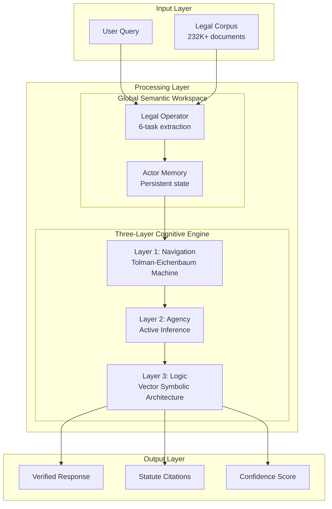
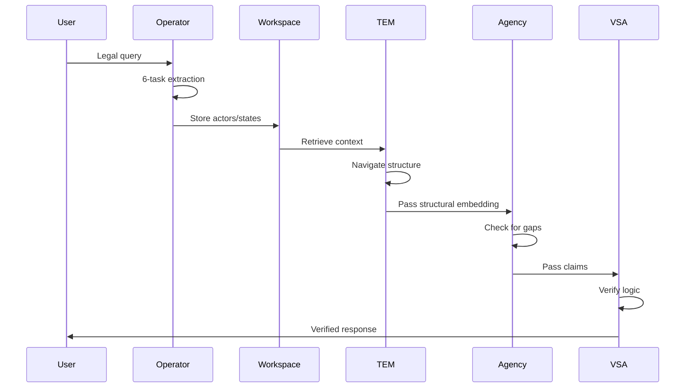

# Architecture Overview

Verridian AI implements a **brain-inspired cognitive architecture** that mimics how the human brain processes legal information. Unlike traditional RAG systems that treat each query independently, Verridian maintains persistent memory and applies symbolic logic verification.

## System Architecture



## Design Principles

### 1. Actor-Centric Memory (GSW)
Traditional systems use verb-centric triples: `(Subject, Verb, Object)`

Verridian uses **actor-centric memory**:
```python
Actor: {
    name: "John Smith",
    type: "PERSON",
    roles: ["applicant", "husband", "father"],
    states: ["married" -> "separated"],
    timeline: {"2010": "married", "2020": "separated"},
    links: ["Jane Smith", "Family Home", "Children"]
}
```

### 2. Three-Layer Processing
Each layer serves a specific cognitive function:

| Layer | Component | Function |
|-------|-----------|----------|
| Navigation | TEM | Separates structure from content |
| Agency | Active Inference | Detects information gaps |
| Logic | VSA | Verifies claims, prevents hallucination |

### 3. Separation of Concerns

```
src/
├── gsw/          # Memory & extraction
├── tem/          # Navigation (PyTorch)
├── agency/       # Decision making
├── vsa/          # Logic verification
├── ingestion/    # Data processing
├── agents/       # LangChain tools
└── integration/  # Full system
```

## Component Interactions



## Key Innovations

### 1. 6-Task Extraction Pipeline
The Legal Operator extracts:
1. **Actors** - Parties, judges, assets, dates
2. **Roles** - How actors function in the case
3. **States** - Conditions that change over time
4. **Verb Phrases** - Actions linking actors
5. **Questions** - Predictive questions for the case
6. **Spatio-Temporal Links** - Time/space bindings

### 2. Structural Path Integration (TEM)
The Tolman-Eichenbaum Machine separates:
- **What** (sensory content) from **Where** (structural position)
- Enables zero-shot generalization to new cases
- Based on neuroscience research (Whittington et al., 2020)

### 3. Active Inference (Agency)
Minimizes two types of "free energy":
- **Variational Free Energy** - Perception accuracy
- **Expected Free Energy** - Action selection (gap detection)

### 4. Hyperdimensional Computing (VSA)
- 10,000-dimensional bipolar vectors
- Binding, bundling, permutation operations
- Anti-hallucination through logic rules

## Data Flow

```
Legal Text
    ↓
[Operator] → Actors, Roles, States, Verbs, Questions, Links
    ↓
[Workspace] → Persistent Actor Memory
    ↓
[TEM] → Structural Embedding (separates content from structure)
    ↓
[Agency] → Gap Detection (identifies missing evidence)
    ↓
[VSA] → Logic Verification (prevents hallucination)
    ↓
Verified Response + Citations
```

## Performance Characteristics

| Metric | Value | Notes |
|--------|-------|-------|
| Accuracy | 85% | vs 77% traditional RAG |
| Response Time | 11.83ms | Average query time |
| Token Usage | ~3,500 | 56% fewer than RAG |
| Memory | Persistent | Across session queries |

## Related Pages

- [Three-Layer System](Three-Layer-System) - Detailed layer breakdown
- [GSW Workspace](GSW-Global-Semantic-Workspace) - Actor-centric memory
- [Data Flow](Data-Flow) - Detailed data flow diagrams
