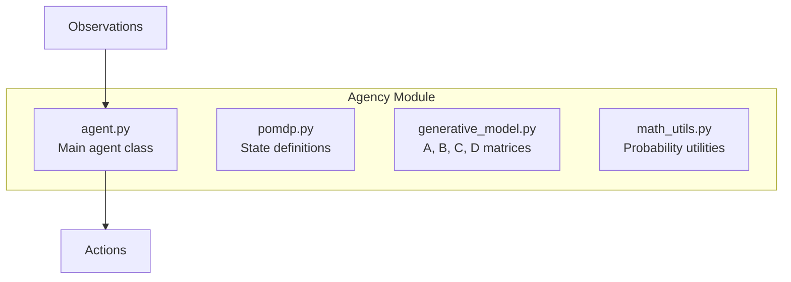
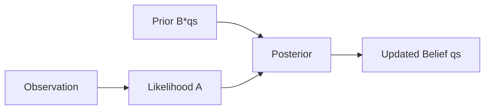
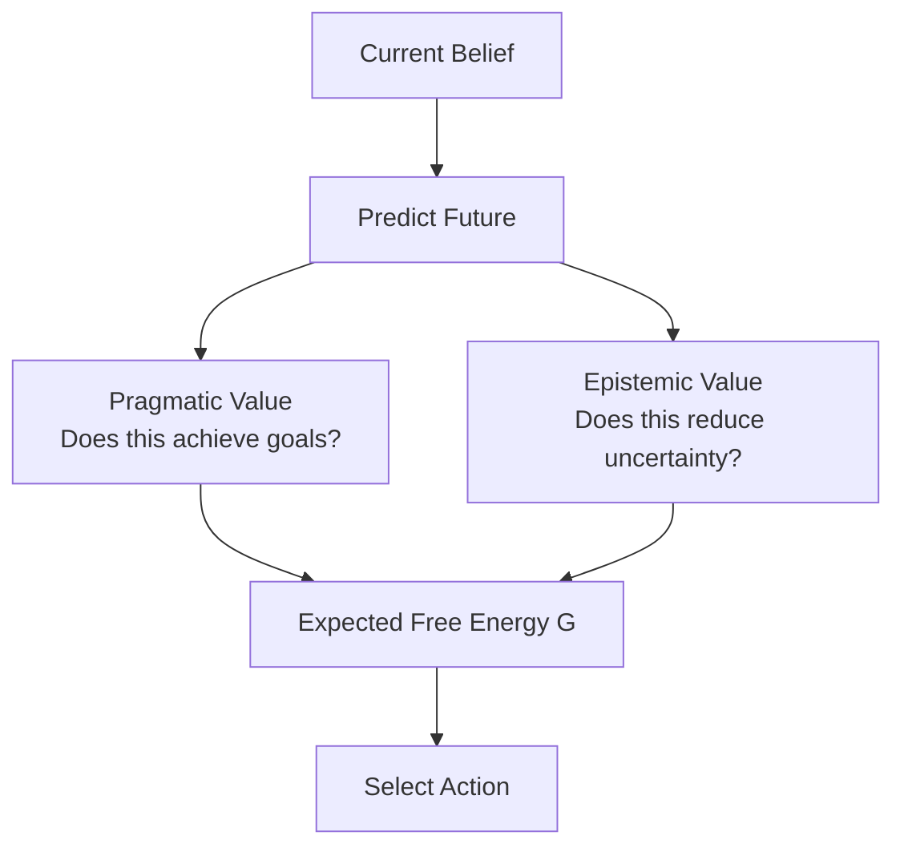
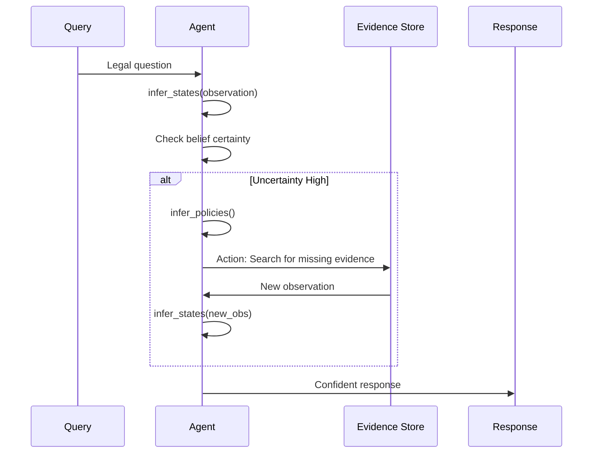

# Backend: Agency Module

The **Agency** module implements **Active Inference** for intelligent action selection and gap detection.

## Overview

**Location**: `src/agency/`
**Based on**: Friston et al. - "Active Inference: A Process Theory"



## Core Concept

Active Inference minimizes **Free Energy**:
- **Variational Free Energy (VFE)**: Perception - "What is happening?"
- **Expected Free Energy (EFE)**: Action - "What should I do?"

---

## LegalResearchAgent Class

**File**: `src/agency/agent.py`

```python
class LegalResearchAgent:
    def __init__(self):
        # Generative Model matrices
        self.A, self.B, self.C, self.D = build_generative_model()

        # Belief state (posterior over hidden states)
        self.qs = self.D.copy()

        # History tracking
        self.t = 0
        self.action_history = []
        self.obs_history = []
```

### Usage Example

```python
from src.agency.agent import LegalResearchAgent
from src.agency.pomdp import Observation, Action

# Initialize agent
agent = LegalResearchAgent()

# Process observation
obs = Observation(value=3)  # "Evidence found"
action = agent.step(obs)

print(f"Selected action: {action.value}")
# e.g., Action(4) = "Search for more evidence"
```

---

## Generative Model Components

### A Matrix (Observation Likelihood)
P(observation | hidden state)

```python
# A[o, s] = P(observation o | state s)
# Shape: (num_observations, num_states)
A = np.array([
    [0.9, 0.1, 0.0],  # Obs 0: Strong evidence
    [0.1, 0.8, 0.1],  # Obs 1: Weak evidence
    [0.0, 0.1, 0.9],  # Obs 2: No evidence
])
```

### B Matrix (Transition Dynamics)
P(next state | current state, action)

```python
# B[s', s, a] = P(state s' | state s, action a)
# Shape: (num_states, num_states, num_actions)
B = np.zeros((3, 3, 4))
B[:, :, 0] = np.eye(3)  # Action 0: Stay
B[:, :, 1] = ...        # Action 1: Search
```

### C Matrix (Preferences)
Log-preferences over observations (what the agent "wants" to see)

```python
# C[o] = log P(preferred observation o)
C = np.array([
    2.0,   # Strongly prefer: Complete evidence
    0.5,   # Mildly prefer: Partial evidence
    -1.0,  # Avoid: Missing evidence
])
```

### D Matrix (Prior)
Initial belief over hidden states

```python
# D[s] = P(initial state s)
D = np.array([0.33, 0.33, 0.34])  # Uniform
```

---

## Key Methods

### 1. State Inference (VFE Minimization)

```python
def infer_states(self, observation_idx: int):
    """
    Update beliefs based on observation.
    Minimizes Variational Free Energy.

    qs = softmax( ln(A[o, :]) + ln(B[:, :, u] @ qs_prev) )
    """
    # Get prior from dynamics
    if self.t == 0:
        prior = self.D
    else:
        last_action = self.action_history[-1]
        prior = self.B[:, :, last_action] @ self.qs

    # Get likelihood from observation
    likelihood = self.A[observation_idx, :]

    # Posterior (Bayes rule)
    posterior_unnorm = likelihood * prior + 1e-16
    self.qs = normalize(posterior_unnorm)

    self.obs_history.append(observation_idx)
```

**Diagram:**


### 2. Policy Selection (EFE Minimization)

```python
def infer_policies(self) -> int:
    """
    Select action to minimize Expected Free Energy.
    G = Pragmatic Value + Epistemic Value
    """
    num_actions = self.B.shape[2]
    G = np.zeros(num_actions)

    for u in range(num_actions):
        # Predict future
        qs_next_pred = self.B[:, :, u] @ self.qs
        qo_next_pred = self.A @ qs_next_pred

        # Pragmatic value (utility)
        pragmatic = np.dot(qo_next_pred, self.C)

        # Epistemic value (information gain)
        epistemic = self._compute_info_gain(qo_next_pred, qs_next_pred)

        G[u] = pragmatic + epistemic

    # Softmax selection
    policy_prob = softmax(G)
    action_idx = np.random.choice(num_actions, p=policy_prob)

    self.action_history.append(action_idx)
    self.t += 1
    return action_idx
```

**Diagram:**


---

## Information Gain Calculation

```python
def _compute_info_gain(self, qo_next, qs_next):
    """
    Epistemic value: expected reduction in uncertainty.
    Higher = more informative action.
    """
    epistemic = 0
    for o in range(len(qo_next)):
        prob_o = qo_next[o]
        if prob_o < 1e-6:
            continue

        # Posterior if we observed o
        post_s = normalize(self.A[o, :] * qs_next)

        # KL divergence: uncertainty reduction
        kl = kl_divergence(post_s, qs_next)
        epistemic += prob_o * kl

    return epistemic
```

---

## Gap Detection Flow



---

## POMDP Definitions

**File**: `src/agency/pomdp.py`

```python
@dataclass
class HiddenState:
    """Hidden state of the legal case."""
    value: int  # State index

@dataclass
class Observation:
    """Observable evidence."""
    value: int  # Observation index

@dataclass
class Action:
    """Agent action."""
    value: int  # Action index
```

### Legal Domain Mapping

| State | Description |
|-------|-------------|
| 0 | Complete evidence available |
| 1 | Partial evidence |
| 2 | Missing critical evidence |

| Observation | Description |
|-------------|-------------|
| 0 | Strong evidence found |
| 1 | Weak evidence found |
| 2 | No evidence found |

| Action | Description |
|--------|-------------|
| 0 | Answer with current info |
| 1 | Search for more evidence |
| 2 | Request clarification |
| 3 | Cite statute |

---

## Main Step Function

```python
def step(self, observation: Observation) -> Action:
    """Main loop step: observe -> infer -> act."""
    # Update beliefs
    self.infer_states(observation.value - 1)

    # Select action
    action_idx = self.infer_policies()

    return Action(action_idx + 1)
```

---

## Math Utilities

**File**: `src/utils/math_utils.py`

```python
def normalize(dist):
    """Normalize probability distribution."""
    return dist / (dist.sum() + 1e-16)

def softmax(x, temperature=1.0):
    """Softmax with temperature."""
    e_x = np.exp((x - np.max(x)) / temperature)
    return e_x / e_x.sum()

def entropy(dist):
    """Shannon entropy."""
    return -np.sum(dist * np.log(dist + 1e-16))

def kl_divergence(p, q):
    """KL divergence D_KL(P || Q)."""
    return np.sum(p * np.log((p + 1e-16) / (q + 1e-16)))
```

---

## Performance Impact

| Feature | Impact |
|---------|--------|
| Gap detection | +3% accuracy |
| Epistemic exploration | Reduces hallucination |
| Pragmatic focus | Faster responses |

---

## Dependencies

```python
import numpy as np
from src.agency.pomdp import HiddenState, Observation, Action
from src.agency.generative_model import build_generative_model
from src.utils.math_utils import normalize, softmax, entropy, kl_divergence
```

## Related Pages

- [Three-Layer-System](Three-Layer-System) - Agency in context
- [Backend-TEM-Module](Backend-TEM-Module) - TEM feeds into Agency
- [Architecture-Overview](Architecture-Overview) - System design
