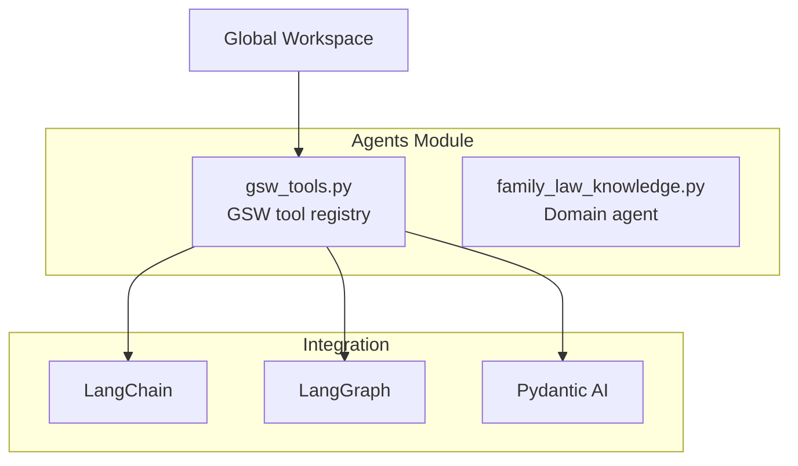

# Backend: Agents Module

The **Agents Module** provides LangChain/LangGraph compatible tools for AI agents to query the Global Semantic Workspace.

## Overview

**Location**: `src/agents/`



## Files

| File | Purpose | Lines |
|------|---------|-------|
| `gsw_tools.py` | LangChain-compatible tool registry | ~440 |
| `family_law_knowledge.py` | Family law domain agent | ~300 |

---

## GSW Tools

**File**: `src/agents/gsw_tools.py`

### Available Tools

| Tool | Description | Parameters |
|------|-------------|------------|
| `find_parties` | Find parties in knowledge base | `query: str` |
| `get_case_questions` | Get questions by case type | `case_type: str` |
| `get_unanswered_questions` | Get unanswered questions | `limit: int` |
| `answer_question` | Record an answer | `question_id, answer` |
| `find_actors_by_role` | Find actors with specific role | `role: str` |
| `get_knowledge_context` | Get compressed context | `format, max_actors` |
| `get_workspace_stats` | Get workspace statistics | - |
| `get_ontology_vocabulary` | Get domain vocabulary | - |

### Usage with LangChain

```python
from src.agents.gsw_tools import get_gsw_tools, set_workspace_path
from pathlib import Path

# Set the workspace path
set_workspace_path(Path("data/workspaces/family_law_gsw.json"))

# Get tools for agent
tools = get_gsw_tools()

# Use with LangChain
from langchain_core.agents import create_react_agent
agent = create_react_agent(model, tools)
```

### Usage with LangGraph

```python
from langgraph.prebuilt import create_react_agent
from src.agents.gsw_tools import get_gsw_tools

tools = get_gsw_tools()
agent = create_react_agent(model, tools)

# Run agent
result = agent.invoke({"messages": [("user", "Find all applicants in the case")]})
```

---

## Tool Implementations

### find_parties

```python
@tool
def find_parties(query: str = "") -> str:
    """
    Find parties (people) in the legal knowledge base.

    Args:
        query: Optional name to search for (case-insensitive partial match)

    Returns:
        JSON string with list of parties and their roles
    """
    registry = get_registry()
    results = registry.agent.find_parties(query)
    return json.dumps({
        "success": True,
        "count": len(results),
        "parties": results
    }, indent=2)
```

### get_knowledge_context

```python
@tool
def get_knowledge_context(format: str = "toon", max_actors: int = 30) -> str:
    """
    Get compressed knowledge context for inclusion in prompts.

    Args:
        format: Output format - "toon" or "json"
        max_actors: Maximum number of actors to include

    Returns:
        Knowledge context in requested format
    """
    registry = get_registry()

    if format.lower() == "toon":
        context = registry.agent.get_context_toon(max_actors)
    else:
        context = json.dumps(registry.agent.get_context_json(max_actors))

    return context
```

### answer_question

```python
@tool
def answer_question(question_id: str, answer: str) -> str:
    """
    Record an answer to a predictive question.

    Args:
        question_id: The ID of the question (e.g., "q_abc123")
        answer: The answer text

    Returns:
        JSON confirmation
    """
    registry = get_registry()
    success = registry.agent.answer_question(question_id, answer)
    return json.dumps({
        "success": success,
        "question_id": question_id,
        "message": "Question answered" if success else "Question not found"
    })
```

---

## Direct API

For non-LangChain usage:

```python
from src.agents.gsw_tools import GSWDirectAPI
from pathlib import Path

# Initialize API
api = GSWDirectAPI(Path("data/workspaces/family_law_gsw.json"))

# Find parties
parties = api.find_parties("Smith")

# Get unanswered questions
questions = api.get_unanswered(limit=10)

# Answer a question
api.answer("q_abc123", "March 2020")

# Get TOON context
context = api.get_context(format="toon", max_actors=50)

# Get statistics
stats = api.get_stats()
```

---

## Family Law Agent

**File**: `src/agents/family_law_knowledge.py`

Specialized agent for Family Law domain knowledge:

```python
from src.agents.family_law_knowledge import FamilyLawAgent
from pathlib import Path

# Load agent with workspace
agent = FamilyLawAgent.load(Path("data/workspaces/family_law_gsw.json"))

# Find parties
parties = agent.find_parties("Smith")

# Get questions by case type
questions = agent.find_cases_by_type("parenting")

# Get actors by role
applicants = agent.get_actors_by_role("Applicant")

# Get TOON context
context = agent.get_context_toon(max_actors=30)

# Get ontology context
ontology = agent.get_ontology_context()
```

---

## Pydantic Models

### PartyInfo

```python
class PartyInfo(BaseModel):
    """Information about a party in a case."""
    id: str
    name: str
    roles: List[str]
    cases: List[str]
```

### QuestionInfo

```python
class QuestionInfo(BaseModel):
    """A predictive question from the GSW."""
    id: str
    question: str
    type: str
    answered: bool
    answer: Optional[str]
```

### KnowledgeContext

```python
class KnowledgeContext(BaseModel):
    """Compressed knowledge context for LLM prompts."""
    format: str
    content: str
    stats: Dict[str, Any]
```

---

## Tool Registry

```python
class GSWToolRegistry:
    """
    Registry of GSW tools for agent integration.
    Manages workspace connection and provides tool methods.
    """

    def __init__(self, workspace_path: Optional[Path] = None):
        self.workspace_path = workspace_path
        self._agent: Optional[FamilyLawAgent] = None

    @property
    def agent(self) -> FamilyLawAgent:
        """Lazy-load the agent."""
        if self._agent is None:
            if self.workspace_path and self.workspace_path.exists():
                self._agent = FamilyLawAgent.load(self.workspace_path)
            else:
                self._agent = FamilyLawAgent()
        return self._agent
```

---

## Integration Examples

### ReAct Agent

```python
from langchain_openai import ChatOpenAI
from langgraph.prebuilt import create_react_agent
from src.agents.gsw_tools import get_gsw_tools, set_workspace_path

# Setup
set_workspace_path(Path("data/workspaces/family_law.json"))
tools = get_gsw_tools()
model = ChatOpenAI(model="gpt-4")

# Create agent
agent = create_react_agent(model, tools)

# Query
response = agent.invoke({
    "messages": [("user", "Who are the parties in the Smith case?")]
})
```

### Tool Calling

```python
from langchain_core.tools import tool

# Tools are decorated with @tool
@tool
def find_parties(query: str = "") -> str:
    """Find parties in the knowledge base."""
    ...

# Use in chain
chain = model.bind_tools([find_parties])
result = chain.invoke("Find Smith")
```

---

## Related Pages

- [Backend-GSW-Module](Backend-GSW-Module) - GSW extraction
- [GSW-Global-Semantic-Workspace](GSW-Global-Semantic-Workspace) - Workspace concepts
- [API-Reference](API-Reference) - Complete API docs
- [Data-Schemas](Data-Schemas) - Schema definitions
