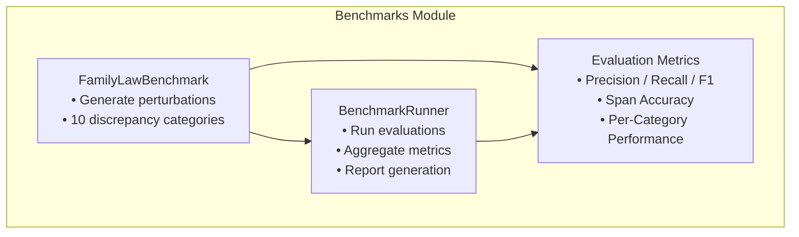
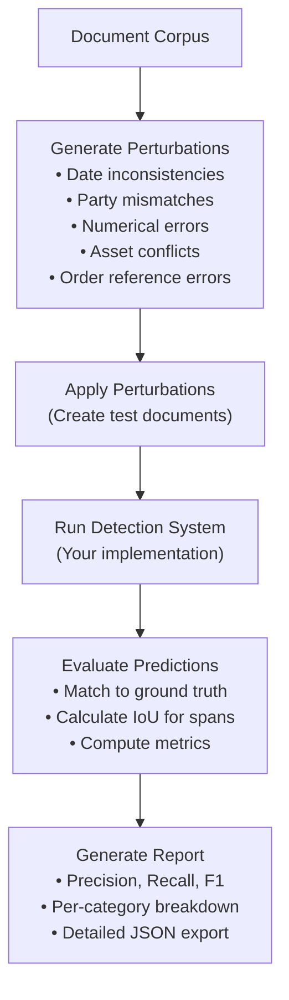

# Backend: Benchmarks Module

The **Benchmarks Module** provides comprehensive discrepancy detection evaluation for family law documents using controlled perturbations and ground truth datasets.

## Overview

**Location**: `src/benchmarks/`



## Files

| File | Purpose | Lines |
|------|---------|-------|
| `family_law_discrepancy.py` | Benchmark perturbation generator | ~622 |
| `benchmark_runner.py` | Orchestrates benchmark evaluation | ~591 |
| `benchmark.py` | Integration benchmark (legacy) | ~148 |

---

## 10 Discrepancy Categories

### Legal Discrepancies (5)

These are structural inconsistencies in legal logic:

| Category | Description | Severity |
|----------|-------------|----------|
| `PROPERTY_POOL` | Property division without defined asset pool | 5 |
| `PARENTING_ORDER` | Parenting orders without children mentioned | 5 |
| `SPOUSAL_MAINTENANCE` | Maintenance orders without legal basis | 4 |
| `CHILD_SUPPORT` | Child support without children identified | 5 |
| `CONSENT_ORDER` | Consent orders without documented consent | 4 |

### In-Text Discrepancies (5)

These are textual inconsistencies that can be detected at the span level:

| Category | Description | Severity |
|----------|-------------|----------|
| `DATE_INCONSISTENCY` | Conflicting or impossible dates | 3 |
| `PARTY_MISMATCH` | Party name changes or mismatches | 4 |
| `ASSET_REFERENCE` | Asset value/description conflicts | 4 |
| `NUMERICAL` | Number or percentage mismatches | 3 |
| `ORDER_REFERENCE` | Order ID or type conflicts | 3 |

---

## FamilyLawBenchmark Class

**File**: `src/benchmarks/family_law_discrepancy.py`

### Initialization

```python
from src.benchmarks.family_law_discrepancy import (
    FamilyLawBenchmark,
    LegalDiscrepancyType,
    InTextDiscrepancyType
)

# Create benchmark with reproducible seed
benchmark = FamilyLawBenchmark(seed=42)
```

### Core Method: `generate_perturbations()`

```python
def generate_perturbations(
    self,
    document: str,
    category: str,
    num_perturbations: int = 5
) -> List[DiscrepancyInstance]:
    """
    Generate perturbations for a given document.

    Args:
        document: The source document text
        category: Document category (parenting, property, general)
        num_perturbations: Number of perturbations to generate

    Returns:
        List of DiscrepancyInstance objects
    """
```

### Usage Example

```python
from src.benchmarks.family_law_discrepancy import (
    FamilyLawBenchmark,
    create_sample_document
)

# Initialize benchmark
benchmark = FamilyLawBenchmark(seed=42)

# Create or load a document
document = create_sample_document("parenting")

# Generate perturbations
perturbations = benchmark.generate_perturbations(
    document=document,
    category="parenting",
    num_perturbations=5
)

# Apply perturbations to create test document
perturbed_doc = benchmark.apply_perturbations(document, perturbations)

# Display generated perturbations
for p in perturbations:
    print(f"Type: {p.discrepancy_type}")
    print(f"Span: [{p.span_start}:{p.span_end}]")
    print(f"Original: {p.original_text}")
    print(f"Perturbed: {p.perturbed_text}")
    print(f"Severity: {p.severity}/5")
    print()
```

---

## DiscrepancyInstance Structure

```python
@dataclass
class DiscrepancyInstance:
    """A single instance of a discrepancy in a document."""
    original_text: str           # Original, correct text
    perturbed_text: str         # Modified text with discrepancy
    discrepancy_type: str       # Type from enum
    span_start: int             # Character index where it starts
    span_end: int               # Character index where it ends
    explanation: str            # Human-readable explanation
    severity: int = 3           # Severity rating (1-5)
    metadata: Dict[str, Any]    # Additional context
```

---

## BenchmarkRunner Class

**File**: `src/benchmarks/benchmark_runner.py`

### Initialization

```python
from src.benchmarks.benchmark_runner import BenchmarkRunner
from pathlib import Path

# Create runner with custom output directory
runner = BenchmarkRunner(
    output_dir=Path("data/benchmark_results")
)
```

### Adding Documents

```python
# Add single document
runner.add_document(
    document_text=document_text,
    category="parenting",
    doc_id="case_001",
    metadata={"source": "real_case", "year": 2023}
)

# Add multiple documents
documents = [
    {"text": doc1, "category": "parenting", "doc_id": "case_001"},
    {"text": doc2, "category": "property", "doc_id": "case_002"}
]
runner.add_documents_from_list(documents)
```

### Running Benchmarks

```python
# Define your detection function
def my_detector(document: str, ground_truth: List) -> List[Tuple[int, int, str]]:
    """
    Your discrepancy detection system.

    Args:
        document: Document text with perturbations
        ground_truth: List of DiscrepancyInstance (for reference only)

    Returns:
        List of (start, end, type) tuples for detected discrepancies
    """
    predictions = []
    # Your detection logic here
    return predictions

# Run benchmark
results = runner.run_benchmark(
    detection_function=my_detector,
    num_perturbations_per_doc=5,
    verbose=True
)

# Generate report
report_path = runner.generate_report()
print(f"Report saved to: {report_path}")
```

### Evaluation Metrics

The benchmark calculates comprehensive metrics:

```python
# Aggregate metrics returned
{
    "mean_precision": 0.85,
    "mean_recall": 0.78,
    "mean_f1": 0.81,
    "mean_span_accuracy": 0.73,
    "total_true_positives": 42,
    "total_false_positives": 8,
    "total_false_negatives": 12,
    "total_documents": 10,
    "total_perturbations": 50,
    "per_category": {...},
    "per_discrepancy_type": {...}
}
```

---

## Benchmark Flow Diagram



---

## Integration with CI/CD

### GitHub Actions Example

```yaml
name: Benchmark Tests

on:
  pull_request:
    branches: [ main ]
  schedule:
    - cron: '0 0 * * 0'  # Weekly

jobs:
  benchmark:
    runs-on: ubuntu-latest

    steps:
    - uses: actions/checkout@v3

    - name: Set up Python
      uses: actions/setup-python@v4
      with:
        python-version: '3.10'

    - name: Install dependencies
      run: |
        pip install -r requirements.txt

    - name: Run benchmarks
      run: |
        python -m src.benchmarks.benchmark_runner --mode sample

    - name: Upload results
      uses: actions/upload-artifact@v3
      with:
        name: benchmark-results
        path: data/benchmark_results/

    - name: Check performance threshold
      run: |
        python scripts/check_benchmark_threshold.py \
          --report data/benchmark_results/latest.json \
          --min-f1 0.75
```

### Performance Monitoring Script

```python
"""Check if benchmark meets minimum performance threshold."""
import json
import sys
from pathlib import Path

def check_threshold(report_path: Path, min_f1: float = 0.75):
    with open(report_path) as f:
        report = json.load(f)

    metrics = report["aggregate_metrics"]
    f1_score = metrics["mean_f1"]

    print(f"F1 Score: {f1_score:.3f}")
    print(f"Threshold: {min_f1:.3f}")

    if f1_score < min_f1:
        print("❌ Performance below threshold!")
        sys.exit(1)
    else:
        print("✅ Performance meets threshold")
        sys.exit(0)

if __name__ == "__main__":
    import argparse
    parser = argparse.ArgumentParser()
    parser.add_argument("--report", type=Path, required=True)
    parser.add_argument("--min-f1", type=float, default=0.75)
    args = parser.parse_args()

    check_threshold(args.report, args.min_f1)
```

---

## Complete Example

```python
"""Complete benchmark workflow example."""
from pathlib import Path
from src.benchmarks.family_law_discrepancy import FamilyLawBenchmark, create_sample_document
from src.benchmarks.benchmark_runner import BenchmarkRunner

# 1. Initialize
benchmark = FamilyLawBenchmark(seed=42)
runner = BenchmarkRunner(output_dir=Path("data/results"))

# 2. Add test documents
for category in ["parenting", "property", "general"]:
    doc = create_sample_document(category)
    runner.add_document(
        document_text=doc,
        category=category,
        doc_id=f"sample_{category}",
        metadata={"synthetic": True}
    )

# 3. Define detection function
def detection_function(document, ground_truth):
    """Placeholder - replace with your actual detector."""
    import random
    predictions = []

    # Simple baseline: detect 50% randomly
    for gt in ground_truth:
        if random.random() < 0.5:
            predictions.append((gt.span_start, gt.span_end, gt.discrepancy_type))

    return predictions

# 4. Run benchmark
results = runner.run_benchmark(
    detection_function=detection_function,
    num_perturbations_per_doc=5,
    verbose=True
)

# 5. Display results
print(f"\n{'='*60}")
print(f"BENCHMARK RESULTS")
print(f"{'='*60}")
print(f"Mean F1 Score: {results['mean_f1']:.3f}")
print(f"Precision: {results['mean_precision']:.3f}")
print(f"Recall: {results['mean_recall']:.3f}")
print(f"Span Accuracy: {results['mean_span_accuracy']:.3f}")

# 6. Generate report
report_path = runner.generate_report(include_details=True)
print(f"\nDetailed report: {report_path}")
```

---

## Related Pages

- [Backend-Span-Detector](Backend-Span-Detector) - Span-level issue detection
- [Backend-Evaluation-Module](Backend-Evaluation-Module) - Multi-judge evaluation
- [Backend-GSW-Module](Backend-GSW-Module) - Legal operator extraction
- [Data-Schemas](Data-Schemas) - Complete schema reference
