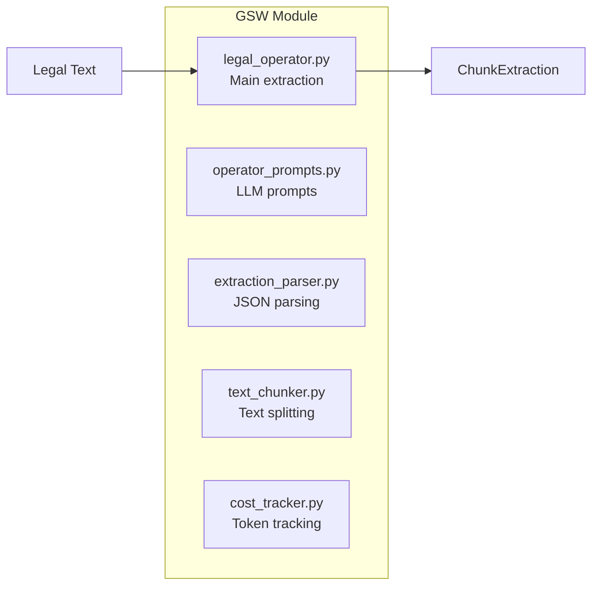
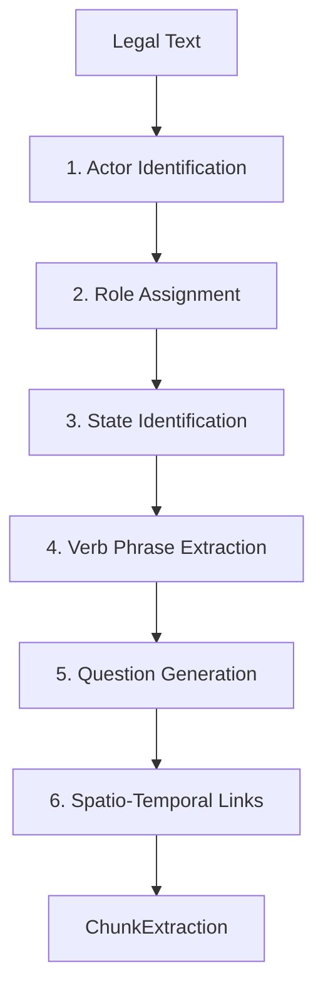
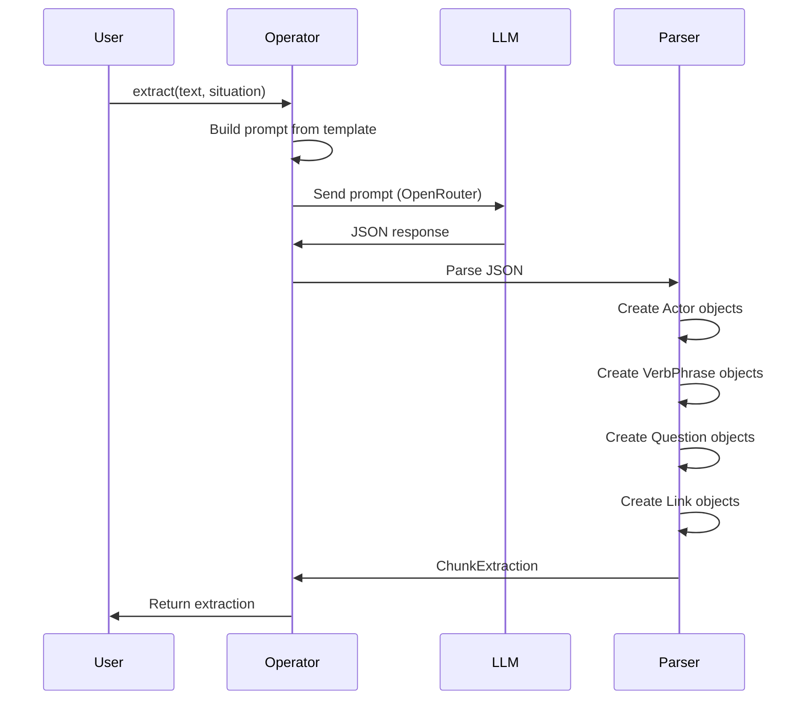

# Backend: GSW Module

The **Global Semantic Workspace (GSW)** module implements actor-centric memory extraction from legal documents.

## Overview

**Location**: `src/gsw/`



## Files

| File | Purpose | Lines |
|------|---------|-------|
| `legal_operator.py` | Main LegalOperator class | 353 |
| `operator_prompts.py` | System/user prompts for LLM | ~200 |
| `extraction_parser.py` | Parse JSON to schema objects | ~150 |
| `text_chunker.py` | Split text into processable chunks | ~100 |
| `cost_tracker.py` | Track API token usage | ~80 |

---

## LegalOperator Class

**File**: `src/gsw/legal_operator.py`

### Initialization

```python
from src.gsw.legal_operator import LegalOperator

operator = LegalOperator(
    model="google/gemini-2.5-flash",
    api_key=None,  # Uses env OPENROUTER_API_KEY
    use_openrouter=True
)
```

### 6-Task Extraction Pipeline

The operator extracts 6 types of structured information:



### Core Method: `extract()`

```python
def extract(
    self,
    text: str,
    situation: str = "",
    background_context: str = "",
    ontology_context: Optional[OntologyContext] = None,
    chunk_id: Optional[str] = None,
    document_id: str = ""
) -> ChunkExtraction:
    """
    Extract structured information from legal text.

    Args:
        text: The legal text to process
        situation: Brief description (e.g., "Family law dispute")
        background_context: Surrounding context
        ontology_context: Known vocabulary for consistency
        chunk_id: Unique identifier for this chunk
        document_id: Source document ID

    Returns:
        ChunkExtraction with actors, verbs, questions, links
    """
```

### Usage Example

```python
from src.gsw.legal_operator import LegalOperator
from src.logic.gsw_schema import ChunkExtraction

# Initialize
operator = LegalOperator()

# Extract from text
text = """
In the matter of Smith & Smith [2023] FamCA 123,
the Applicant (John Smith) seeks property settlement
following separation from the Respondent (Jane Smith)
after 15 years of marriage. The parties have two children.
"""

extraction: ChunkExtraction = operator.extract(
    text=text,
    situation="Family law property settlement",
    document_id="smith_v_smith_2023"
)

# Access extracted data
print(f"Actors: {[a.name for a in extraction.actors]}")
print(f"Questions: {[q.question_text for q in extraction.questions]}")
```

---

## Extracted Data Structures

### Actor

```python
@dataclass
class Actor:
    id: str                    # Unique identifier
    name: str                  # "John Smith"
    actor_type: ActorType      # PERSON, ASSET, DATE, INSTITUTION
    aliases: List[str]         # ["Applicant", "Husband"]
    roles: List[str]           # ["applicant", "father"]
    states: List[State]        # Current/historical states
    source_chunk_id: str       # Origin chunk
```

### State

```python
@dataclass
class State:
    state_type: str            # "MARITAL_STATUS"
    value: str                 # "separated"
    temporal_marker: str       # "2020"
    source_chunk_id: str
```

### VerbPhrase

```python
@dataclass
class VerbPhrase:
    id: str
    verb: str                  # "seeks"
    subject_actor_id: str      # Reference to Actor
    object_actor_id: str       # Reference to Actor
    temporal_context: str      # "following separation"
```

### PredictiveQuestion

```python
@dataclass
class PredictiveQuestion:
    id: str
    question_text: str         # "What property is subject to settlement?"
    question_type: QuestionType  # FACTUAL, PROCEDURAL, PRECEDENT
    relevant_actor_ids: List[str]
    answer_summary: str        # Brief answer from text
```

### SpatioTemporalLink

```python
@dataclass
class SpatioTemporalLink:
    id: str
    actor_id: str
    link_type: LinkType        # TEMPORAL, SPATIAL, CAUSAL
    target_id: str
    relationship: str          # "married_to"
    temporal_marker: str       # "2008-2023"
```

---

## Extraction Flow Diagram



---

## JSON Response Format

The LLM returns structured JSON:

```json
{
  "situation_summary": "Family law property settlement dispute",
  "actors": [
    {
      "name": "John Smith",
      "type": "PERSON",
      "aliases": ["Applicant", "Husband"],
      "roles": ["applicant", "father"],
      "states": [
        {"type": "MARITAL_STATUS", "value": "separated", "when": "2020"}
      ]
    },
    {
      "name": "Jane Smith",
      "type": "PERSON",
      "aliases": ["Respondent", "Wife"],
      "roles": ["respondent", "mother"]
    }
  ],
  "verb_phrases": [
    {
      "verb": "seeks",
      "subject": "John Smith",
      "object": "property settlement",
      "context": "following separation"
    }
  ],
  "questions": [
    {
      "text": "What property is subject to settlement?",
      "type": "FACTUAL",
      "actors": ["John Smith", "Jane Smith"],
      "answer": "Family home and superannuation"
    }
  ],
  "spatio_temporal_links": [
    {
      "actor": "John Smith",
      "type": "TEMPORAL",
      "target": "Jane Smith",
      "relationship": "married_to",
      "when": "2008-2023"
    }
  ]
}
```

---

## Error Handling

```python
def _repair_json(self, text: str) -> str:
    """Attempt to repair common JSON issues from LLM output."""
    # Remove trailing commas
    text = re.sub(r',(\s*[}\]])', r'\1', text)
    # Fix unescaped newlines
    text = re.sub(r'(?<!\\)\n(?=.*")', '\\n', text)
    # Close truncated responses
    open_braces = text.count('{') - text.count('}')
    if open_braces > 0:
        text += '}' * open_braces
    return text
```

---

## Self-Correction (Reflexion)

```python
def review_extraction(
    self,
    extraction: ChunkExtraction,
    original_text: str
) -> ChunkExtraction:
    """
    Review and improve extraction accuracy.

    Checks:
    1. Are all parties identified?
    2. Are all dates captured?
    3. Are key assets identified?
    4. Are relationships tracked?
    """
```

---

## Dependencies

```python
from src.logic.gsw_schema import (
    Actor, ActorType, State, VerbPhrase,
    PredictiveQuestion, SpatioTemporalLink,
    ChunkExtraction, OntologyContext
)
```

---

## TOON Integration

The GSW module uses **TOON (Token-Oriented Object Notation)** for efficient LLM context injection.

**File**: `src/utils/toon.py`

### Context Encoding

```python
from src.utils.toon import ToonEncoder

# Encode workspace for LLM context (40% fewer tokens)
toon_context = ToonEncoder.encode_workspace(workspace)

# Or encode specific entities
toon_actors = ToonEncoder.encode_actors(actors_list)
toon_summary = ToonEncoder.encode_context_summary(workspace)
```

### Entity Reconciliation with TOON

```python
from src.gsw.legal_reconciler import LegalReconciler

reconciler = LegalReconciler(use_toon=True)  # Enable TOON encoding
result = reconciler.reconcile(existing_actors, new_actors)
```

### Performance Impact

| Operation | JSON Tokens | TOON Tokens | Reduction |
|-----------|-------------|-------------|-----------|
| Full workspace | 2,500 | 1,500 | 40% |
| Actor list (10) | 450 | 270 | 40% |
| Questions (5) | 260 | 155 | 40% |

See [TOON-Format](TOON-Format) for complete format documentation.

---

## Related Pages

- [GSW-Global-Semantic-Workspace](GSW-Global-Semantic-Workspace) - Conceptual overview
- [Data-Schemas](Data-Schemas) - Complete schema reference
- [Backend-Ingestion-Module](Backend-Ingestion-Module) - Bulk processing
- [TOON-Format](TOON-Format) - TOON format specification
