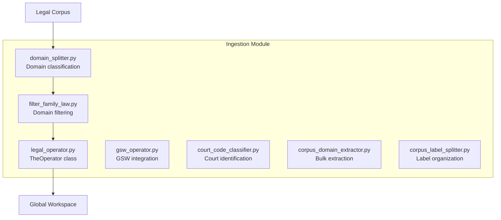
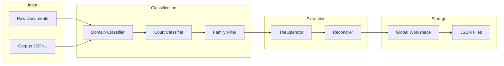
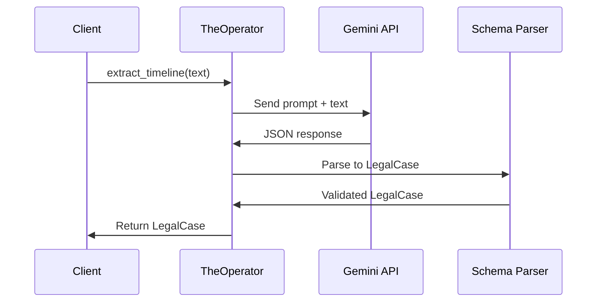
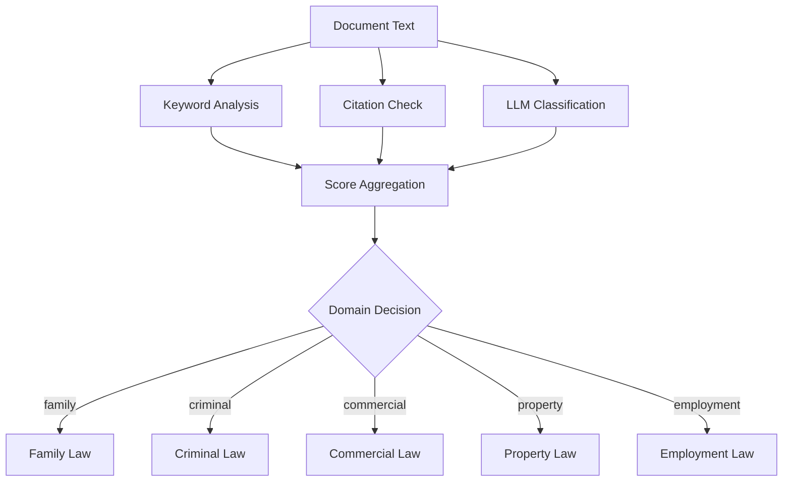
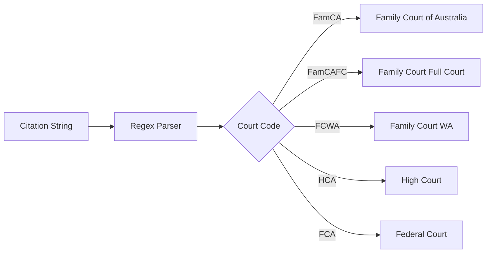
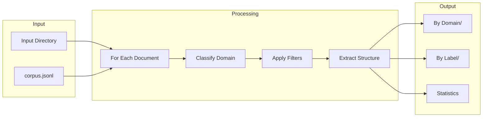
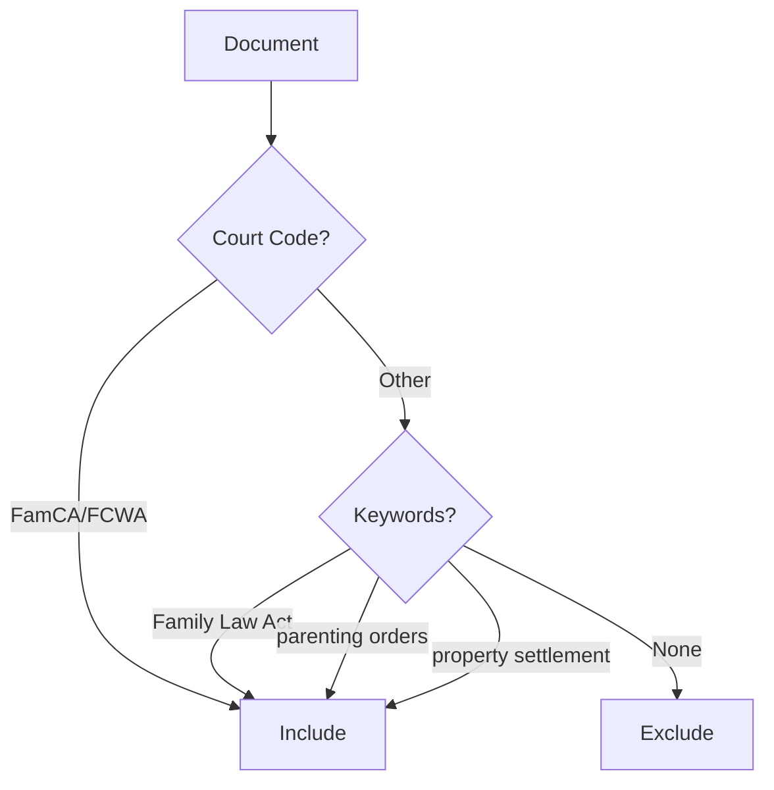
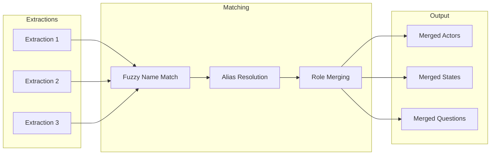
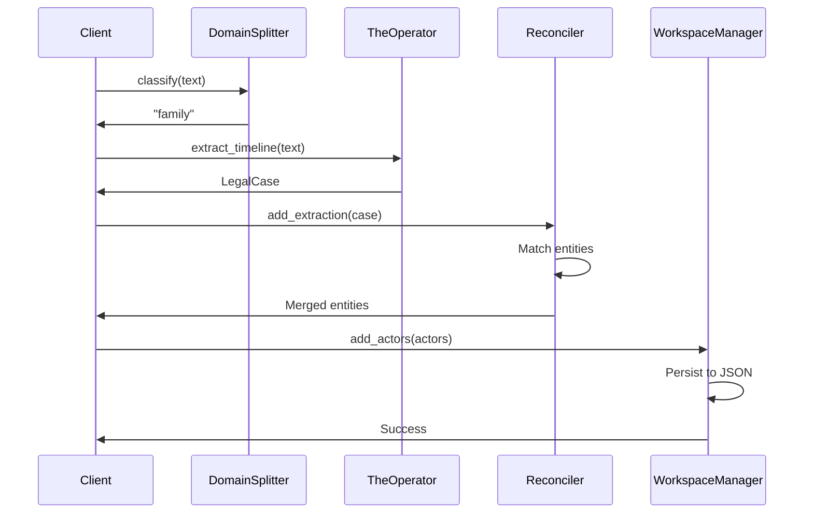

# Backend: Ingestion Module

The **Ingestion Module** handles bulk document processing, domain classification, and corpus management.

## Overview

**Location**: `src/ingestion/`



---

## Ingestion Pipeline



---

## Files

| File | Purpose | Lines |
|------|---------|-------|
| `legal_operator.py` | Core extraction using Gemini | ~80 |
| `gsw_operator.py` | GSW-specific operator | ~150 |
| `domain_splitter.py` | Split corpus by legal domain | ~200 |
| `filter_family_law.py` | Filter Family Law documents | ~100 |
| `court_code_classifier.py` | Identify court/jurisdiction | ~150 |
| `corpus_domain_extractor.py` | Batch domain extraction | ~180 |
| `corpus_label_splitter.py` | Organize by labels | ~120 |
| `classification_config.py` | Classification settings | ~50 |
| `prompts.py` | LLM prompts for classification | ~100 |
| `reconciler.py` | Entity reconciliation | ~200 |

---

## TheOperator Class

**File**: `src/ingestion/legal_operator.py`

The Operator is the "Episodic Legal Observer" that extracts structured data from legal text.



### Usage Example

```python
from src.ingestion.legal_operator import TheOperator

# Initialize operator
operator = TheOperator(api_key="your_google_api_key")

# Extract timeline from text
case = await operator.extract_timeline(legal_text)

if case:
    print(f"Title: {case.title}")
    print(f"Persons: {[p.name for p in case.persons]}")
    print(f"Timeline: {len(case.timeline)} events")
```

### Extraction Output

```python
LegalCase:
    case_id: str
    title: str
    persons: List[Person]      # Parties, judges, witnesses
    objects: List[Object]      # Assets, properties
    timeline: List[Event]      # Chronological events
    states: List[State]        # Conditions over time
    outcomes: List[Outcome]    # Case results
```

---

## Domain Classification

### Classification Flow



### Domain Splitter

**File**: `src/ingestion/domain_splitter.py`

```python
from src.ingestion.domain_splitter import DomainSplitter

splitter = DomainSplitter()
domain = splitter.classify(document_text)
# Returns: "family", "criminal", "commercial", etc.
```

### Supported Domains

| Domain | Description | Keywords |
|--------|-------------|----------|
| `family` | Family Law | divorce, custody, property settlement |
| `criminal` | Criminal Law | prosecution, sentence, offence |
| `commercial` | Commercial Law | contract, corporation, trade |
| `property` | Property Law | land, title, easement |
| `employment` | Employment Law | dismissal, award, workplace |

---

## Court Code Classifier

**File**: `src/ingestion/court_code_classifier.py`



### Usage

```python
from src.ingestion.court_code_classifier import classify_court

result = classify_court("[2023] FamCA 123")
# Returns: {"court": "Family Court of Australia", "jurisdiction": "Federal"}
```

### Supported Courts

| Code | Court | Jurisdiction |
|------|-------|--------------|
| FamCA | Family Court of Australia | Federal |
| FamCAFC | Family Court Full Court | Federal |
| FCWA | Family Court of Western Australia | State |
| HCA | High Court of Australia | Federal |
| FCA | Federal Court of Australia | Federal |

---

## Corpus Processing

### Bulk Processing Pipeline



### Bulk Domain Extraction

**File**: `src/ingestion/corpus_domain_extractor.py`

```python
from src.ingestion.corpus_domain_extractor import process_corpus

# Process all documents in directory
results = process_corpus(
    input_dir="data/raw_corpus",
    output_dir="data/classified",
    domain_filter="family"
)

print(f"Processed: {results['total']}")
print(f"Family Law: {results['family']}")
```

### Label Organization

**File**: `src/ingestion/corpus_label_splitter.py`

```python
from src.ingestion.corpus_label_splitter import organize_by_labels

organize_by_labels(
    input_jsonl="data/extractions.jsonl",
    output_dir="data/by_label"
)
# Creates: data/by_label/parenting/, data/by_label/property/, etc.
```

---

## Family Law Filter

**File**: `src/ingestion/filter_family_law.py`



### Usage

```python
from src.ingestion.filter_family_law import filter_family_law

# Filter JSONL file
filtered = filter_family_law(
    input_path="data/corpus.jsonl",
    output_path="data/family_law_corpus.jsonl"
)

print(f"Family Law documents: {filtered}")
```

### Filter Criteria

- **Court codes**: FamCA, FamCAFC, FCWA
- **Keywords**: "Family Law Act", "parenting orders", "property settlement"
- **Case types**: parenting, property, divorce, maintenance

---

## Reconciliation

**File**: `src/ingestion/reconciler.py`



### Usage

```python
from src.ingestion.reconciler import EntityReconciler

reconciler = EntityReconciler()

# Add extractions
reconciler.add_extraction(extraction1)
reconciler.add_extraction(extraction2)

# Get merged entities
merged_actors = reconciler.get_merged_actors()
```

### Reconciliation Rules

| Step | Operation | Description |
|------|-----------|-------------|
| 1 | Name matching | Fuzzy match on actor names |
| 2 | Alias resolution | Map aliases to canonical names |
| 3 | Role merging | Combine roles from multiple sources |
| 4 | Timeline ordering | Sort states chronologically |

---

## Configuration

**File**: `src/ingestion/classification_config.py`

```python
CLASSIFICATION_CONFIG = {
    "model": "gemini-2.0-flash",
    "temperature": 0.1,
    "max_tokens": 2048,
    "domains": ["family", "criminal", "commercial", "property"],
    "confidence_threshold": 0.8
}
```

---

## Full Pipeline Example



### Code Example

```python
import asyncio
from pathlib import Path
from src.ingestion.legal_operator import TheOperator
from src.ingestion.domain_splitter import DomainSplitter
from src.gsw.workspace import WorkspaceManager

async def ingest_document(text: str, workspace_path: Path):
    # 1. Classify domain
    splitter = DomainSplitter()
    domain = splitter.classify(text)

    if domain != "family":
        return None

    # 2. Extract structure
    operator = TheOperator()
    case = await operator.extract_timeline(text)

    if not case:
        return None

    # 3. Add to workspace
    manager = WorkspaceManager.load(workspace_path)
    # ... add actors, states, etc.
    manager.save()

    return case

# Run
asyncio.run(ingest_document(text, Path("data/workspace.json")))
```

---

## Performance

| Operation | Speed | Notes |
|-----------|-------|-------|
| Domain classification | 0.5s | Per document |
| Court code extraction | 0.1s | Regex-based |
| Timeline extraction | 2-3s | LLM call |
| Reconciliation | 0.1s | Per 100 entities |
| Bulk processing | ~1000/hr | With rate limiting |

---

## Related Pages

- [Backend-GSW-Module](Backend-GSW-Module) - Extraction details
- [Data-Flow](Data-Flow) - System data flow
- [Data-Schemas](Data-Schemas) - Schema definitions
- [Development-Guide](Development-Guide) - Setup instructions
