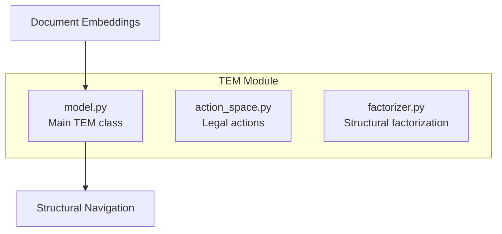
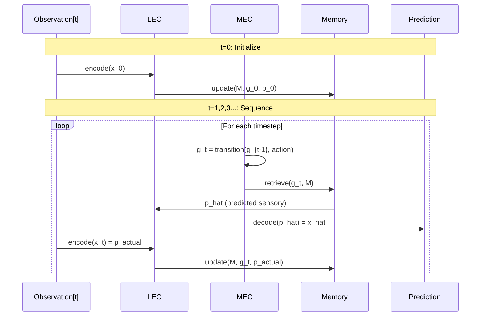

# Backend: TEM Module

The **Tolman-Eichenbaum Machine (TEM)** module implements navigation-based neural architecture for legal graph traversal.

## Overview

**Location**: `src/tem/`
**Based on**: Whittington et al. (2020) - "The Tolman-Eichenbaum Machine"



## Core Concept

TEM separates **WHAT** (sensory content) from **WHERE** (structural position):

| Component | Brain Region | Function |
|-----------|--------------|----------|
| MEC | Medial Entorhinal Cortex | Grid cells - structural position |
| LEC | Lateral Entorhinal Cortex | Sensory encoding |
| Hippocampus | CA3/CA1 | Memory binding |

---

## TolmanEichenbaumMachine Class

**File**: `src/tem/model.py`

```python
class TolmanEichenbaumMachine(nn.Module):
    def __init__(self, input_dim: int, hidden_dim: int, action_dim: int):
        super().__init__()
        self.hidden_dim = hidden_dim

        self.mec = TransitionModule(hidden_dim, action_dim)  # Grid cells
        self.lec = SensoryModule(input_dim, hidden_dim)      # Sensory
        self.memory = MemoryModule(hidden_dim)               # Hippocampus

        self.g_init = nn.Parameter(torch.randn(hidden_dim))  # Initial state
```

### Usage Example

```python
import torch
from src.tem.model import TolmanEichenbaumMachine

# Initialize TEM
tem = TolmanEichenbaumMachine(
    input_dim=768,      # Embedding dimension
    hidden_dim=256,     # Internal representation
    action_dim=10       # Number of legal actions
)

# Prepare input
observations = torch.randn(32, 5, 768)  # (batch, seq_len, embed_dim)
actions = torch.randint(0, 10, (32, 5)) # (batch, seq_len)

# Forward pass
output = tem(observations, actions)
predictions = output['predictions']  # (batch, seq_len, 768)
```

---

## Components

### TransitionModule (MEC - Grid Cells)

Models structural transitions in abstract space.

```python
class TransitionModule(nn.Module):
    def __init__(self, hidden_dim: int, action_dim: int):
        # Transition weights: [Action_Dim, Hidden, Hidden]
        self.weights = nn.Parameter(
            torch.randn(action_dim, hidden_dim, hidden_dim) * 0.01
        )
        self.bias = nn.Parameter(torch.zeros(hidden_dim))
        self.activation = nn.Tanh()

    def forward(self, g_prev: torch.Tensor, action_indices: torch.Tensor):
        """
        g_prev: (Batch, Hidden) - previous structural state
        action_indices: (Batch,) - action taken
        Returns: g_next (Batch, Hidden)
        """
        W_a = self.weights[action_indices]  # Select transition matrix
        g_next = torch.bmm(W_a, g_prev.unsqueeze(2)).squeeze(2)
        return self.activation(g_next + self.bias)
```

**Diagram:**
```mermaid
graph LR
    G_prev[g_{t-1}] --> W[W_action]
    W --> G_next[g_t]
    A[Action] --> W
```

### SensoryModule (LEC)

Encodes observations into sensory embeddings.

```python
class SensoryModule(nn.Module):
    def __init__(self, input_dim: int, hidden_dim: int):
        self.encoder = nn.Sequential(
            nn.Linear(input_dim, hidden_dim * 2),
            nn.ReLU(),
            nn.Linear(hidden_dim * 2, hidden_dim)
        )
        self.decoder = nn.Sequential(
            nn.Linear(hidden_dim, hidden_dim * 2),
            nn.ReLU(),
            nn.Linear(hidden_dim * 2, input_dim)
        )

    def encode(self, x: torch.Tensor) -> torch.Tensor:
        """Document embedding -> Sensory representation"""
        return self.encoder(x)

    def decode(self, p: torch.Tensor) -> torch.Tensor:
        """Sensory representation -> Predicted embedding"""
        return self.decoder(p)
```

### MemoryModule (Hippocampus)

Binds structural (g) and sensory (p) representations.

```python
class MemoryModule(nn.Module):
    def retrieve(self, g: torch.Tensor, M: torch.Tensor) -> torch.Tensor:
        """
        Retrieve sensory prediction from memory.
        p_hat = M * g
        """
        return torch.bmm(M, g.unsqueeze(2)).squeeze(2)

    def update(self, M: torch.Tensor, g: torch.Tensor, p: torch.Tensor,
               eta: float = 0.1) -> torch.Tensor:
        """
        Hebbian learning update.
        M_new = M + eta * (p * g^T)
        """
        update_term = torch.bmm(p.unsqueeze(2), g.unsqueeze(1))
        return M + eta * update_term
```

---

## Forward Pass



### Code Implementation

```python
def forward(self, observations: torch.Tensor, actions: torch.Tensor):
    batch_size, seq_len, _ = observations.size()

    # Initialize
    g = self.g_init.expand(batch_size, -1)
    M = torch.zeros(batch_size, self.hidden_dim, self.hidden_dim)
    predictions = []

    # First observation
    p = self.lec.encode(observations[:, 0])
    M = self.memory.update(M, g, p)
    predictions.append(self.lec.decode(p))

    # Sequence processing
    for t in range(seq_len - 1):
        # 1. Path integration
        g = self.mec(g, actions[:, t])

        # 2. Memory retrieval
        p_hat = self.memory.retrieve(g, M)
        x_hat = self.lec.decode(p_hat)
        predictions.append(x_hat)

        # 3. Update memory with actual observation
        p_actual = self.lec.encode(observations[:, t+1])
        M = self.memory.update(M, g, p_actual)

    return {'predictions': torch.stack(predictions, dim=1)}
```

---

## Legal Action Space

**File**: `src/tem/action_space.py`

```python
LEGAL_ACTIONS = [
    "APPLY_STATUTE",      # Apply Family Law Act section
    "CITE_PRECEDENT",     # Reference prior case
    "EVALUATE_EVIDENCE",  # Assess evidence strength
    "CHECK_REQUIREMENTS", # Verify legal requirements
    "TRAVERSE_TIMELINE",  # Navigate temporal sequence
    "IDENTIFY_PARTY",     # Recognize legal party
    "ASSESS_PROPERTY",    # Evaluate property division
    "CONSIDER_CHILDREN",  # Best interests assessment
    "REVIEW_FINANCES",    # Financial assessment
    "CONCLUDE"            # Final determination
]

def get_action_dim():
    return len(LEGAL_ACTIONS)
```

---

## Training

```python
# Loss function
def compute_loss(predictions, targets):
    return F.mse_loss(predictions, targets)

# Training loop
optimizer = torch.optim.Adam(tem.parameters(), lr=1e-3)

for epoch in range(epochs):
    for batch in dataloader:
        observations, actions, targets = batch

        output = tem(observations, actions)
        loss = compute_loss(output['predictions'], targets)

        optimizer.zero_grad()
        loss.backward()
        optimizer.step()
```

---

## Key Properties

| Property | Description |
|----------|-------------|
| **Zero-shot generalization** | Navigate new cases with learned structure |
| **Factorized representation** | Separate content from structure |
| **Hebbian memory** | Online learning during inference |
| **Path integration** | Navigate without sensory input |

---

## Dependencies

```python
import torch
import torch.nn as nn
import torch.nn.functional as F
from src.tem.action_space import get_action_dim
```

## Related Pages

- [Three-Layer-System](Three-Layer-System) - TEM in context
- [Backend-Agency-Module](Backend-Agency-Module) - TEM feeds into Agency
- [Architecture-Overview](Architecture-Overview) - System design
