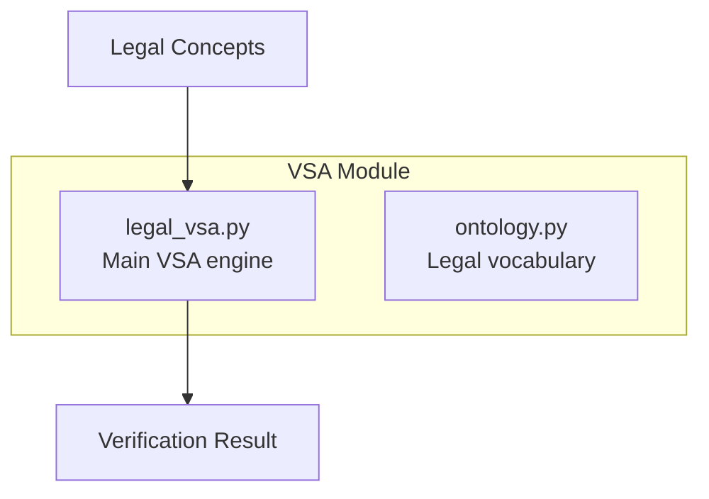
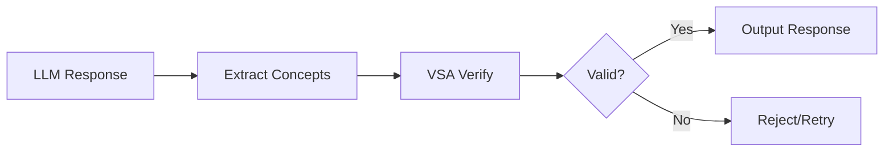

# Backend: VSA Module

The **Vector Symbolic Architecture (VSA)** module implements hyperdimensional computing for anti-hallucination verification.

## Overview

**Location**: `src/vsa/`
**Dimension**: D = 10,000 (bipolar vectors {-1, 1})



## Core Concept

VSA uses **hyperdimensional computing** to:
- Represent concepts as high-dimensional vectors
- Compose complex structures from primitives
- Verify semantic consistency
- Detect contradictions (anti-hallucination)

---

## LegalVSA Class

**File**: `src/vsa/legal_vsa.py`

```python
DIMENSION = 10000  # Hypervector dimension

class LegalVSA:
    def __init__(self, dimension: int = DIMENSION, device: str = "cpu"):
        self.dimension = dimension
        self.device = torch.device(device)
        self.memory: Dict[str, torch.Tensor] = {}  # Concept -> Vector
        self._initialize_ontology()
```

### Usage Example

```python
from src.vsa.legal_vsa import get_vsa_service

# Get singleton instance
vsa = get_vsa_service()

# Add concepts
vsa.add_concept("PROPERTY_SETTLEMENT")
vsa.add_concept("MARRIAGE")

# Verify claims
result = vsa.verify_no_hallucination([
    "PROPERTY_SETTLEMENT",
    "DIVORCE"  # Missing MARRIAGE requirement
])
print(result)
# {'valid': False, 'issues': ["'PROPERTY_SETTLEMENT' REQUIRES 'MARRIAGE'"]}
```

---

## Hyperdimensional Operations

### 1. Random Vector Generation

```python
def _generate_random_vector(self) -> torch.Tensor:
    """Generates bipolar hypervector {-1, 1}."""
    v = torch.randint(0, 2, (self.dimension,), dtype=torch.float32)
    return v * 2 - 1  # {0,1} -> {-1,1}
```

**Properties:**
- Any two random vectors are nearly orthogonal
- `sim(v1, v2) ≈ 0` for random v1, v2
- Probability of similarity > 0.1 is negligible

### 2. Binding (Composition)

```python
def bind(self, v1: torch.Tensor, v2: torch.Tensor) -> torch.Tensor:
    """Element-wise multiplication."""
    return v1 * v2
```

**Properties:**
- `bind(A, B)` is dissimilar to both A and B
- Commutative: `A * B = B * A`
- Self-inverse: `A * A = 1` (identity)
- Preserves distance: `sim(A*B, A*C) = sim(B, C)`

**Use case:** Create "role-filler" bindings
```python
# "HUSBAND" bound to "John"
husband_john = vsa.bind(
    vsa.get_vector("HUSBAND"),
    vsa.get_vector("JOHN")
)
```

### 3. Bundling (Superposition)

```python
def bundle(self, vectors: List[torch.Tensor]) -> torch.Tensor:
    """Sum + sign (majority rule)."""
    sum_vec = torch.stack(vectors).sum(dim=0)
    return torch.sign(sum_vec)
```

**Properties:**
- Result is similar to ALL inputs
- Represents set membership
- Order-independent

**Use case:** Create composite records
```python
# Family case = bundle of all parties
case_vector = vsa.bundle([
    vsa.get_vector("HUSBAND"),
    vsa.get_vector("WIFE"),
    vsa.get_vector("CHILDREN"),
    vsa.get_vector("PROPERTY")
])
```

### 4. Permutation (Sequence)

```python
def permute(self, v: torch.Tensor, shifts: int = 1) -> torch.Tensor:
    """Cyclic shift for encoding order."""
    return torch.roll(v, shifts=shifts, dims=0)
```

**Properties:**
- `permute(A)` is dissimilar to A
- Used for encoding sequences/order
- `permute^n(A)` cycles back after D shifts

**Use case:** Encode timeline
```python
# Timeline: married -> separated -> divorced
timeline = vsa.bundle([
    vsa.permute(vsa.get_vector("MARRIED"), 0),
    vsa.permute(vsa.get_vector("SEPARATED"), 1),
    vsa.permute(vsa.get_vector("DIVORCED"), 2)
])
```

---

## Similarity Measurement

```python
def similarity(self, v1: torch.Tensor, v2: torch.Tensor) -> float:
    """Cosine similarity (dot product / D for bipolar)."""
    return torch.dot(v1, v2).item() / self.dimension
```

**Interpretation:**
- `sim ≈ 1.0`: Same concept
- `sim ≈ 0.0`: Unrelated concepts
- `sim ≈ -1.0`: Inverted concept

### Cleanup (Memory Retrieval)

```python
def cleanup(self, noisy_vector: torch.Tensor, threshold: float = 0.3):
    """Find closest concepts in memory."""
    results = []
    for name, vec in self.memory.items():
        sim = self.similarity(noisy_vector, vec)
        if sim > threshold:
            results.append((name, sim))
    return sorted(results, key=lambda x: x[1], reverse=True)
```

---

## Knowledge Graph Encoding

```python
def encode_graph(self, triplets: List[Tuple[str, str, str]]) -> torch.Tensor:
    """
    Encode (Subject, Relation, Object) triplets.
    Graph = Sum( S * R * O )
    """
    edges = []
    for s, r, o in triplets:
        v_s = self.get_vector(s)
        v_r = self.get_vector(r)
        v_o = self.get_vector(o)
        edges.append(self.bind(self.bind(v_s, v_r), v_o))
    return self.bundle(edges)
```

**Example:**
```python
triplets = [
    ("JOHN", "MARRIED_TO", "JANE"),
    ("JOHN", "FATHER_OF", "CHILD1"),
    ("FAMILY_HOME", "OWNED_BY", "JOHN")
]
graph_vector = vsa.encode_graph(triplets)
```

---

## Anti-Hallucination Verification

**File**: `src/vsa/ontology.py`

```python
LOGIC_RULES = [
    # Requirements
    ("PROPERTY_SETTLEMENT", "REQUIRES", "MARRIAGE"),
    ("DIVORCE", "REQUIRES", "12_MONTH_SEPARATION"),
    ("SPOUSAL_MAINTENANCE", "REQUIRES", "FINANCIAL_NEED"),

    # Contradictions
    ("SOLE_CUSTODY", "CONTRADICTS", "JOINT_CUSTODY"),
    ("MARRIED", "CONTRADICTS", "DIVORCED"),
    ("RECONCILED", "CONTRADICTS", "SEPARATED"),
]
```

### Verification Logic

```python
def verify_no_hallucination(self, statement_concepts: List[str]) -> Dict:
    """Check consistency against logic rules."""
    issues = []
    present = set(statement_concepts)

    for subj, rel, obj in LOGIC_RULES:
        if rel == "REQUIRES":
            # If A requires B, and we have A, must have B
            if subj in present and obj not in present:
                issues.append(
                    f"Logic Violation: '{subj}' REQUIRES '{obj}', but missing"
                )

        if rel == "CONTRADICTS":
            # A and B cannot coexist
            if subj in present and obj in present:
                issues.append(
                    f"Contradiction: '{subj}' and '{obj}' cannot coexist"
                )

    return {
        "valid": len(issues) == 0,
        "issues": issues,
        "confidence": 1.0 if len(issues) == 0 else 0.5
    }
```

### Usage in Pipeline



---

## Ontology Initialization

```python
def _initialize_ontology(self):
    """Pre-generate vectors for all legal terms."""
    tokens = get_all_tokens()  # From ontology.py
    for token in tokens:
        self.add_concept(token)
```

**Legal Ontology Categories:**
- Party types (APPLICANT, RESPONDENT, CHILD)
- Relationship states (MARRIED, SEPARATED, DIVORCED)
- Legal concepts (PROPERTY_SETTLEMENT, CUSTODY)
- Temporal markers (DATE, DURATION, TIMELINE)
- Evidence types (DOCUMENT, TESTIMONY, FINANCIAL_RECORD)

---

## Performance Characteristics

| Operation | Complexity | Notes |
|-----------|------------|-------|
| Bind | O(D) | Element-wise multiply |
| Bundle | O(N*D) | Sum + sign |
| Similarity | O(D) | Dot product |
| Cleanup | O(M*D) | M = memory size |

Where D = 10,000 and typical M < 10,000

---

## Singleton Pattern

```python
_vsa_instance = None

def get_vsa_service() -> LegalVSA:
    """Get or create singleton VSA instance."""
    global _vsa_instance
    if _vsa_instance is None:
        _vsa_instance = LegalVSA()
    return _vsa_instance
```

---

## Dependencies

```python
import torch
import numpy as np
from src.vsa.ontology import get_all_tokens, LOGIC_RULES
```

## Related Pages

- [Three-Layer-System](Three-Layer-System) - VSA in context
- [Glossary](Glossary) - Legal terminology
- [Data-Schemas](Data-Schemas) - Schema definitions
