# Backend: Validation Module

The **Validation Module** provides statutory RAG (Retrieval-Augmented Generation) validation for legal extractions against authoritative statutory corpus.

## Overview

**Location**: `src/validation/`

```mermaid
flowchart TB
    subgraph SRV["Statutory RAG Validator"]
        CORPUS["Statutory Corpus (JSON)<br/>• Family Law<br/>• Evidence Acts<br/>• Marriage Act"]

        CL["CorpusLoader<br/>• Load acts<br/>• Index sections<br/>• Search by text<br/>• Search by tags"]

        VAL["StatutoryRAGValidator<br/>1. Extract claims from input<br/>2. Retrieve relevant statutes<br/>3. Check compliance<br/>4. Detect conflicts<br/>5. Generate recommendations"]

        RESULT["ValidationResult<br/>• Compliance score (0.0-1.0)<br/>• Supporting citations<br/>• Conflicts list<br/>• Recommendations"]
    end

    CORPUS --> CL
    CL --> VAL
    VAL --> RESULT
```



## Files

| File | Purpose | Lines |
|------|---------|-------|
| `statutory_rag.py` | Main validator with RAG retrieval | ~545 |
| `corpus_loader.py` | Loads and indexes statutory JSON | ~294 |
| `__init__.py` | Module exports | ~10 |

---

## StatutoryRAGValidator Class

**File**: `src/validation/statutory_rag.py`

### Initialization

```python
from src.validation.statutory_rag import StatutoryRAGValidator

# Initialize with default corpus path
validator = StatutoryRAGValidator(
    corpus_path="data/statutory_corpus"
)

# The validator automatically:
# 1. Loads all JSON files from corpus_path
# 2. Builds search indices
# 3. Prepares for validation
```

### Core Method: `validate_extraction()`

```python
def validate_extraction(
    self,
    extraction: dict,
    context: str = ""
) -> ValidationResult:
    """
    Validate a legal extraction against statutory corpus.

    Args:
        extraction: Dictionary containing the extraction to validate
        context: Optional additional context

    Returns:
        ValidationResult with compliance score, citations, and recommendations
    """
```

### Usage Example

```python
from src.validation.statutory_rag import StatutoryRAGValidator

# Initialize validator
validator = StatutoryRAGValidator(
    corpus_path="data/statutory_corpus"
)

# Example extraction to validate
extraction = {
    "text": "The court considers best interests of the child",
    "legal_test": "Best interests test under s60CC",
    "requirements": [
        "Primary consideration: benefit of meaningful relationship with both parents",
        "Need to protect from harm",
        "Child's views",
        "Nature of relationship with each parent"
    ]
}

# Validate
result = validator.validate_extraction(extraction)

# Check results
print(f"Valid: {result.is_valid}")
print(f"Compliance Score: {result.compliance_score:.2f}")
print(f"\nSupporting Citations ({len(result.supporting_citations)}):")
for citation in result.supporting_citations:
    print(f"  • {citation}")

if result.conflicts:
    print(f"\nConflicts ({len(result.conflicts)}):")
    for conflict in result.conflicts:
        print(f"  ⚠️  {conflict}")

print(f"\nRecommendations ({len(result.recommendations)}):")
for rec in result.recommendations:
    print(f"  → {rec}")
```

---

## ValidationResult Structure

```python
@dataclass
class ValidationResult:
    """Results of statutory validation."""
    is_valid: bool                                    # Overall validity
    compliance_score: float                           # 0.0 to 1.0
    supporting_citations: List[StatutoryReference]    # Supporting statutes
    conflicts: List[str]                              # Detected conflicts
    recommendations: List[str]                        # Improvement suggestions

    def __str__(self) -> str:
        status = "VALID" if self.is_valid else "INVALID"
        return (
            f"Validation Result: {status}\n"
            f"Compliance Score: {self.compliance_score:.2f}\n"
            f"Supporting Citations: {len(self.supporting_citations)}\n"
            f"Conflicts: {len(self.conflicts)}\n"
            f"Recommendations: {len(self.recommendations)}"
        )
```

### StatutoryReference Structure

```python
@dataclass
class StatutoryReference:
    """Reference to a statutory provision."""
    act_name: str              # "Family Law Act 1975"
    section: str               # "60CC"
    subsection: Optional[str]  # "2" (if applicable)
    content: str               # Text content of provision
    url: str                   # URL to legislation

    def __str__(self) -> str:
        ref = f"{self.act_name} s{self.section}"
        if self.subsection:
            ref += f"({self.subsection})"
        return ref
```

---

## Compliance Scoring Explanation

The compliance score (0.0 to 1.0) is calculated based on:

### 1. Term Overlap Analysis

```
For each claim in extraction:
  For each statute in corpus:
    - Extract terms from claim
    - Extract terms from statute
    - Calculate overlap ratio = |intersection| / |claim_terms|
    - Select best match score

  Aggregate best scores across all claims
```

### 2. Required Elements Check

```
If statute has required_elements:
  For each required element:
    Check if element keywords present in claims
    element_score = found_elements / total_elements

  Combined score = (term_overlap + element_score) / 2
```

### 3. Final Calculation

```
compliance_score = sum(best_match_scores) / num_claims

Interpretation:
  ≥ 0.80: Excellent compliance
  0.60-0.79: Good compliance
  0.40-0.59: Moderate compliance
  0.20-0.39: Low compliance
  < 0.20: Poor compliance

is_valid = compliance_score >= 0.6 AND no_conflicts
```

---

## CorpusLoader Class

**File**: `src/validation/corpus_loader.py`

### Initialization

```python
from src.validation.corpus_loader import CorpusLoader

# Load corpus from directory
loader = CorpusLoader(corpus_dir="data/statutory_corpus")

# The loader automatically:
# 1. Loads all *.json files
# 2. Builds section index
# 3. Builds keyword index
```

### Search Methods

#### Search by Section Number

```python
# Get specific section
section = loader.get_section(
    section_number="60CC",
    act_name="Family Law Act 1975"  # Optional filter
)

if section:
    print(f"Section: {section['section']}")
    print(f"Title: {section['title']}")
    print(f"Summary: {section['summary']}")
```

#### Search by Keyword

```python
# Find sections by keyword
results = loader.search_by_keyword(
    keyword="parenting",
    top_k=5
)

for result in results:
    print(f"{result['act_name']} s{result['section']}")
    print(f"  {result['title']}")
```

#### Search by Text Content

```python
# Semantic text search
query = "best interests of the child"
results = loader.search_by_text(
    query=query,
    top_k=5
)

for result in results:
    print(f"Relevance: {result['relevance_score']:.2f}")
    print(f"Citation: {result['act_name']} s{result['section']}")
    print(f"Content: {result['summary'][:200]}...")
```

#### Get Related Provisions

```python
# Find related sections
related = loader.get_related_provisions(
    section_number="60CC",
    act_name="Family Law Act 1975"
)

for provision in related:
    print(f"{provision['act_name']} s{provision['section']}")
    print(f"  Keyword overlap: {provision['keyword_overlap']}")
```

---

## How to Add New Statutory Sources

### 1. Create JSON File

Create a new JSON file in `data/statutory_corpus/`:

```json
{
  "act": {
    "name": "Evidence Act 1995",
    "citation": "Evidence Act 1995 (Cth)",
    "jurisdiction": "Commonwealth",
    "url": "https://www.legislation.gov.au/Details/C2022C00361",
    "year": 1995
  },
  "sections": [
    {
      "section": "55",
      "subsection": "1",
      "title": "Relevant evidence",
      "summary": "Evidence that is relevant in a proceeding is evidence that, if it were accepted, could rationally affect (directly or indirectly) the assessment of the probability of the existence of a fact in issue in the proceeding.",
      "legal_test": "Relevance test",
      "keywords": [
        "relevant",
        "evidence",
        "admissible",
        "fact in issue",
        "probative value"
      ],
      "required_elements": [
        {
          "element": "Rational effect on assessment",
          "keywords": ["rationally affect", "probability", "assessment"]
        },
        {
          "element": "Fact in issue",
          "keywords": ["fact in issue", "proceeding"]
        }
      ],
      "threshold": 1.0,
      "minimum_elements": 2
    }
  ]
}
```

### 2. JSON Schema Structure

```javascript
{
  "act": {
    "name": string,           // Full name of the act
    "citation": string,       // Official citation
    "jurisdiction": string,   // Commonwealth/State
    "url": string,           // Link to full text
    "year": number           // Year enacted
  },
  "sections": [
    {
      "section": string,              // Section number
      "subsection": string | null,    // Subsection (optional)
      "title": string,                // Section title
      "summary": string,              // Plain language summary
      "legal_test": string,           // Name of legal test
      "keywords": string[],           // Search keywords

      // Optional: For compliance checking
      "required_elements": [
        {
          "element": string,          // Element name
          "keywords": string[]        // Keywords to detect
        }
      ],
      "threshold": number,            // Min score (0.0-1.0)
      "minimum_elements": number      // Min required elements
    }
  ]
}
```

### 3. Reload Validator

```python
# The validator will automatically load new files
validator = StatutoryRAGValidator(
    corpus_path="data/statutory_corpus"
)

# Verify loading
loader = validator.corpus_loader
print(f"Loaded {len(loader.acts)} acts")
print(f"Indexed {len(loader.section_index)} sections")

# Test new section
section = loader.get_section("55", "Evidence Act 1995")
if section:
    print(f"Successfully loaded: {section['title']}")
```

---

## Validation Flow Diagram

```mermaid
flowchart TB
    INPUT["Extraction Input"]

    EXTRACT["Extract Claims<br/>• Text fields<br/>• Requirements<br/>• Findings<br/>• Legal tests"]

    RETRIEVE["Retrieve Statutes<br/>• Search by text<br/>• Search by keywords<br/>• Rank by relevance"]

    COMPLY["Check Compliance<br/>• Term overlap analysis<br/>• Required elements check<br/>• Calculate score"]

    CONFLICTS["Detect Conflicts<br/>• Missing elements<br/>• Contradictions<br/>• Threshold violations"]

    RECOMMEND["Generate Recommendations<br/>• Address missing items<br/>• Resolve conflicts<br/>• Improve compliance"]

    RESULT["Return ValidationResult<br/>• is_valid<br/>• compliance_score<br/>• citations<br/>• conflicts<br/>• recommendations"]

    INPUT --> EXTRACT
    EXTRACT --> RETRIEVE
    RETRIEVE --> COMPLY
    COMPLY --> CONFLICTS
    CONFLICTS --> RECOMMEND
    RECOMMEND --> RESULT
```



---

## Complete Example

```python
"""Complete validation workflow example."""
from src.validation.statutory_rag import StatutoryRAGValidator, ValidationResult

# Initialize
validator = StatutoryRAGValidator(
    corpus_path="data/statutory_corpus"
)

# Example: Validate parenting order extraction
extraction = {
    "conclusion": "Parenting orders granted",
    "legal_test": "Best interests of the child (s60CC)",
    "requirements": [
        "Benefit of meaningful relationship with parents",
        "Protection from harm",
        "Child's views considered",
        "Nature of relationship with each parent",
        "Willingness to facilitate relationship"
    ],
    "findings": [
        "Child is 8 years old, views were obtained",
        "Both parents capable of caring for child",
        "No history of family violence",
        "Mother primary carer during marriage"
    ]
}

# Validate
result: ValidationResult = validator.validate_extraction(extraction)

# Display detailed results
print("=" * 60)
print("STATUTORY VALIDATION REPORT")
print("=" * 60)

print(f"\nStatus: {'✅ VALID' if result.is_valid else '❌ INVALID'}")
print(f"Compliance Score: {result.compliance_score:.2%}")

print(f"\n{'='*60}")
print(f"SUPPORTING STATUTORY CITATIONS ({len(result.supporting_citations)})")
print(f"{'='*60}")
for citation in result.supporting_citations:
    print(f"\n📋 {citation}")
    print(f"   Content: {citation.content[:150]}...")

if result.conflicts:
    print(f"\n{'='*60}")
    print(f"CONFLICTS DETECTED ({len(result.conflicts)})")
    print(f"{'='*60}")
    for i, conflict in enumerate(result.conflicts, 1):
        print(f"\n{i}. ⚠️  {conflict}")

print(f"\n{'='*60}")
print(f"RECOMMENDATIONS ({len(result.recommendations)})")
print(f"{'='*60}")
for i, rec in enumerate(result.recommendations, 1):
    print(f"\n{i}. → {rec}")

print("\n" + "=" * 60)
```

---

## Related Pages

- [Backend-Benchmarks-Module](Backend-Benchmarks-Module) - Benchmark evaluation
- [Backend-GSW-Module](Backend-GSW-Module) - Legal operator extraction
- [Data-Schemas](Data-Schemas) - Complete schema reference
- [Backend-Evaluation-Module](Backend-Evaluation-Module) - Multi-judge evaluation
