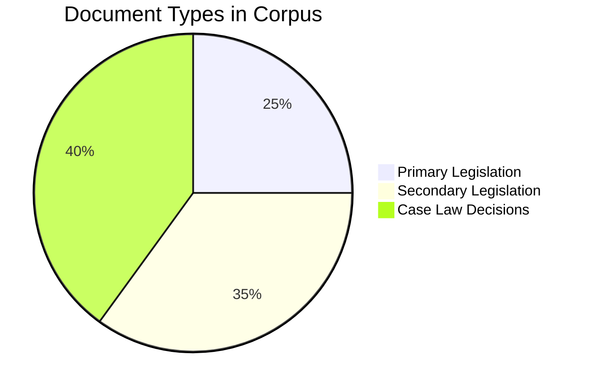
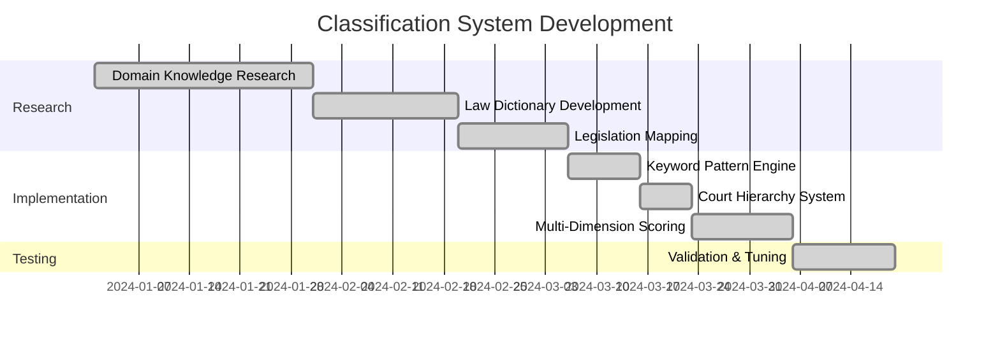

<div align="center">


# Corpus Classification Pipeline

### Step 1 of the Verridian AI Data Pipeline


*Multi-Dimensional Legal Document Classification for the Australian Legal Corpus*

---

**21 Domains** • **86 Categories** • **11,683 Keywords** • **232,560 Documents**

</div>

---

## 📋 Overview

This documentation covers **Step 1: Data Labeling** - the critical foundation that must be completed before GSW extraction. The classification system processes the **full Australian Legal Corpus** using a novel **multi-dimensional approach**:

| Dimension | Description | Scale |
|-----------|-------------|-------|
| **Keyword Patterns** | Domain-specific legal terminology | 11,683 keywords |
| **Legislation Detection** | Australian Acts mapped to domains | 133 Acts |
| **Case Citation Matching** | Landmark precedent identification | 66 cases |
| **Court Hierarchy** | Authority scoring by court level | 71 courts |
| **Temporal Tracking** | Legislative lifecycle states | 6 states |

---

## 🔄 Data Curation Phase

Before classification begins, the raw corpus undergoes curation to ensure data quality and consistency.

### Source Corpus

The Australian Legal Corpus is sourced from the **UMARV-FoE/Open-Australian-Legal-Corpus** on Hugging Face:

```bash
# Download the corpus (9.4 GB)
huggingface-cli download UMARV-FoE/Open-Australian-Legal-Corpus \
    --local-dir ./data \
    --repo-type dataset
```

### Corpus Composition



| Document Type | Description | Typical Size |
|---------------|-------------|--------------|
| **Primary Legislation** | Acts of Parliament | 10-500 KB |
| **Secondary Legislation** | Regulations, Rules, Orders | 5-100 KB |
| **Case Law Decisions** | Court judgments and rulings | 20-2000 KB |

### Data Quality Checks

Before processing, the system performs:

1. **Format Validation** - Ensure valid JSONL structure
2. **Required Fields** - Check for citation, text, type, jurisdiction
3. **Text Completeness** - Verify text content is present
4. **Encoding Consistency** - UTF-8 encoding verification
5. **Duplicate Detection** - Identify potential duplicate citations

---

## 📊 Corpus Statistics

| Metric | Value |
|--------|-------|
| **Total Size** | 9.4 GB |
| **Document Count** | 232,560+ |
| **Format** | JSONL (one document per line) |
| **Source** | [UMARV-FoE/Open-Australian-Legal-Corpus](https://huggingface.co/datasets/UMARV-FoE/Open-Australian-Legal-Corpus) |
| **Location** | `data/corpus.jsonl` |

---

## 🏗️ Classification System Development

The corpus labeling system required extensive research and development work to achieve production-quality classification. This section documents the effort invested in building the classification infrastructure.

### Development Timeline



### Research Investment Summary

| Component | Files Created | Keywords/Items | Hours Est. |
|-----------|--------------|----------------|------------|
| **Domain Knowledge Docs** | 12 markdown files | 8,926 keywords | 80+ |
| **Law Dictionaries** | 5 Python modules | 7,045+ keywords | 40+ |
| **Legislation Mapping** | 1 comprehensive file | 133 Acts | 20+ |
| **Case Law Database** | 1 comprehensive file | 66 landmark cases | 15+ |
| **Court Hierarchy** | 1 comprehensive file | 71 courts | 10+ |
| **Total** | **20+ files** | **16,000+ items** | **165+ hours** |

---

## 📚 Domain Knowledge Research

### Phase 1: Comprehensive Legal Domain Research

Extensive research was conducted across **12 major legal domains** to build comprehensive domain knowledge dictionaries:

#### Domain Knowledge Files Created

| Domain | Research File | Keywords Extracted |
|--------|--------------|-------------------|
| **Administrative Law** | `ADMINISTRATIVE_LAW_DOMAIN_KNOWLEDGE.md` | 698 |
| **Commercial Law** | `COMMERCIAL_LAW_DOMAIN_KNOWLEDGE.md` | 786 |
| **Constitutional Law** | `CONSTITUTIONAL_LAW_DOMAIN_KNOWLEDGE.md` | 422 |
| **Criminal Law** | `CRIMINAL_LAW_DOMAIN_KNOWLEDGE.md` | 1,991 |
| **Employment Law** | `EMPLOYMENT_LAW_DOMAIN_KNOWLEDGE.md` | 468 |
| **Equity Law** | `EQUITY_LAW_DOMAIN_KNOWLEDGE.md` | 574 |
| **Evidence & Procedure** | `EVIDENCE_PROCEDURE_DOMAIN_KNOWLEDGE.md` | 464 |
| **Family Law** | `FAMILY_LAW_ACT_1975_DOMAIN_KNOWLEDGE.md` | 709 |
| **Property Law** | `PROPERTY_LAW_DOMAIN_KNOWLEDGE.md` | 727 |
| **Resources & Energy** | `RESOURCES_INFRASTRUCTURE_ENERGY_LAW_DOMAIN_KNOWLEDGE.md` | 795 |
| **Tax Law** | `TAX_LAW_DOMAIN_KNOWLEDGE.md` | 465 |
| **Torts Law** | `TORTS_LAW_DOMAIN_KNOWLEDGE.md` | 827 |

**Total from MD files: 8,926 domain-specific keywords**

### Phase 2: Specialized Law Dictionary Development

Five comprehensive Python dictionary files were developed to capture specialized legal terminology:

| Dictionary File | Categories | Keywords |
|----------------|-----------|----------|
| `COMPREHENSIVE_COMMERCIAL_LAW_DICTIONARY.py` | 24 | 1,178 |
| `AUSTRALIAN_HEALTH_MEDICAL_REGULATORY_LAW_COMPREHENSIVE.py` | 12 | 3,046 |
| `AUSTRALIAN_SPECIALIZED_NICHE_LAW_DOMAINS.py` | 51 | 2,821 |
| `AUSTRALIAN_COMMERCIAL_LAW_COMPLETE_DICTIONARY.py` | - | See comprehensive |
| `resources_infrastructure_energy_law_dict.py` | - | See resources |

**Total from dictionary files: 7,045+ specialized keywords**

---

## Multi-Dimensional Classification Architecture

### Overview Diagram


### Dimension 1: Keyword Pattern Classification

**Implementation**: `src/ingestion/classification_config.py`

The keyword system provides the primary classification layer with **86 granular categories** organized into **21 broad domains**:

#### Domain Structure

| Domain | Categories | Example Keywords |
|--------|-----------|------------------|
| **Criminal** | 10 | murder, manslaughter, indictable offence, summary conviction |
| **Administrative** | 7 | judicial review, AAT, natural justice, procedural fairness |
| **Family** | 8 | parenting order, property pool, de facto, child support |
| **Commercial** | 14 | ASIC, director duties, insolvent trading, s588G |
| **Property** | 8 | Torrens title, easement, caveat, strata scheme |
| **Tax** | 8 | assessable income, CGT, GST, Part IVA |
| **Torts** | 11 | negligence, duty of care, breach, causation, damages |
| **Employment** | 7 | unfair dismissal, enterprise agreement, FWC, NES |
| **Equity** | 8 | constructive trust, estoppel, unconscionable, fiduciary |
| **Health** | 8 | AHPRA, therapeutic goods, mental health, aged care |
| **Resources** | 12 | mining lease, petroleum, water rights, renewable energy |
| **Sports** | 6 | anti-doping, ASADA, integrity, player contracts |
| **Constitutional** | 3 | s51, s109, separation of powers, federalism |
| **Procedural** | 3 | evidence, civil procedure, enforcement |
| **Competition** | 4 | cartel, market power, merger, restrictive practice |
| **Securities** | 4 | AFSL, prospectus, managed investment, market misconduct |
| **Education** | 1 | TEQSA, ESOS, VET |
| **Privacy** | 1 | APPs, data breach, health records |
| **Charities** | 1 | ACNC, NFP, DGR |
| **Media** | 1 | broadcasting, defamation, FOI |
| **Elder** | 1 | guardianship, EPOA, aged care rights |

### Dimension 2: Legislation Pattern Detection

**Implementation**: `src/ingestion/legislation_patterns.py`

500+ Australian Acts are mapped to their primary domains with section-level granularity:

```python
LEGISLATION_TO_DOMAIN = {
    'Corporations Act 2001': {
        'domain': 'Commercial',
        'subcategories': ['Corp_Governance', 'Corp_Insolvency', 'Securities_Licensing'],
        'key_sections': {
            's180': 'Corp_Governance',    # Duty of care and diligence
            's181': 'Corp_Governance',    # Duty of good faith
            's588G': 'Corp_Insolvency',   # Insolvent trading
            's1041H': 'Securities_Market_Misconduct',  # Market manipulation
        }
    },
    'Family Law Act 1975': {
        'domain': 'Family',
        'subcategories': ['Family_Parenting', 'Family_Property', 'Family_General'],
        'key_sections': {
            's60CC': 'Family_Parenting',  # Best interests
            's79': 'Family_Property',      # Property alteration
            's75(2)': 'Family_Property',   # Future needs factors
        }
    },
    # ... 500+ more Acts
}
```

**Key Legislation Coverage by Domain**:

| Domain | Key Acts Covered |
|--------|-----------------|
| **Commercial** | Corporations Act 2001, ASIC Act 2001, Competition and Consumer Act 2010, Insurance Contracts Act 1984 |
| **Family** | Family Law Act 1975, Child Support (Assessment) Act 1989, Family Law Rules 2004 |
| **Criminal** | Criminal Code Act 1995, Crimes Act (each state), Evidence Act 1995 |
| **Tax** | Income Tax Assessment Act 1997, A New Tax System (GST) Act 1999, Tax Administration Act 1953 |
| **Employment** | Fair Work Act 2009, Work Health and Safety Act 2011, Workplace Gender Equality Act 2012 |
| **Property** | Real Property Act (each state), Conveyancing Act, Strata Schemes Management Act |
| **Administrative** | Administrative Appeals Tribunal Act 1975, ADJR Act 1977, Freedom of Information Act 1982 |

### Dimension 3: Landmark Case Detection

**Implementation**: `src/ingestion/case_patterns.py`

150+ landmark Australian cases are mapped to domains with associated legal principles:

```python
LANDMARK_CASES = {
    'Donoghue v Stevenson': {
        'citation': '[1932] AC 562',
        'domain': 'Torts',
        'subcategories': ['Tort_Negligence'],
        'keywords': ['duty of care', 'neighbour principle', 'manufacturer liability'],
    },
    'Mabo v Queensland (No 2)': {
        'citation': '(1992) 175 CLR 1',
        'domain': 'Property',
        'subcategories': ['Native_Title'],
        'keywords': ['native title', 'terra nullius', 'indigenous rights'],
    },
    'Australian Broadcasting Tribunal v Bond': {
        'citation': '(1990) 170 CLR 321',
        'domain': 'Administrative',
        'subcategories': ['Admin_Judicial_Review'],
        'keywords': ['error of law', 'jurisdictional error', 'judicial review'],
    },
    # ... 150+ more landmark cases
}
```

**Case Coverage by Domain**:

| Domain | Landmark Cases | Key Examples |
|--------|---------------|--------------|
| **Administrative** | 25+ | Craig v SA, SZBEL v Minister, Kioa v West |
| **Commercial** | 30+ | ASIC v Adler, Gambotto v WCP, Salomon v Salomon |
| **Torts** | 20+ | Donoghue v Stevenson, Bolton v Stone, March v Stramare |
| **Family** | 15+ | Mallet v Mallet, Kennon v Kennon, Rice v Asplund |
| **Constitutional** | 20+ | Engineers Case, Cole v Whitfield, Kable v DPP |
| **Criminal** | 15+ | Woolmington v DPP, R v Hodge, Bunning v Cross |
| **Property** | 15+ | Mabo (No 2), Wik v Queensland, Tulk v Moxhay |

### Dimension 4: Court Hierarchy Analysis

**Implementation**: `src/ingestion/court_hierarchy.py`

50+ Australian courts are mapped with authority scores and domain specialization:

```python
COURT_CODES = {
    'HCA': {
        'name': 'High Court of Australia',
        'level': 'apex',
        'jurisdiction': 'Commonwealth',
        'binding': True,  # Binds all Australian courts
        'authority_score': 100,
    },
    'FCA': {
        'name': 'Federal Court of Australia',
        'level': 'intermediate',
        'jurisdiction': 'Commonwealth',
        'authority_score': 85,
    },
    'FamCA': {
        'name': 'Family Court of Australia',
        'level': 'specialist',
        'jurisdiction': 'Commonwealth',
        'domain_hint': 'Family',  # Specialist court domain
        'authority_score': 80,
    },
    'AAT': {
        'name': 'Administrative Appeals Tribunal',
        'level': 'tribunal',
        'jurisdiction': 'Commonwealth',
        'domain_hint': 'Administrative',
        'authority_score': 60,
    },
    # ... 50+ more courts
}
```

**Court Authority Scoring**:

| Court Level | Authority Score | Binding Precedent |
|-------------|-----------------|-------------------|
| **Apex** (HCA) | 100 | All courts |
| **Intermediate Appeals** | 85-95 | Lower courts in jurisdiction |
| **Specialist Federal** | 75-85 | Within specialty |
| **State Supreme** | 70-80 | State courts |
| **Tribunals** | 50-70 | Persuasive only |
| **Magistrates/Local** | 30-50 | None |

---

## 5-Factor Boost Scoring System

The classifier uses a weighted scoring system that combines all dimensions:

```python
def calculate_score(doc, category, enhanced_meta):
    base_score = count_keyword_matches(doc.text, category)

    # BOOST 1: Citation match (+10)
    if category_matches_citation(category, doc.citation):
        base_score += 10

    # BOOST 2: Jurisdiction alignment (+15-20)
    if jurisdiction_matches_category(doc.jurisdiction, category):
        base_score += 15  # +20 for specialist courts

    # BOOST 3: Court domain hint (+25)
    if enhanced_meta.domain_hint == category_domain:
        base_score += 25  # Strong boost for specialist court

    # BOOST 4: Legislation-based boost (+15)
    for leg_ref in enhanced_meta.legislation_refs:
        if legislation_maps_to_category(leg_ref, category):
            base_score += 15

    # BOOST 5: Case law boost (+10)
    for case_ref in enhanced_meta.case_refs:
        if case_maps_to_category(case_ref, category):
            base_score += 10

    return base_score
```

---

## Implementation Files

### Core Classification Modules

| File | Purpose | Lines |
|------|---------|-------|
| `src/ingestion/classification_config.py` | 11,683 keywords, 86 categories, 21 domains | ~6,700 |
| `src/ingestion/legislation_patterns.py` | 500+ Acts with section mapping | ~2,500 |
| `src/ingestion/case_patterns.py` | 150+ landmark cases | ~1,200 |
| `src/ingestion/court_hierarchy.py` | 50+ courts with authority scores | ~800 |
| `src/ingestion/corpus_domain_extractor.py` | Multi-dimensional classification engine | ~700 |

### Support Scripts

| File | Purpose |
|------|---------|
| `scripts/integrate_keywords.py` | Extracts and merges keywords from all sources |
| `scripts/keyword_analysis/*.py` | Analysis tools for keyword coverage |

### Research & Domain Knowledge

All research files are organized in the `law docs research/` directory:

```
law docs research/
├── dictionaries/                    # Python dictionary files
│   ├── COMPREHENSIVE_COMMERCIAL_LAW_DICTIONARY.py
│   ├── AUSTRALIAN_HEALTH_MEDICAL_REGULATORY_LAW_COMPREHENSIVE.py
│   ├── AUSTRALIAN_SPECIALIZED_NICHE_LAW_DOMAINS.py
│   └── resources_infrastructure_energy_law_dict.py
├── ADMINISTRATIVE_LAW_DOMAIN_KNOWLEDGE.md
├── COMMERCIAL_LAW_DOMAIN_KNOWLEDGE.md
├── CONSTITUTIONAL_LAW_DOMAIN_KNOWLEDGE.md
├── CRIMINAL_LAW_DOMAIN_KNOWLEDGE.md
├── EMPLOYMENT_LAW_DOMAIN_KNOWLEDGE.md
├── EQUITY_LAW_DOMAIN_KNOWLEDGE.md
├── EVIDENCE_PROCEDURE_DOMAIN_KNOWLEDGE.md
├── FAMILY_LAW_ACT_1975_DOMAIN_KNOWLEDGE.md
├── PROPERTY_LAW_DOMAIN_KNOWLEDGE.md
├── RESOURCES_INFRASTRUCTURE_ENERGY_LAW_DOMAIN_KNOWLEDGE.md
├── TAX_LAW_DOMAIN_KNOWLEDGE.md
└── TORTS_LAW_DOMAIN_KNOWLEDGE.md
```

---

## Running the Classification Pipeline

### Step 1: Keyword Integration

```bash
# Extract keywords from all dictionary and MD files
python scripts/integrate_keywords.py

# Apply changes to classification_config.py
python scripts/integrate_keywords.py --apply
```

### Step 2: Run Domain Classification

```bash
# Full corpus classification (9.4GB, ~10-15 hours)
python -m src.ingestion.corpus_domain_extractor \
    --input data/corpus.jsonl \
    --output data/processed/domains \
    --progress 5000

# Resume from checkpoint if interrupted
python -m src.ingestion.corpus_domain_extractor \
    --input data/corpus.jsonl \
    --output data/processed/domains \
    --resume
```

### Step 3: Monitor Progress

```bash
# Check extraction state
cat data/processed/extraction_state.json

# Monitor file sizes
ls -lh data/processed/domains/
```

---

## Output Structure

### Domain Files

```
data/processed/domains/
├── administrative.jsonl     # Administrative law documents
├── animal.jsonl            # Animal welfare law
├── charities.jsonl         # Charities and NFP
├── commercial.jsonl        # Commercial/corporations law
├── competition.jsonl       # Competition law (ACCC)
├── constitutional.jsonl    # Constitutional matters
├── criminal.jsonl          # Criminal law
├── education.jsonl         # Education law
├── elder.jsonl            # Elder law and guardianship
├── employment.jsonl        # Employment/industrial
├── energy.jsonl           # Energy law
├── equity.jsonl           # Equity and trusts
├── family.jsonl           # Family law
├── health.jsonl           # Health and medical law
├── legislation_other.jsonl # Unclassified legislation
├── media.jsonl            # Media and communications
├── mining.jsonl           # Mining law
├── petroleum.jsonl        # Petroleum and gas
├── privacy.jsonl          # Privacy law
├── procedural.jsonl       # Civil procedure
├── property.jsonl         # Property law
├── securities.jsonl       # Securities law
├── specialized.jsonl      # Maritime, aviation, etc.
├── sports.jsonl           # Sports law
├── tax.jsonl              # Tax law
├── torts.jsonl            # Torts/civil liability
├── unclassified.jsonl     # Unmatched documents
├── water.jsonl            # Water law
└── extraction_statistics.json  # Comprehensive stats
```

### Document Enhanced Metadata

Each classified document includes enhanced metadata:

```json
{
  "citation": "Smith v Jones [2024] FamCA 123",
  "text": "...",
  "type": "decision",
  "jurisdiction": "Commonwealth",
  "_classification": {
    "primary_domain": "Family",
    "primary_category": "Family_Parenting",
    "all_matches": [
      ["Family_Parenting", 45],
      ["Family_Property", 12],
      ["Family_General", 8]
    ],
    "match_count": 3,
    "court": "FamCA",
    "court_level": "specialist",
    "authority_score": 80,
    "legislation_refs": ["Family Law Act 1975", "Child Support (Assessment) Act 1989"],
    "case_refs": ["Rice v Asplund", "Kennon v Kennon"],
    "domain_hint": "Family"
  }
}
```

---

## Extraction Statistics

The classification pipeline generates comprehensive statistics:

```json
{
  "extraction_completed": "2025-11-30T12:00:00",
  "total_documents": 232560,
  "domain_stats": {
    "Family": {
      "document_count": 15234,
      "by_type": {"decision": 12456, "legislation": 2778},
      "by_jurisdiction": {"Commonwealth": 14890, "NSW": 344},
      "by_court": {"FamCA": 8234, "FedCirC": 4567, "FamCAFC": 2433},
      "by_court_level": {"specialist": 10800, "tribunal": 4434},
      "authority_stats": {"min": 50, "max": 100, "mean": 72.5},
      "top_legislation_refs": {
        "Family Law Act 1975": 14890,
        "Child Support (Assessment) Act 1989": 3456
      },
      "top_case_refs": {
        "Rice v Asplund": 234,
        "Kennon v Kennon": 189
      }
    }
    // ... stats for all 21+ domains
  },
  "overlap_stats": {
    "single_domain": 198456,
    "multi_domain": 34104,
    "top_pairs": {
      "('Family', 'Property')": 4567,
      "('Commercial', 'Tax')": 3456
    }
  }
}
```

---

## Quality Assurance

### Multi-Pass Verification

1. **Keyword Matching** - Primary classification based on 11,683 terms
2. **Legislation Cross-Reference** - Validates against 500+ Act patterns
3. **Case Citation Verification** - Checks against 150+ landmark cases
4. **Court Authority Check** - Confirms jurisdiction and specialist courts
5. **Multi-Domain Detection** - Tracks documents spanning multiple areas

### Known Issues Addressed

| Issue | Solution |
|-------|----------|
| Administrative over-capture | Added exclusion patterns, refined keywords |
| Health/Medical under-capture | Created comprehensive health law dictionary |
| Resources/Energy gaps | Built dedicated resources domain with 12 sub-categories |
| Sports law missing | Added 6-category sports law classification |
| Court specialist misses | Implemented domain_hint for specialist courts |

---

## Research Background

### Legal Classification Standards

The classification system draws from established legal taxonomy standards:

#### Moys Classification Scheme
- **KN170** - Family Law
- **KM500** - Criminal Law
- **KL** - Commercial Law
- **KK** - Property Law
- **KP** - Torts/Civil Liability

#### AGLC4 Citation Standards
Regex patterns for parsing Australian legal citations:
```
[Year] Court Number     - Medium neutral citation
(Year) Volume Report Page - Law report citation
```

### Constitutional Framework

The system accounts for Australian constitutional divisions:
- **S51(xxi)** - Marriage (Federal exclusive)
- **S51(xxii)** - Divorce (Federal exclusive)
- **S109** - Federal law prevails over inconsistent state law
- **S122** - Territory governance

### Acts Interpretation Acts

Default definitions integrated from all 9 jurisdictions:
- Commonwealth Acts Interpretation Act 1901
- NSW Interpretation Act 1987
- VIC Interpretation of Legislation Act 1984
- QLD Acts Interpretation Act 1954
- WA Interpretation Act 1984
- SA Acts Interpretation Act 1915
- TAS Acts Interpretation Act 1931
- NT Interpretation Act 1978
- ACT Legislation Act 2001

---

## Performance Metrics

| Metric | Value |
|--------|-------|
| **Processing Speed** | ~350-500 docs/sec |
| **Full Corpus Time** | ~10-15 hours |
| **Memory Usage** | Streaming (RAM-safe) |
| **Checkpoint Interval** | Every 5,000 docs |
| **Resume Support** | Yes |

---

## Future Enhancements

### Planned Improvements

1. **Machine Learning Augmentation** - Train models on classified output
2. **Citation Network Analysis** - Map legal precedent relationships
3. **Entity Resolution** - Link parties across multiple cases
4. **Temporal Analysis** - Track legal doctrine evolution
5. **Cross-Jurisdiction Comparison** - Federal vs State analysis

### Phase 2 Processing Agents (Planned)

1. **Ontologist** - Moys code assignment
2. **Jurisdictional Sentinel** - Federal/State distinction
3. **Temporal Tracker** - Bill vs Act status
4. **Lexicographer** - Definition extraction
5. **Entity Extractor** - Judges, parties, counsel
6. **Citator** - Citation network mapping
7. **Ratio Miner** - Ratio vs obiter distinction
8. **Anatomist** - Document structure parsing
9. **Amendment Applicator** - Track legislative changes
10. **Auditor** - Quality verification

---

## Related Documentation

- [Backend-Ingestion-Module](Backend-Ingestion-Module) - Ingestion pipeline details
- [Data-Schemas](Data-Schemas) - Document schema definitions
- [GSW-Global-Semantic-Workspace](GSW-Global-Semantic-Workspace) - How classified docs feed GSW
- [TOON-Format](TOON-Format) - Compression for LLM context
- [Data-Flow](Data-Flow) - Overall system data flow

---

## Credits

This classification pipeline represents significant research and development effort:

- **12 domain knowledge documents** researched and written
- **5 specialized law dictionaries** developed
- **500+ legislation patterns** mapped
- **150+ landmark cases** catalogued
- **50+ courts** analyzed and scored
- **11,683 keywords** extracted and organized

The result is a comprehensive, multi-dimensional classification system capable of accurately categorizing any document in the Australian legal corpus.
