# Data Flow

This page documents how data moves through the Verridian AI system, from raw legal documents to verified responses.

---

## High-Level Overview

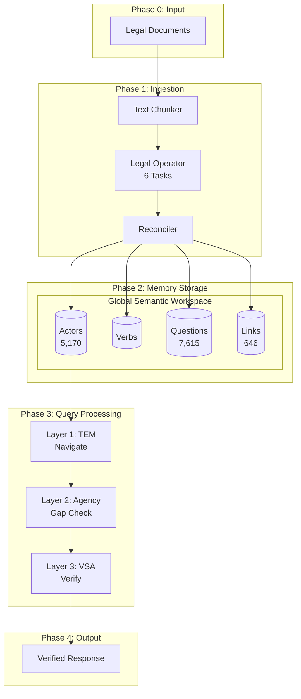

---

## Phase 1: Document Ingestion

### Step 1.1: Text Chunking

**File**: `src/gsw/text_chunker.py`

Documents are split into manageable chunks for processing:

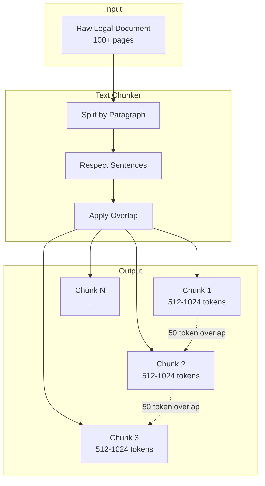

**Configuration**:
| Parameter | Value | Purpose |
|-----------|-------|---------|
| Chunk size | 512-1024 tokens | Optimal for LLM context |
| Overlap | 50 tokens | Preserve cross-boundary context |
| Boundary | Paragraph/sentence aware | Clean splits |

---

### Step 1.2: 6-Task Extraction Pipeline

**File**: `src/gsw/legal_operator.py`

Each chunk goes through the Legal Operator's 6-task extraction:

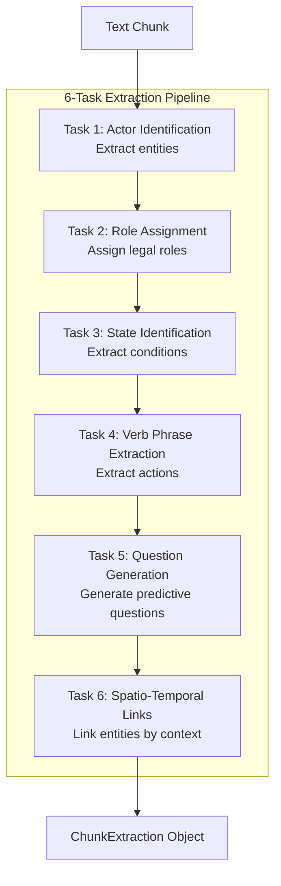

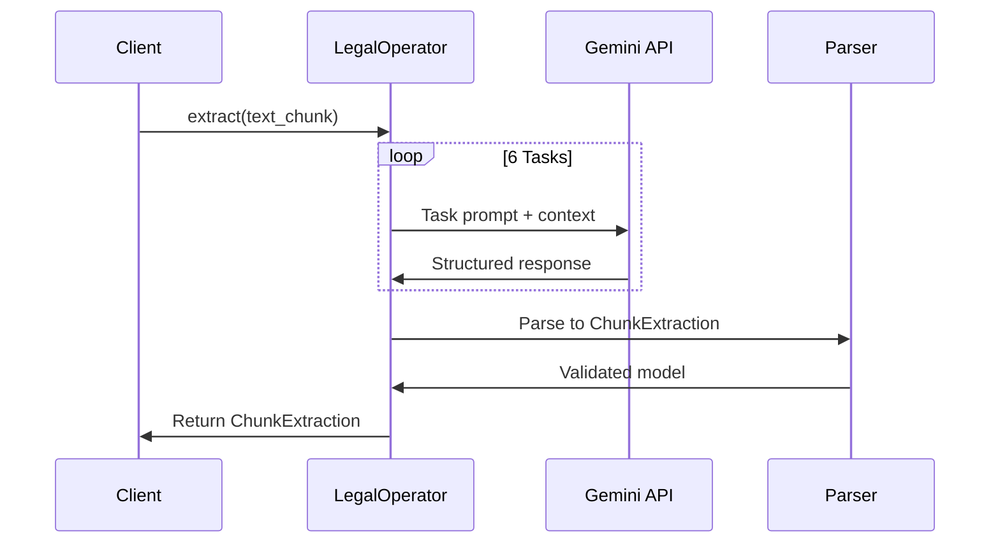

#### Task Outputs

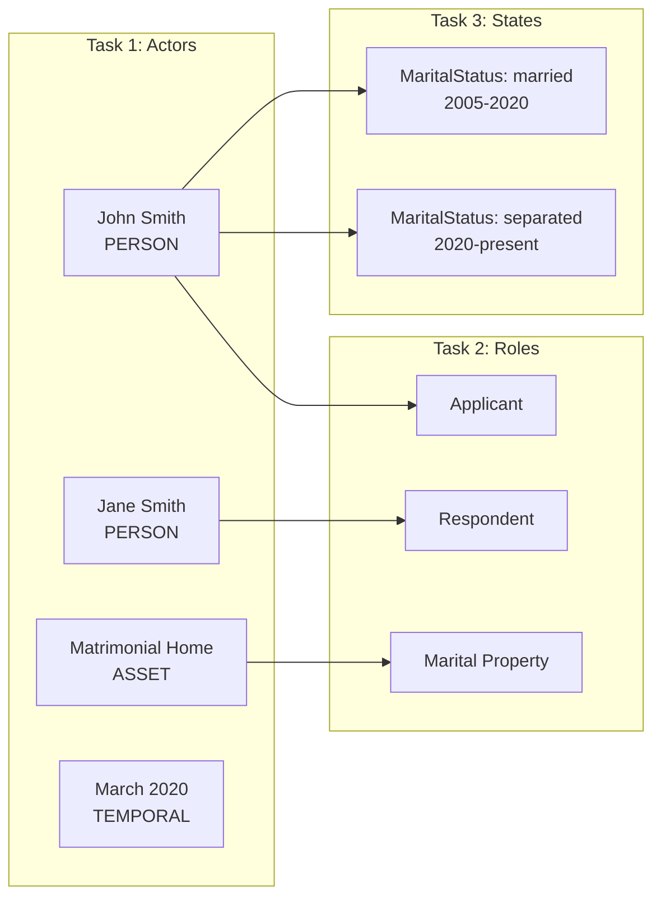

---

### Step 1.3: Entity Reconciliation

**File**: `src/gsw/legal_reconciler.py`

Multiple chunks may reference the same entity with different names. The Reconciler merges them:

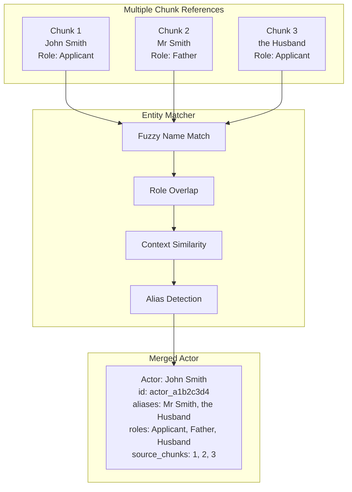

**Reconciliation Steps**:
1. **Alias Matching**: "John Smith" = "Mr Smith" = "the Applicant"
2. **Role Merging**: Combine roles from all chunks
3. **State Timeline**: Order states chronologically
4. **Link Integration**: Merge spatio-temporal bindings

---

## Phase 2: Memory Storage

### Global Semantic Workspace (GSW)

**File**: `src/gsw/workspace.py`

All extracted and reconciled entities are stored in the GSW:

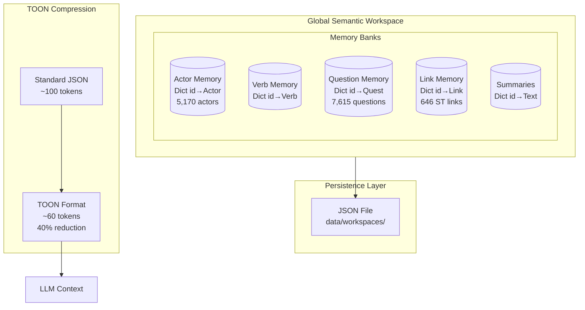

### TOON Format Example

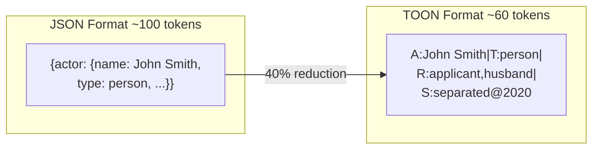

---

## Phase 3: Query Processing

### Three-Layer Cognitive Engine

When a user query arrives, it flows through the three cognitive layers:

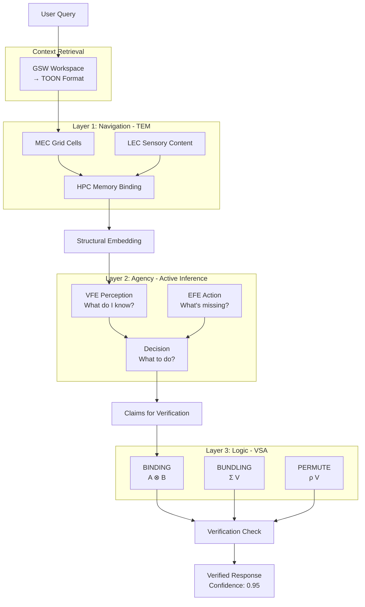

### Layer Details

```mermaid
graph TB
    subgraph TEM["Layer 1: TEM - Navigation"]
        TEM1[Find structural patterns]
        TEM2[Navigate to similar cases]
        TEM3[Extract structural embedding]
    end

    subgraph Agency["Layer 2: Agency - Gap Detection"]
        AG1[CHECK: Marriage evidence?]
        AG2[CHECK: Separation evidence?]
        AG3[CHECK: Property to divide?]
        AG4[CHECK: All requirements met?]
    end

    subgraph VSA["Layer 3: VSA - Verification"]
        VSA1[RULE: PROPERTY_SETTLEMENT requires MARRIAGE]
        VSA2[RULE: DIVORCE requires 12_MONTH_SEPARATION]
        VSA3[CONTRADICTION CHECK: No conflicts]
    end

    TEM1 --> TEM2 --> TEM3
    AG1 --> AG2 --> AG3 --> AG4
    VSA1 --> VSA2 --> VSA3
```

### TOON Compression

**TOON (Token-Oriented Object Notation)** reduces token usage by ~40% with 73.9% parsing accuracy.

**File**: `src/utils/toon.py`

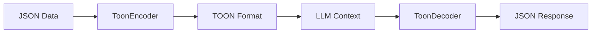

**Example Transformation**:

```python
# JSON format (~127 tokens)
{
    "actors": [
        {"id": "a1", "name": "John Smith", "type": "person", "roles": ["Applicant", "Father"]}
    ]
}

# TOON format (~76 tokens - 40% reduction)
Actors[1]{id,name,type,roles}
a1,John Smith,person,Applicant|Father
```

**Integration Points**:
| Layer | TOON Usage |
|-------|------------|
| GSW | Ontology context, entity reconciliation |
| TEM | Case graph serialization |
| Agency | Gap representation encoding |
| API | Response format option |

See [TOON-Format](TOON-Format) for complete documentation.

---

## API Data Flow

### Chat Request Flow

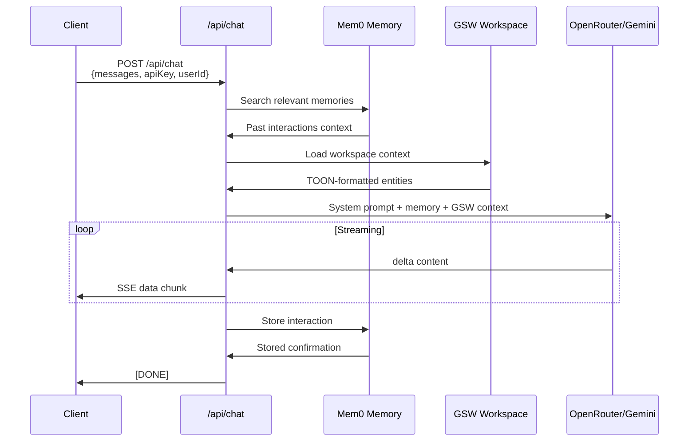

### Request/Response Structure

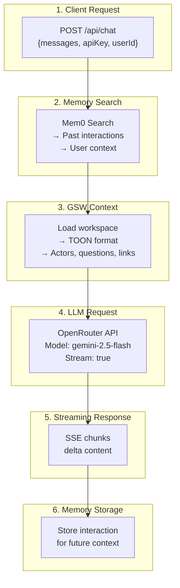

---

## Data Format Transformations

### Complete Transformation Pipeline

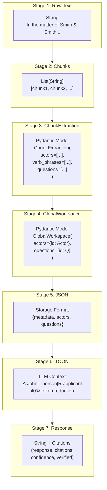

### Stage Details

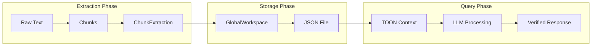

---

## Performance Metrics

### Processing Time by Stage

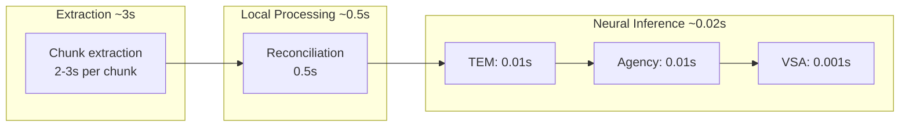

| Stage | Typical Time | Tokens Used | Notes |
|-------|-------------|-------------|-------|
| Chunk extraction | 2-3s | ~2,000 | LLM call per chunk |
| Reconciliation | 0.5s | - | Local entity matching |
| TEM navigation | 0.01s | - | PyTorch inference |
| Agency inference | 0.01s | - | NumPy computation |
| VSA verification | 0.001s | - | Vector operations |
| **Total response** | **11.83ms avg** | **~3,500** | End-to-end |

### Performance Comparison

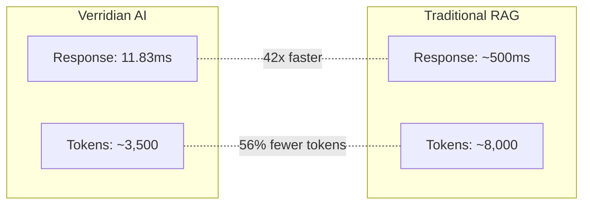

---

## Code Examples

### Extraction Pipeline

```python
from src.gsw.legal_operator import LegalOperator
from src.gsw.workspace import WorkspaceManager
from pathlib import Path

# Initialize operator
operator = LegalOperator()

# Extract from legal text
text = """
In the matter of Smith & Smith [2023] FamCA 123,
the Applicant (John Smith) seeks property settlement
following separation from the Respondent (Jane Smith).
"""

extraction = operator.extract(
    text=text,
    situation="Family law property settlement"
)

# Store in workspace
manager = WorkspaceManager.load(Path("data/workspace.json"))
manager.add_extraction(extraction)
manager.save()

# Query workspace
actors = manager.query_actors_by_role("Applicant")
print(f"Found {len(actors)} applicants")
```

### Query Processing

```python
from src.tem.model import TolmanEichenbaumMachine
from src.agency.agent import LegalResearchAgent
from src.vsa.legal_vsa import get_vsa_service

# Load context from GSW
context = manager.get_context_toon(max_actors=50)

# Process through TEM (navigation)
tem = TolmanEichenbaumMachine(input_dim=768, hidden_dim=256, action_dim=10)
structural_embedding = tem.encode(context)

# Check for gaps (agency)
agent = LegalResearchAgent()
gaps = agent.check_completeness(query, context)

# Verify logic (VSA)
vsa = get_vsa_service()
result = vsa.verify_no_hallucination(["PROPERTY_SETTLEMENT", "MARRIAGE"])

if result["valid"]:
    print("Response verified - no hallucinations")
```

---

## Related Pages

- [Architecture-Overview](Architecture-Overview) - System design
- [Backend-GSW-Module](Backend-GSW-Module) - Extraction details
- [Backend-TEM-Module](Backend-TEM-Module) - Navigation layer
- [Backend-Agency-Module](Backend-Agency-Module) - Gap detection
- [Backend-VSA-Module](Backend-VSA-Module) - Logic verification
- [Backend-Ingestion-Module](Backend-Ingestion-Module) - Bulk processing
- [Three-Layer-System](Three-Layer-System) - Cognitive layers
- [Data-Schemas](Data-Schemas) - Schema definitions
- [TOON-Format](TOON-Format) - Token compression format
