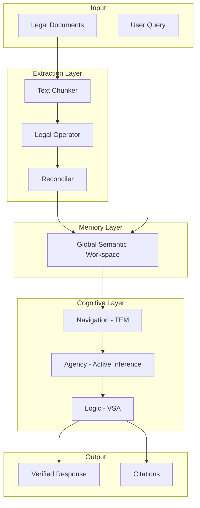
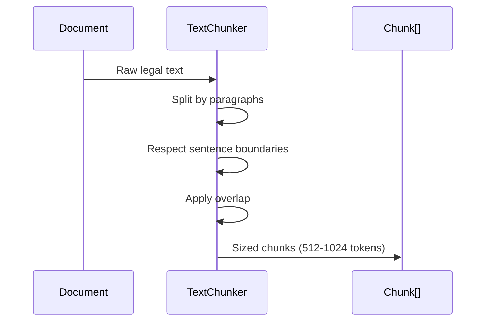
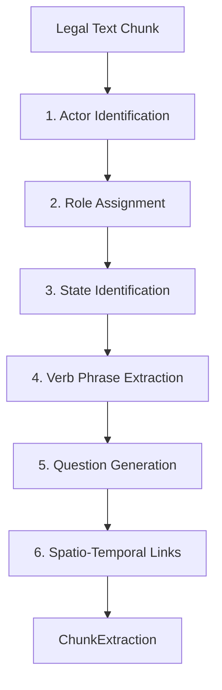
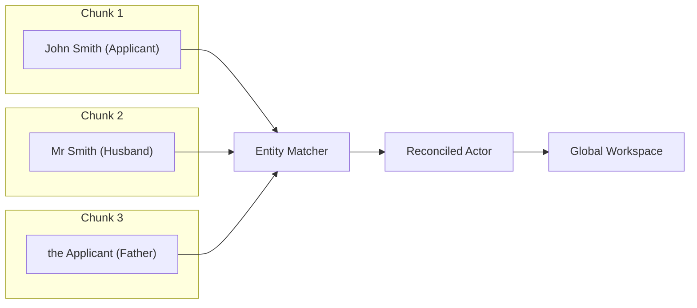
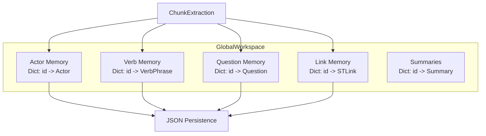
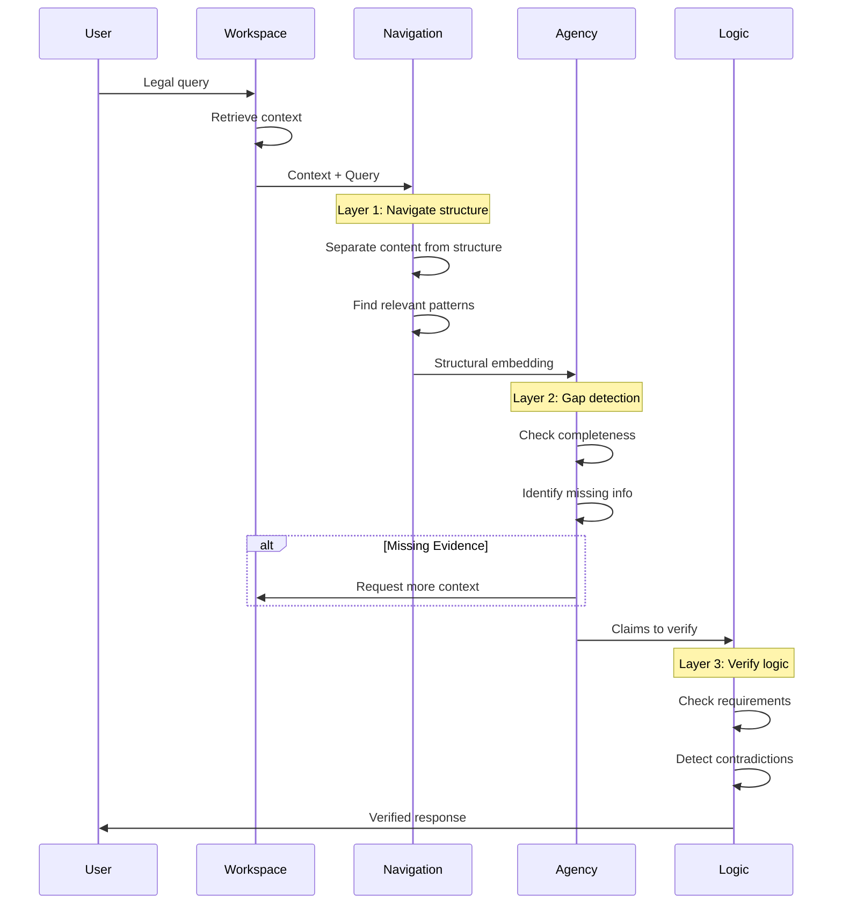
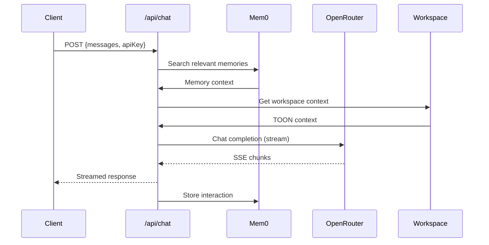

# Data Flow

This page documents how data moves through the Verridian AI system, from raw legal documents to verified responses.

## High-Level Flow



---

## Phase 1: Document Ingestion

### Text Chunking

**File**: `src/gsw/text_chunker.py`

Documents are split into manageable chunks for processing:



Configuration:
- **Chunk size**: 512-1024 tokens
- **Overlap**: 50 tokens
- **Boundary detection**: Paragraph and sentence aware

---

## Phase 2: 6-Task Extraction

### Legal Operator Pipeline

**File**: `src/gsw/legal_operator.py`

Each chunk goes through the 6-task extraction pipeline:



**Output Structure**:
```python
ChunkExtraction:
    - actors: List[Actor]           # Who is involved
    - verb_phrases: List[VerbPhrase] # What happened
    - questions: List[Question]      # What could be asked
    - spatio_temporal_links: List[Link]  # When/where bindings
```

---

## Phase 3: Reconciliation

### Entity Merging

**File**: `src/gsw/legal_reconciler.py`

Multiple chunks may reference the same entity. The Reconciler merges them:



Reconciliation steps:
1. **Alias matching**: "John Smith" = "Mr Smith" = "the Applicant"
2. **Role merging**: Combine roles from all chunks
3. **State timeline**: Order states chronologically
4. **Link integration**: Merge spatio-temporal bindings

---

## Phase 4: Workspace Storage

### Global Semantic Workspace

**File**: `src/gsw/workspace.py`



---

## Phase 5: Query Processing

### Three-Layer Cognitive Engine

When a user query arrives:



---

## Data Format Transformations

### Input to Output

```
Raw Text (String)
    ↓
Chunks (List[String])
    ↓
ChunkExtraction (Pydantic Model)
    ↓
GlobalWorkspace (Pydantic Model)
    ↓
JSON (Storage)
    ↓
TOON (LLM Context)
    ↓
Response (String + Citations)
```

### TOON Compression

TOON format reduces token usage by ~40%:

```python
# JSON format (~100 tokens)
{"actor": {"name": "John Smith", "type": "person", "roles": ["applicant"]}}

# TOON format (~60 tokens)
A:John Smith|T:person|R:applicant
```

---

## API Data Flow

### Chat Request Flow



---

## Performance Metrics

| Stage | Typical Time | Tokens Used |
|-------|-------------|-------------|
| Chunk extraction | 2-3s | ~2000 |
| Reconciliation | 0.5s | - |
| TEM navigation | 0.01s | - |
| Agency inference | 0.01s | - |
| VSA verification | 0.001s | - |
| Total response | 11.83ms avg | ~3500 |

---

## Related Pages

- [Architecture-Overview](Architecture-Overview) - System design
- [Backend-GSW-Module](Backend-GSW-Module) - Extraction details
- [Backend-Ingestion-Module](Backend-Ingestion-Module) - Bulk processing
- [Three-Layer-System](Three-Layer-System) - Cognitive layers
