# Data Schemas

Complete schema definitions for the Verridian AI system.

## Overview

**File**: `src/logic/gsw_schema.py`

All schemas are defined using Pydantic v2 for type safety and validation.

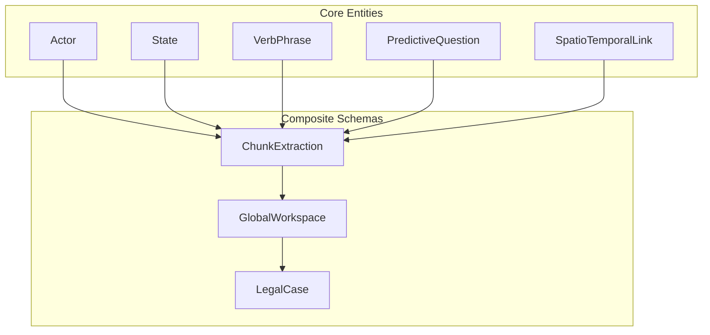

---

## Entity Relationships

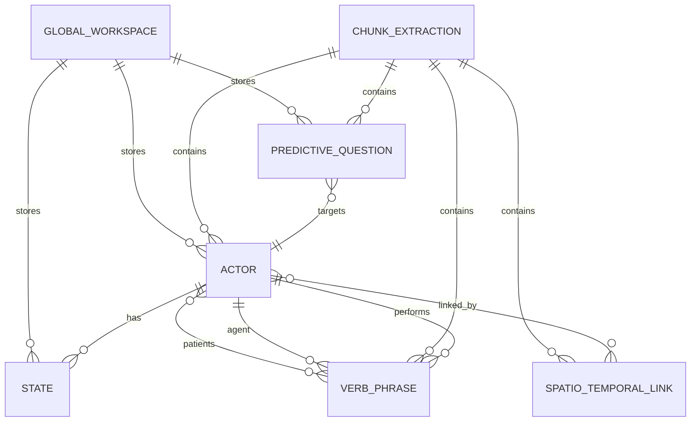

---

## Enums

### ActorType

Types of actors that can be extracted from legal documents.

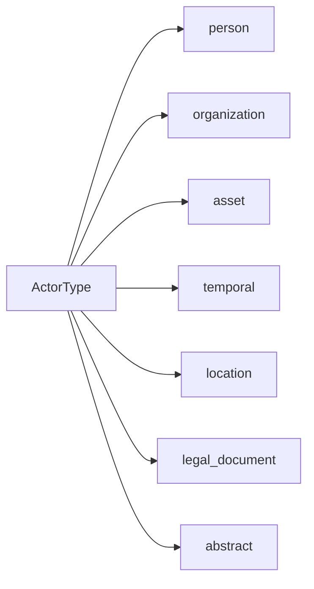

```python
class ActorType(str, Enum):
    PERSON = "person"              # Parties, judges, children, witnesses
    ORGANIZATION = "organization"   # Courts, departments, employers
    ASSET = "asset"                # Property, super, vehicles, accounts
    TEMPORAL = "temporal"          # Dates, time periods
    LOCATION = "location"          # Addresses, court locations
    LEGAL_DOCUMENT = "legal_document"  # Orders, applications, affidavits
    ABSTRACT = "abstract"          # Concepts, legal principles
```

### QuestionType

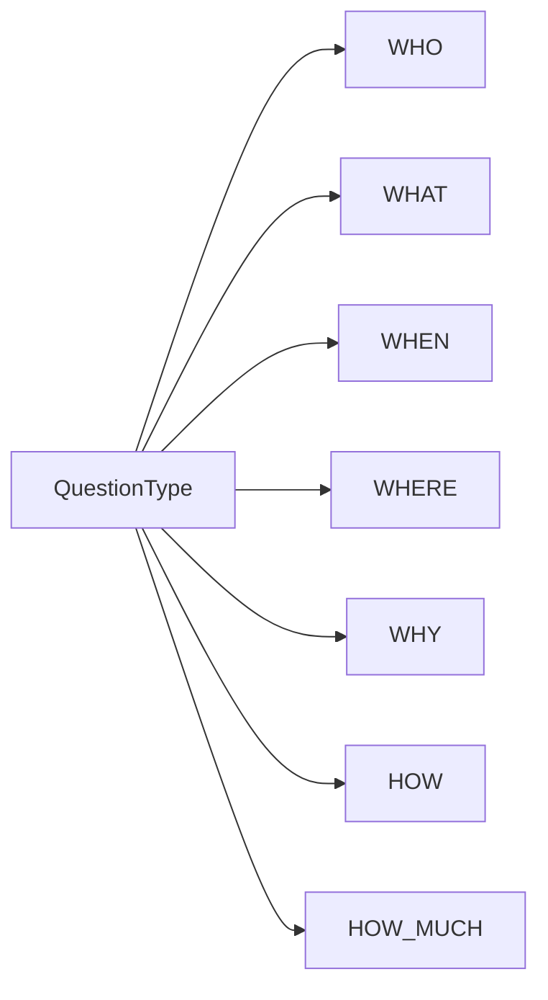

```python
class QuestionType(str, Enum):
    WHO = "who"
    WHAT = "what"
    WHEN = "when"
    WHERE = "where"
    WHY = "why"
    HOW = "how"
    HOW_MUCH = "how_much"
```

### LinkType

```python
class LinkType(str, Enum):
    SPATIAL = "spatial"
    TEMPORAL = "temporal"
```

---

## Core Entities

### Actor

The central organizing unit in the GSW model.

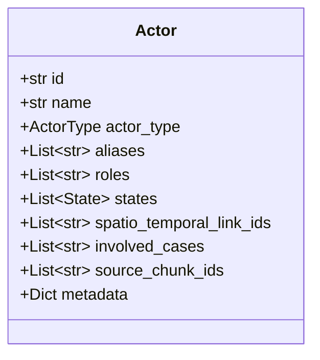

```python
class Actor(BaseModel):
    id: str = Field(default_factory=lambda: f"actor_{uuid4().hex[:8]}")
    name: str
    actor_type: ActorType
    aliases: List[str] = []           # Other names/references
    roles: List[str] = []             # Flexible role strings
    states: List[State] = []
    spatio_temporal_link_ids: List[str] = []
    involved_cases: List[str] = []    # Cross-case tracking
    source_chunk_ids: List[str] = []
    metadata: Dict[str, Any] = {}
```

**Example:**
```json
{
    "id": "actor_a1b2c3d4",
    "name": "John Smith",
    "actor_type": "person",
    "aliases": ["Mr Smith", "the Applicant", "the Husband"],
    "roles": ["Applicant", "Husband", "Father"],
    "states": [
        {"name": "MaritalStatus", "value": "married", "start_date": "2010-03-15"},
        {"name": "MaritalStatus", "value": "separated", "start_date": "2020-06-01"}
    ]
}
```

---

### State

A condition that characterizes how an actor exists at a specific point in time.

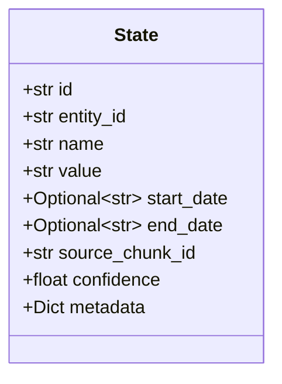

```python
class State(BaseModel):
    id: str = Field(default_factory=lambda: f"state_{uuid4().hex[:8]}")
    entity_id: str                    # Which actor this state applies to
    name: str                         # State type (e.g., "RelationshipStatus")
    value: str                        # State value (e.g., "Married")
    start_date: Optional[str] = None  # When state began (ISO format)
    end_date: Optional[str] = None    # When state ended (None if current)
    source_chunk_id: str = ""
    confidence: float = 1.0
    metadata: Dict[str, Any] = {}
```

**Example:**
```json
{
    "id": "state_x1y2z3",
    "entity_id": "actor_a1b2c3d4",
    "name": "EmploymentStatus",
    "value": "employed as accountant",
    "start_date": "2015-01-01",
    "end_date": null,
    "confidence": 0.95
}
```

---

### VerbPhrase

An action or event involving actors.

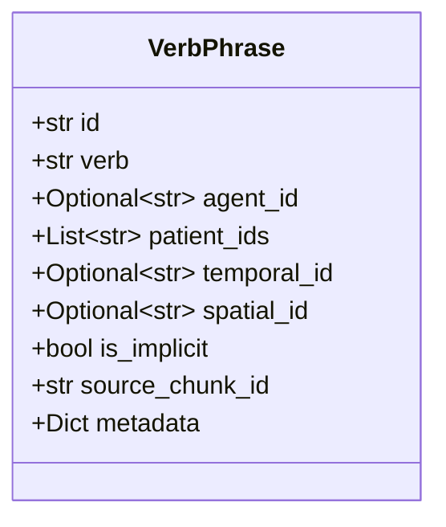

```python
class VerbPhrase(BaseModel):
    id: str = Field(default_factory=lambda: f"verb_{uuid4().hex[:8]}")
    verb: str                         # The action word (e.g., "filed")
    agent_id: Optional[str] = None    # Who performed the action
    patient_ids: List[str] = []       # Who/what was affected
    temporal_id: Optional[str] = None # Link to temporal entity
    spatial_id: Optional[str] = None  # Link to location entity
    is_implicit: bool = False         # Was this inferred?
    source_chunk_id: str = ""
    metadata: Dict[str, Any] = {}
```

**Example:**
```json
{
    "id": "verb_f1g2h3",
    "verb": "filed",
    "agent_id": "actor_a1b2c3d4",
    "patient_ids": ["actor_application_001"],
    "temporal_id": "actor_date_2023",
    "is_implicit": false
}
```

---

### PredictiveQuestion

A question that could be asked about the situation.

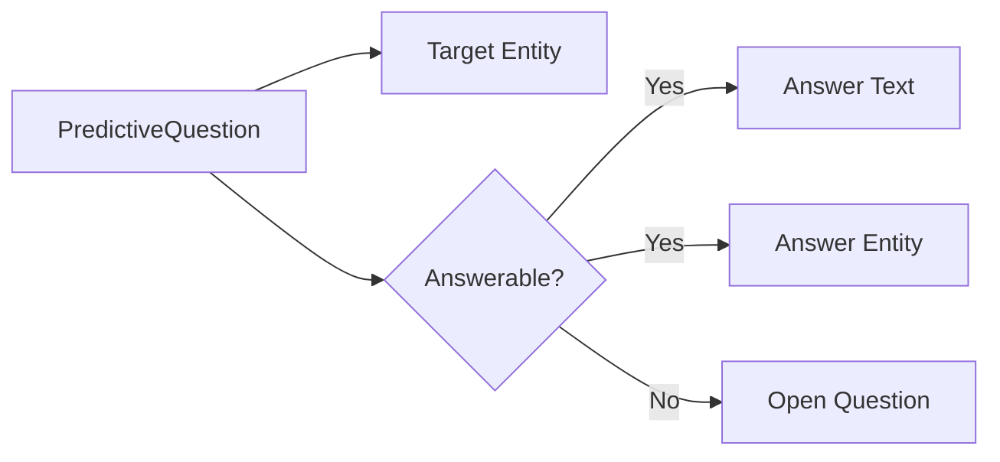

```python
class PredictiveQuestion(BaseModel):
    id: str = Field(default_factory=lambda: f"q_{uuid4().hex[:8]}")
    question_text: str
    question_type: QuestionType
    target_entity_id: Optional[str] = None  # Entity this question is about
    answerable: bool = False
    answer_text: Optional[str] = None
    answer_entity_id: Optional[str] = None  # Entity that IS the answer
    source_chunk_id: str = ""
    answered_in_chunk_id: Optional[str] = None
    metadata: Dict[str, Any] = {}
```

**Example:**
```json
{
    "id": "q_p1q2r3",
    "question_text": "When did the parties separate?",
    "question_type": "when",
    "target_entity_id": "actor_a1b2c3d4",
    "answerable": true,
    "answer_text": "June 2020",
    "answer_entity_id": "actor_date_2020_06"
}
```

---

### SpatioTemporalLink

Links entities that share the same spatial or temporal context.

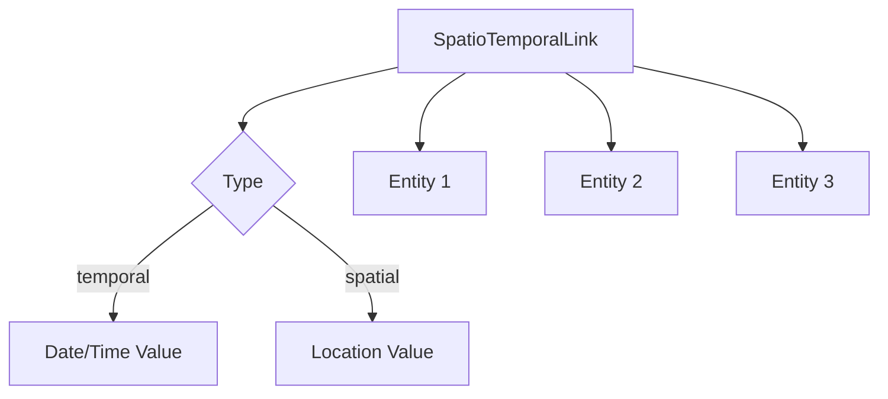

```python
class SpatioTemporalLink(BaseModel):
    id: str = Field(default_factory=lambda: f"link_{uuid4().hex[:8]}")
    linked_entity_ids: List[str]
    tag_type: LinkType
    tag_value: Optional[str] = None   # The actual date/location
    source_chunk_id: str = ""
    metadata: Dict[str, Any] = {}
```

**Example:**
```json
{
    "id": "link_s1t2u3",
    "linked_entity_ids": ["actor_a1b2c3d4", "actor_b2c3d4e5", "actor_cert_001"],
    "tag_type": "temporal",
    "tag_value": "2010-03-15"
}
```

---

## Composite Schemas

### ChunkExtraction

Output of the Legal Operator for a single chunk.

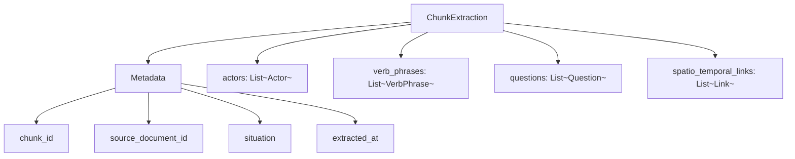

```python
class ChunkExtraction(BaseModel):
    chunk_id: str
    source_document_id: str = ""
    situation: str = ""
    background_context: str = ""

    # Extracted elements
    actors: List[Actor] = []
    verb_phrases: List[VerbPhrase] = []
    questions: List[PredictiveQuestion] = []
    spatio_temporal_links: List[SpatioTemporalLink] = []

    # Metadata
    extracted_at: str = Field(default_factory=lambda: datetime.now().isoformat())
    model_used: str = ""
    raw_llm_response: Optional[str] = None
```

---

### GlobalWorkspace

The central memory of the system.

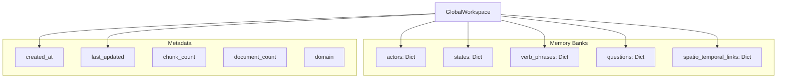

```python
class GlobalWorkspace(BaseModel):
    # Core storage (id -> entity)
    actors: Dict[str, Actor] = {}
    states: Dict[str, State] = {}
    verb_phrases: Dict[str, VerbPhrase] = {}
    questions: Dict[str, PredictiveQuestion] = {}
    spatio_temporal_links: Dict[str, SpatioTemporalLink] = {}

    # Entity summaries
    entity_summaries: Dict[str, str] = {}

    # Metadata
    created_at: str
    last_updated: str
    chunk_count: int = 0
    document_count: int = 0
    domain: str = ""
```

---

### LegalCase

Legal-specific extension with case metadata.

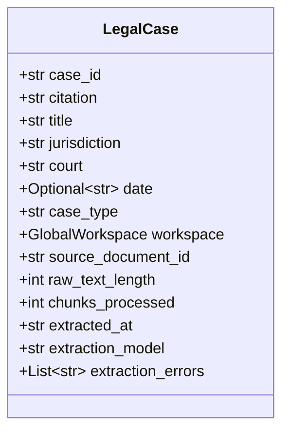

```python
class LegalCase(BaseModel):
    case_id: str = Field(default_factory=lambda: f"case_{uuid4().hex[:8]}")
    citation: str = ""
    title: str = ""
    jurisdiction: str = ""
    court: str = ""
    date: Optional[str] = None
    case_type: str = ""              # "parenting", "property", "divorce"

    # GSW extraction
    workspace: GlobalWorkspace = GlobalWorkspace()

    # Source tracking
    source_document_id: str = ""
    raw_text_length: int = 0
    chunks_processed: int = 0

    # Extraction metadata
    extracted_at: str
    extraction_model: str = ""
    extraction_errors: List[str] = []
```

---

### OntologyContext

Ontology context for self-improving feedback loop.

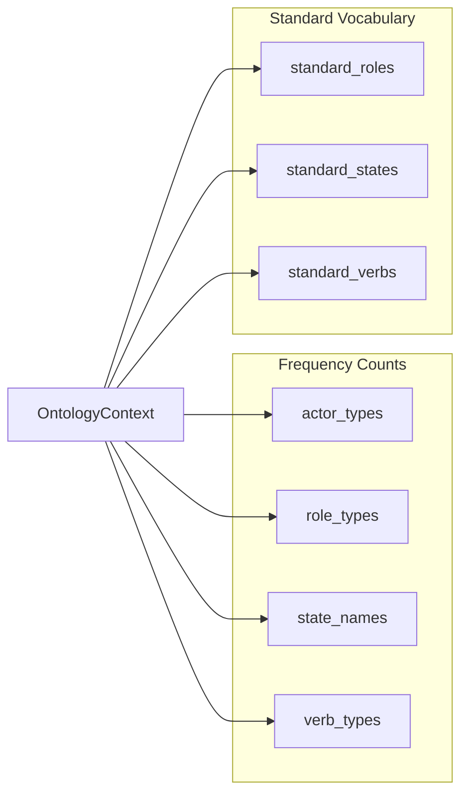

```python
class OntologyContext(BaseModel):
    # Frequency counts
    actor_types: Dict[str, int] = {}
    role_types: Dict[str, int] = {}
    state_names: Dict[str, int] = {}
    verb_types: Dict[str, int] = {}

    # Standard vocabulary
    standard_roles: List[str] = []
    standard_states: List[str] = []
    standard_verbs: List[str] = []
```

---

## Data Flow Through Schemas

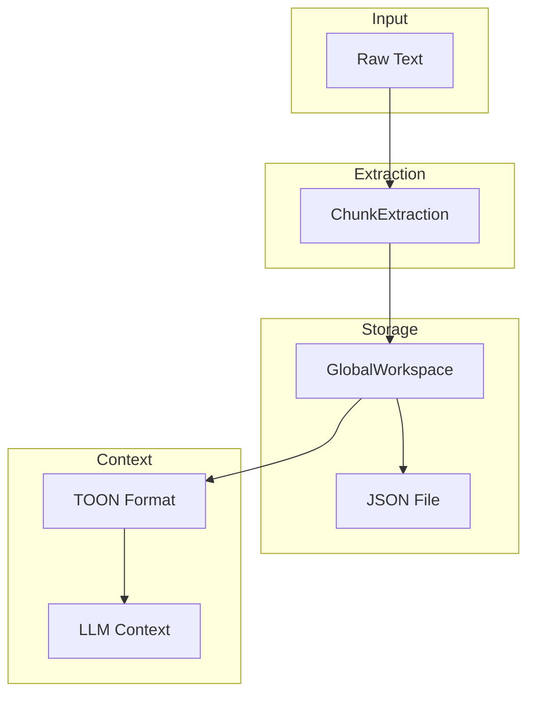

---

## JSON Schema Examples

### Full Workspace Export

```json
{
    "metadata": {
        "created_at": "2024-01-15T10:30:00",
        "last_updated": "2024-01-15T12:45:00",
        "chunk_count": 156,
        "document_count": 12,
        "domain": "family"
    },
    "actors": {
        "actor_a1b2c3d4": {
            "id": "actor_a1b2c3d4",
            "name": "John Smith",
            "actor_type": "person",
            "aliases": ["Mr Smith", "the Applicant"],
            "roles": ["Applicant", "Husband"],
            "states": [],
            "spatio_temporal_link_ids": ["link_s1t2u3"]
        }
    },
    "verb_phrases": {},
    "questions": {},
    "spatio_temporal_links": {},
    "entity_summaries": {}
}
```

---

## TypeScript Types

For frontend use:

```typescript
// ui/src/types/index.ts

interface Actor {
    id: string;
    name: string;
    actor_type: 'person' | 'organization' | 'asset' | 'temporal' | 'location';
    aliases: string[];
    roles: string[];
    states: State[];
}

interface State {
    id: string;
    entity_id: string;
    name: string;
    value: string;
    start_date?: string;
    end_date?: string;
}

interface Message {
    role: 'user' | 'assistant' | 'system';
    content: string;
    timestamp?: Date;
}

interface ChunkExtraction {
    chunk_id: string;
    actors: Actor[];
    verb_phrases: VerbPhrase[];
    questions: PredictiveQuestion[];
    spatio_temporal_links: SpatioTemporalLink[];
}
```

---

## Related Pages

- [GSW-Global-Semantic-Workspace](GSW-Global-Semantic-Workspace) - Workspace concepts
- [Backend-GSW-Module](Backend-GSW-Module) - Extraction pipeline
- [Glossary](Glossary) - Terminology
- [API-Reference](API-Reference) - API documentation
