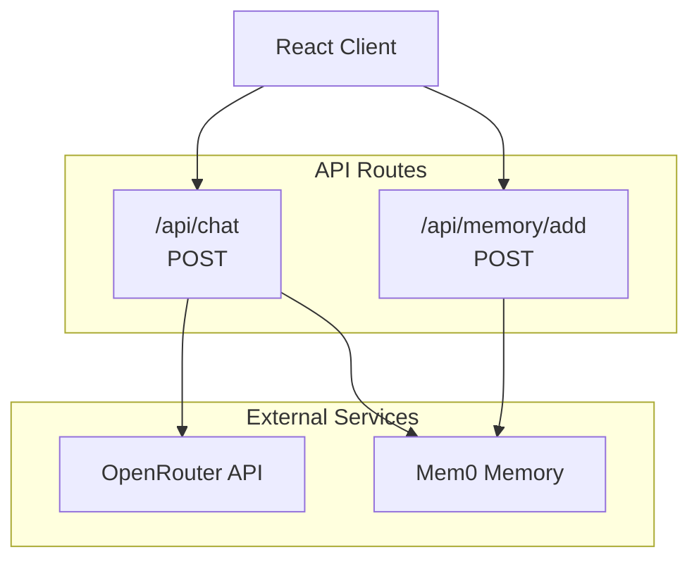

# Frontend: API Routes

Documentation for the Next.js API routes that power the Verridian UI.

## Overview

**Location**: `ui/src/app/api/`



---

## Chat API

**File**: `ui/src/app/api/chat/route.ts`
**Method**: POST
**Purpose**: Stream chat completions from LLM with memory integration

### Request Format

```typescript
interface ChatRequest {
  messages: Array<{
    role: 'user' | 'assistant' | 'system';
    content: string;
  }>;
  model?: string;           // Default: 'google/gemini-2.5-flash-preview-05-20'
  temperature?: number;     // Default: 0.7
  maxTokens?: number;       // Default: 4096
  apiKey: string;           // Required: OpenRouter API key
  systemPrompt?: string;    // Optional: System instructions
  tools?: Tool[];           // Optional: Function calling tools
  userId?: string;          // Optional: For Mem0 memory
}
```

### Response Format

Server-Sent Events (SSE) stream:

```
data: {"id":"...","choices":[{"delta":{"content":"Hello"}}]}
data: {"id":"...","choices":[{"delta":{"content":" world"}}]}
data: [DONE]
```

### Usage Example

```typescript
const response = await fetch('/api/chat', {
  method: 'POST',
  headers: { 'Content-Type': 'application/json' },
  body: JSON.stringify({
    messages: [{ role: 'user', content: 'What is property settlement?' }],
    apiKey: 'sk-or-...',
    systemPrompt: 'You are a legal AI assistant for Australian Family Law.'
  })
});

// Handle streaming response
const reader = response.body?.getReader();
const decoder = new TextDecoder();

while (true) {
  const { done, value } = await reader.read();
  if (done) break;

  const chunk = decoder.decode(value);
  const lines = chunk.split('\n');

  for (const line of lines) {
    if (line.startsWith('data: ') && line !== 'data: [DONE]') {
      const data = JSON.parse(line.slice(6));
      const content = data.choices[0]?.delta?.content;
      if (content) console.log(content);
    }
  }
}
```

### Implementation Details

```typescript
export async function POST(request: NextRequest) {
  const { messages, model, temperature, maxTokens, apiKey, systemPrompt, tools, userId }
    = await request.json();

  // Validate API key
  if (!apiKey) {
    return NextResponse.json(
      { error: 'API key is required' },
      { status: 400 }
    );
  }

  // Mem0 Integration: Search for relevant memories
  let memoryContext = "";
  if (process.env.MEM0_API_KEY) {
    const memoryClient = new MemoryClient({ apiKey: process.env.MEM0_API_KEY });

    // Search past interactions
    const searchResults = await memoryClient.search(
      messages[messages.length - 1].content,
      { user_id: userId || 'test_session_user' }
    );

    if (searchResults?.length > 0) {
      memoryContext = `\n\nRELEVANT MEMORY:\n${
        searchResults.map((m: any) => `- ${m.memory}`).join('\n')
      }`;
    }

    // Store current message
    await memoryClient.add(messages[messages.length - 1].content, {
      user_id: userId,
      metadata: { role: 'user' }
    });
  }

  // Build OpenRouter request
  const requestBody = {
    model: model || 'google/gemini-2.5-flash-preview-05-20',
    messages: [
      ...(systemPrompt ? [{ role: 'system', content: systemPrompt + memoryContext }] : []),
      ...messages
    ],
    temperature: temperature ?? 0.7,
    max_tokens: maxTokens ?? 4096,
    stream: true,
    ...(tools?.length > 0 && { tools, tool_choice: 'auto' })
  };

  // Stream response
  const response = await fetch('https://openrouter.ai/api/v1/chat/completions', {
    method: 'POST',
    headers: {
      'Content-Type': 'application/json',
      'Authorization': `Bearer ${apiKey}`,
      'X-Title': 'Legal AI Assistant'
    },
    body: JSON.stringify(requestBody)
  });

  // Return SSE stream
  return new Response(stream, {
    headers: {
      'Content-Type': 'text/event-stream',
      'Cache-Control': 'no-cache',
      'Connection': 'keep-alive'
    }
  });
}
```

---

## Memory Add API

**File**: `ui/src/app/api/memory/add/route.ts`
**Method**: POST
**Purpose**: Add memories to Mem0 for persistent context

### Request Format

```typescript
interface MemoryAddRequest {
  content: string;          // Memory content
  userId?: string;          // User identifier
  metadata?: {
    role?: string;          // 'user' | 'assistant'
    timestamp?: string;
    context?: string;
  };
}
```

### Response Format

```typescript
interface MemoryAddResponse {
  success: boolean;
  memoryId?: string;
  error?: string;
}
```

### Usage Example

```typescript
await fetch('/api/memory/add', {
  method: 'POST',
  headers: { 'Content-Type': 'application/json' },
  body: JSON.stringify({
    content: 'User asked about property settlement in Sydney',
    userId: 'user_123',
    metadata: { role: 'user', context: 'property_settlement' }
  })
});
```

---

## Error Handling

### Common Error Responses

```typescript
// Missing API key
{ status: 400, error: 'API key is required. Please configure it in Settings.' }

// OpenRouter API error
{ status: 500, error: 'API error: 429 - Rate limit exceeded' }

// General error
{ status: 500, error: 'Chat request failed' }
```

### Error Handling Pattern

```typescript
try {
  const response = await fetch('/api/chat', { ... });

  if (!response.ok) {
    const error = await response.json();
    throw new Error(error.error || 'Request failed');
  }

  // Process stream...
} catch (error) {
  console.error('Chat error:', error);
  // Show user-friendly error message
}
```

---

## Environment Variables

```bash
# Required
OPENROUTER_API_KEY=sk-or-...

# Optional (for memory)
MEM0_API_KEY=m0-...
```

---

## Rate Limiting

OpenRouter applies rate limits based on your plan:

| Tier | Requests/min | Tokens/min |
|------|-------------|------------|
| Free | 20 | 40,000 |
| Paid | 100+ | 200,000+ |

---

## Security Considerations

1. **API Key Handling**: Keys passed from client, stored in browser
2. **Input Validation**: Validate message format before processing
3. **Rate Limiting**: Implement client-side throttling
4. **Error Messages**: Don't expose internal errors to client

---

## CORS Configuration

The API routes are same-origin by default. For external access:

```typescript
// next.config.js
module.exports = {
  async headers() {
    return [
      {
        source: '/api/:path*',
        headers: [
          { key: 'Access-Control-Allow-Origin', value: '*' },
          { key: 'Access-Control-Allow-Methods', value: 'POST, OPTIONS' }
        ]
      }
    ];
  }
};
```

---

## Related Pages

- [Frontend-Overview](Frontend-Overview) - App structure
- [Frontend-Components](Frontend-Components) - UI components
- [API-Reference](API-Reference) - Complete API docs
