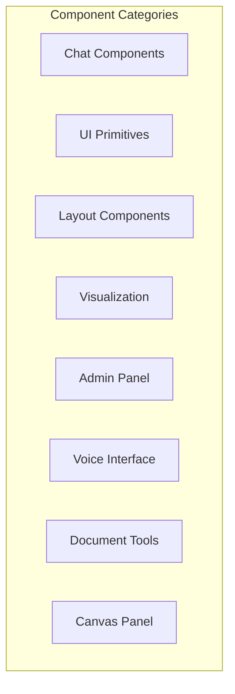

# Frontend Components

Catalog of React components in the Verridian AI frontend.

## Overview

**Location**: `ui/src/components/`



## Directory Structure

```
components/
├── chat/
│   ├── ChatPanel.tsx        # Main chat container
│   ├── ChatMessage.tsx      # Message display
│   └── ChatInput.tsx        # Message input
├── ui/
│   ├── SynapseLoader.tsx    # Loading animation
│   └── VerridianBrainUltimate.tsx  # Brain visualization
├── layout/
│   └── MainLayout.tsx       # App layout wrapper
├── visualization/
│   └── LegalGraph3D.tsx     # Three.js graph
├── admin/
│   └── AdminPanel.tsx       # Admin controls
├── voice/
│   └── VoicePanel.tsx       # Voice interface
├── tools/
│   ├── DocumentTools.tsx    # Document utilities
│   └── CodeInterpreter.tsx  # Code execution
└── canvas/
    └── CanvasPanel.tsx      # Drawing canvas
```

---

## Chat Components

### ChatPanel

**File**: `ui/src/components/chat/ChatPanel.tsx`

Main chat container component.

```tsx
interface ChatPanelProps {
    messages: Message[];
    onSendMessage: (content: string) => void;
    isLoading: boolean;
}

export function ChatPanel({ messages, onSendMessage, isLoading }: ChatPanelProps) {
    return (
        <div className="flex flex-col h-full">
            <div className="flex-1 overflow-y-auto">
                {messages.map((msg, i) => (
                    <ChatMessage key={i} message={msg} />
                ))}
            </div>
            <ChatInput onSend={onSendMessage} disabled={isLoading} />
        </div>
    );
}
```

### ChatMessage

**File**: `ui/src/components/chat/ChatMessage.tsx`

Individual message display with markdown rendering.

```tsx
interface ChatMessageProps {
    message: {
        role: 'user' | 'assistant' | 'system';
        content: string;
        timestamp?: Date;
    };
}

export function ChatMessage({ message }: ChatMessageProps) {
    const isUser = message.role === 'user';

    return (
        <div className={`flex ${isUser ? 'justify-end' : 'justify-start'}`}>
            <div className={`rounded-lg p-4 max-w-[80%] ${
                isUser ? 'bg-verridian-primary text-black' : 'bg-gray-800'
            }`}>
                <ReactMarkdown>{message.content}</ReactMarkdown>
            </div>
        </div>
    );
}
```

### ChatInput

**File**: `ui/src/components/chat/ChatInput.tsx`

Message input with send functionality.

```tsx
interface ChatInputProps {
    onSend: (content: string) => void;
    disabled?: boolean;
    placeholder?: string;
}

export function ChatInput({ onSend, disabled, placeholder }: ChatInputProps) {
    const [input, setInput] = useState('');

    const handleSubmit = () => {
        if (input.trim() && !disabled) {
            onSend(input.trim());
            setInput('');
        }
    };

    return (
        <div className="flex gap-2 p-4 border-t">
            <textarea
                value={input}
                onChange={(e) => setInput(e.target.value)}
                placeholder={placeholder || "Ask a legal question..."}
                disabled={disabled}
                className="flex-1 resize-none"
                onKeyDown={(e) => e.key === 'Enter' && !e.shiftKey && handleSubmit()}
            />
            <button onClick={handleSubmit} disabled={disabled}>
                Send
            </button>
        </div>
    );
}
```

---

## UI Primitives

### SynapseLoader

**File**: `ui/src/components/ui/SynapseLoader.tsx`

Animated loading indicator with neural synapse theme.

```tsx
export function SynapseLoader() {
    return (
        <div className="synapse-loader">
            <div className="neuron neuron-1" />
            <div className="neuron neuron-2" />
            <div className="neuron neuron-3" />
            <div className="synapse" />
        </div>
    );
}
```

### VerridianBrainUltimate

**File**: `ui/src/components/ui/VerridianBrainUltimate.tsx`

Animated brain visualization component.

```tsx
export function VerridianBrainUltimate({ isThinking = false }) {
    return (
        <div className={`brain-container ${isThinking ? 'pulsing' : ''}`}>
            <svg viewBox="0 0 100 100">
                {/* Brain SVG paths */}
            </svg>
        </div>
    );
}
```

---

## Layout Components

### MainLayout

**File**: `ui/src/components/layout/MainLayout.tsx`

Application layout wrapper.

```tsx
interface MainLayoutProps {
    children: React.ReactNode;
    sidebar?: React.ReactNode;
    header?: React.ReactNode;
}

export function MainLayout({ children, sidebar, header }: MainLayoutProps) {
    return (
        <div className="flex h-screen bg-verridian-dark">
            {sidebar && (
                <aside className="w-64 border-r">{sidebar}</aside>
            )}
            <main className="flex-1 flex flex-col">
                {header && <header className="h-16 border-b">{header}</header>}
                <div className="flex-1 overflow-hidden">{children}</div>
            </main>
        </div>
    );
}
```

---

## Visualization Components

### LegalGraph3D

**File**: `ui/src/components/visualization/LegalGraph3D.tsx`

Three.js-powered 3D legal knowledge graph.

```tsx
interface LegalGraph3DProps {
    nodes: GraphNode[];
    edges: GraphEdge[];
    onNodeClick?: (node: GraphNode) => void;
}

interface GraphNode {
    id: string;
    label: string;
    type: 'actor' | 'asset' | 'event';
    position?: [number, number, number];
}

interface GraphEdge {
    source: string;
    target: string;
    label?: string;
}

export function LegalGraph3D({ nodes, edges, onNodeClick }: LegalGraph3DProps) {
    const containerRef = useRef<HTMLDivElement>(null);

    useEffect(() => {
        // Three.js initialization
        const scene = new THREE.Scene();
        const camera = new THREE.PerspectiveCamera(75, width / height, 0.1, 1000);
        const renderer = new THREE.WebGLRenderer();

        // Add nodes as spheres
        nodes.forEach(node => {
            const geometry = new THREE.SphereGeometry(0.5, 32, 32);
            const material = new THREE.MeshBasicMaterial({
                color: getColorByType(node.type)
            });
            const sphere = new THREE.Mesh(geometry, material);
            scene.add(sphere);
        });

        // Animation loop
        const animate = () => {
            requestAnimationFrame(animate);
            renderer.render(scene, camera);
        };
        animate();

        return () => renderer.dispose();
    }, [nodes, edges]);

    return <div ref={containerRef} className="w-full h-full" />;
}
```

---

## Admin Components

### AdminPanel

**File**: `ui/src/components/admin/AdminPanel.tsx`

Administrative controls and settings.

```tsx
export function AdminPanel() {
    const { settings, updateSettings } = useStore();

    return (
        <div className="p-4 space-y-4">
            <h2 className="text-xl font-bold">Settings</h2>

            <div>
                <label>API Key</label>
                <input
                    type="password"
                    value={settings.apiKey}
                    onChange={(e) => updateSettings({ apiKey: e.target.value })}
                />
            </div>

            <div>
                <label>Model</label>
                <select
                    value={settings.model}
                    onChange={(e) => updateSettings({ model: e.target.value })}
                >
                    <option value="google/gemini-2.5-flash">Gemini 2.5 Flash</option>
                    <option value="anthropic/claude-3-sonnet">Claude 3 Sonnet</option>
                </select>
            </div>

            <div>
                <label>Temperature</label>
                <input
                    type="range"
                    min="0"
                    max="1"
                    step="0.1"
                    value={settings.temperature}
                    onChange={(e) => updateSettings({ temperature: parseFloat(e.target.value) })}
                />
            </div>
        </div>
    );
}
```

---

## Voice Components

### VoicePanel

**File**: `ui/src/components/voice/VoicePanel.tsx`

Voice input interface.

```tsx
export function VoicePanel({ onTranscript }: { onTranscript: (text: string) => void }) {
    const [isListening, setIsListening] = useState(false);
    const recognitionRef = useRef<SpeechRecognition | null>(null);

    const startListening = () => {
        if ('webkitSpeechRecognition' in window) {
            const recognition = new webkitSpeechRecognition();
            recognition.continuous = true;
            recognition.interimResults = true;

            recognition.onresult = (event) => {
                const transcript = Array.from(event.results)
                    .map(result => result[0].transcript)
                    .join('');
                onTranscript(transcript);
            };

            recognition.start();
            recognitionRef.current = recognition;
            setIsListening(true);
        }
    };

    return (
        <button
            onClick={isListening ? stopListening : startListening}
            className={`mic-button ${isListening ? 'active' : ''}`}
        >
            {isListening ? 'Stop' : 'Start'} Listening
        </button>
    );
}
```

---

## Tool Components

### DocumentTools

**File**: `ui/src/components/tools/DocumentTools.tsx`

Document generation utilities.

```tsx
export function DocumentTools() {
    const generatePDF = async (content: string) => {
        const response = await fetch('/api/pdf/generate', {
            method: 'POST',
            body: JSON.stringify({ content })
        });
        const blob = await response.blob();
        // Download blob
    };

    const generateDOCX = async (content: string) => {
        const response = await fetch('/api/docx/generate', {
            method: 'POST',
            body: JSON.stringify({ content })
        });
        const blob = await response.blob();
        // Download blob
    };

    return (
        <div className="flex gap-2">
            <button onClick={() => generatePDF(content)}>Export PDF</button>
            <button onClick={() => generateDOCX(content)}>Export DOCX</button>
        </div>
    );
}
```

### CodeInterpreter

**File**: `ui/src/components/tools/CodeInterpreter.tsx`

Code execution interface.

```tsx
export function CodeInterpreter() {
    const [code, setCode] = useState('');
    const [output, setOutput] = useState('');

    const execute = async () => {
        const response = await fetch('/api/execute', {
            method: 'POST',
            body: JSON.stringify({ code })
        });
        const result = await response.json();
        setOutput(result.output);
    };

    return (
        <div className="space-y-4">
            <textarea
                value={code}
                onChange={(e) => setCode(e.target.value)}
                className="font-mono"
            />
            <button onClick={execute}>Run</button>
            <pre className="bg-black p-4">{output}</pre>
        </div>
    );
}
```

---

## Canvas Components

### CanvasPanel

**File**: `ui/src/components/canvas/CanvasPanel.tsx`

Drawing canvas for annotations.

```tsx
export function CanvasPanel() {
    const canvasRef = useRef<HTMLCanvasElement>(null);
    const [isDrawing, setIsDrawing] = useState(false);

    const startDrawing = (e: MouseEvent) => {
        setIsDrawing(true);
        const ctx = canvasRef.current?.getContext('2d');
        if (ctx) {
            ctx.beginPath();
            ctx.moveTo(e.offsetX, e.offsetY);
        }
    };

    const draw = (e: MouseEvent) => {
        if (!isDrawing) return;
        const ctx = canvasRef.current?.getContext('2d');
        if (ctx) {
            ctx.lineTo(e.offsetX, e.offsetY);
            ctx.stroke();
        }
    };

    return (
        <canvas
            ref={canvasRef}
            onMouseDown={startDrawing}
            onMouseMove={draw}
            onMouseUp={() => setIsDrawing(false)}
            className="w-full h-full border"
        />
    );
}
```

---

## Related Pages

- [Frontend-Overview](Frontend-Overview) - App structure
- [Frontend-API-Routes](Frontend-API-Routes) - API documentation
- [Development-Guide](Development-Guide) - Development setup
