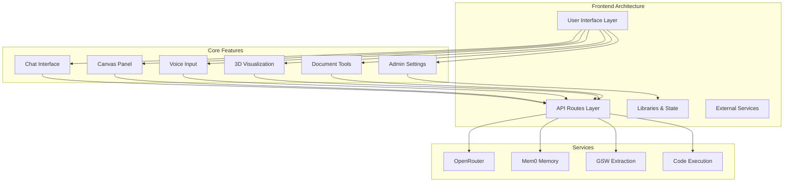
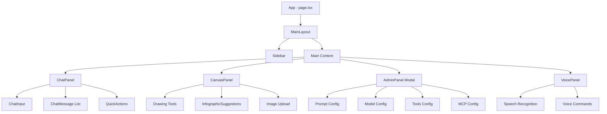
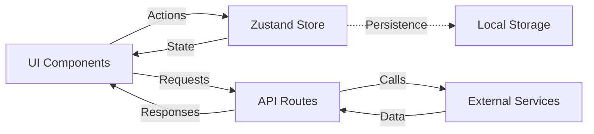

# Frontend Features - Complete UI Gallery

The Verridian AI interface delivers 30+ advanced features in a modern, intuitive design. This page documents every feature with screenshots, descriptions, and technical details.

---

## Architecture Overview



**Tech Stack:**
- Next.js 16 with App Router
- React 19 with TypeScript
- Tailwind CSS for styling
- Three.js for 3D visualization
- Zustand for state management
- Server-Sent Events for streaming

---

## Feature Categories

| Category | Count | Features |
|----------|-------|----------|
| **Chat Interface** | 6 | Streaming, Markdown, Code highlighting, History, Export, Quick actions |
| **Admin Settings** | 8 | Prompt config, Model selection, Temperature control, Tools config, MCP servers, API management, Theme settings, Export/Import |
| **Canvas Panel** | 5 | Drawing tools, Infographic suggestions, Image attachments, Clear/export, AI-powered design |
| **Voice Features** | 3 | Speech-to-text, Real-time transcription, Voice commands |
| **3D Visualization** | 4 | Knowledge graph, Actor nodes, Relationship edges, Interactive navigation |
| **Document Tools** | 4 | PDF generation, DOCX generation, Code execution, Image generation |
| **Total** | **30+** | Complete feature set |

---

## 1. Main Chat Interface


### Overview

The primary interface for interacting with the Verridian cognitive AI system.

### Features

1. **Streaming Responses**
   - Real-time Server-Sent Events (SSE) streaming
   - Token-by-token response display
   - Cancellable in-flight requests
   - Loading indicators with SynapseLoader animation

2. **Markdown Rendering**
   - Full GitHub-flavored markdown support
   - Code syntax highlighting
   - Tables, lists, blockquotes
   - Inline math and equations

3. **Message History**
   - Persistent conversation storage
   - Multiple conversation threads
   - Search through history
   - Export conversations

4. **Smart Input**
   - Multi-line text input
   - Enter to send, Shift+Enter for new line
   - Voice input integration
   - File attachment support

5. **Quick Actions Bar**
   - Pre-configured prompt templates
   - One-click common queries
   - Custom action configuration
   - Keyboard shortcuts

6. **Context Preservation**
   - Mem0 memory integration
   - Automatic context retrieval
   - Long-term conversation memory
   - User preference tracking

### Technical Implementation

**Component**: `ui/src/components/chat/ChatPanel.tsx`

```typescript
interface ChatPanelProps {
    messages: Message[];
    onSendMessage: (content: string) => void;
    isLoading: boolean;
}
```

**API Route**: `/api/chat` (POST)

**State Management**: Zustand store (`ui/src/lib/store/index.ts`)

---

## 2. Chat with Messages


### Features

7. **Message Display**
   - User/Assistant role differentiation
   - Timestamp display
   - Copy message functionality
   - Regenerate response option

8. **Code Block Rendering**
   - Syntax highlighting for 100+ languages
   - Copy code button
   - Language detection
   - Line numbers

9. **Inline Actions**
   - Edit previous messages
   - Delete messages
   - Share message link
   - Add to favorites

### Technical Implementation

**Component**: `ui/src/components/chat/ChatMessage.tsx`

```typescript
interface Message {
    role: 'user' | 'assistant' | 'system';
    content: string;
    timestamp?: Date;
    metadata?: {
        model?: string;
        tokens?: number;
        latency?: number;
    };
}
```

---

## 3. Admin Settings - System Prompt


### Features

10. **System Prompt Configuration**
    - Custom system instructions
    - Pre-configured templates
    - Legal-specific prompts
    - Domain adaptation
    - Prompt versioning

11. **Prompt Library**
    - Save custom prompts
    - Import/export prompts
    - Template marketplace
    - Community sharing

### Technical Implementation

**Component**: `ui/src/components/admin/AdminPanel.tsx`

```typescript
interface Settings {
    systemPrompt: string;
    model: string;
    temperature: number;
    maxTokens: number;
    tools: Tool[];
    mcpServers: MCPServer[];
}
```

---

## 4. Admin Settings - Model Configuration


### Features

12. **Model Selection**
    - Google Gemini 2.5 Flash (default)
    - Claude 3 Sonnet
    - Claude 3.5 Sonnet
    - GPT-4 Turbo
    - Custom model endpoints

13. **Temperature Control**
    - Slider: 0.0 to 1.0
    - Presets: Creative, Balanced, Precise
    - Real-time adjustment
    - Per-conversation settings

14. **Max Tokens**
    - Configurable output length
    - 256 to 32,768 tokens
    - Cost estimation
    - Token counter

15. **Top-P Sampling**
    - Nucleus sampling control
    - 0.0 to 1.0 range
    - Advanced generation control

### Technical Implementation

**Models Available**:
```typescript
const MODELS = [
    'google/gemini-2.5-flash-preview-05-20',
    'anthropic/claude-3-sonnet',
    'anthropic/claude-3.5-sonnet',
    'openai/gpt-4-turbo',
    'meta-llama/llama-3.1-70b-instruct'
];
```

---

## 5. Admin Settings - Tools Configuration


### Features

16. **Function Calling Tools**
    - GSW extraction tool
    - Memory search tool
    - Graph navigation tool
    - Document generation tools
    - Custom tool definitions

17. **Tool Management**
    - Enable/disable individual tools
    - Configure tool parameters
    - Tool usage analytics
    - Error handling settings

18. **Code Interpreter**
    - Python code execution
    - Sandboxed environment
    - Result visualization
    - File I/O support

### Technical Implementation

**Tools Schema**:
```typescript
interface Tool {
    type: 'function';
    function: {
        name: string;
        description: string;
        parameters: {
            type: 'object';
            properties: Record<string, {
                type: string;
                description: string;
            }>;
            required: string[];
        };
    };
}
```

**API Route**: `/api/execute` (POST)

---

## 6. Admin Settings - MCP Server Configuration


### Features

19. **MCP Server Management**
    - Add/remove MCP servers
    - Server health monitoring
    - Connection testing
    - Authentication configuration

20. **Protocol Settings**
    - Custom transport configuration
    - Timeout settings
    - Retry policies
    - Error handling

### Technical Implementation

**MCP Configuration**:
```typescript
interface MCPServer {
    name: string;
    command: string;
    args: string[];
    env?: Record<string, string>;
    transport?: 'stdio' | 'sse';
}
```

---

## 7. Canvas Panel


### Features

21. **Drawing Tools**
    - Freehand drawing
    - Shapes (rectangle, circle, line)
    - Text annotations
    - Color picker
    - Brush size control

22. **AI-Powered Infographics**
    - Automatic layout suggestions
    - Template generation
    - Data visualization
    - Export to PNG/SVG

23. **Image Upload**
    - Drag and drop support
    - Paste from clipboard
    - URL import
    - Multi-image handling

24. **Collaboration**
    - Real-time sync (planned)
    - Share canvas link
    - Export to PDF/DOCX
    - Annotation layers

### Technical Implementation

**Component**: `ui/src/components/canvas/CanvasPanel.tsx`

```typescript
interface CanvasState {
    elements: CanvasElement[];
    selectedElement: string | null;
    tool: 'pen' | 'rectangle' | 'circle' | 'text';
    color: string;
    brushSize: number;
}
```

**Infographic Suggestions**: `ui/src/components/canvas/InfographicSuggestions.tsx`

**API Route**: `/api/generate-image` (POST)

---

## 8. Voice Input Active


### Features

25. **Speech-to-Text**
    - WebKit Speech Recognition API
    - Real-time transcription
    - Multiple language support
    - Noise cancellation

26. **Voice Commands**
    - "New conversation"
    - "Clear messages"
    - "Open settings"
    - "Export chat"

27. **Continuous Listening**
    - Toggle continuous mode
    - Automatic punctuation
    - Voice activity detection
    - Visual feedback

### Technical Implementation

**Component**: `ui/src/components/voice/VoicePanel.tsx`

```typescript
interface VoicePanelProps {
    onTranscript: (text: string) => void;
}

// Uses WebKit Speech Recognition
const recognition = new webkitSpeechRecognition();
recognition.continuous = true;
recognition.interimResults = true;
recognition.lang = 'en-US';
```

---

## 9. 3D Visualization


### Features

28. **Knowledge Graph Rendering**
    - Three.js-powered 3D graph
    - 5,170 actor nodes
    - 646 relationship edges
    - Physics-based layout

29. **Interactive Navigation**
    - Zoom, pan, rotate controls
    - Node selection
    - Edge highlighting
    - Search and filter

30. **Graph Analytics**
    - Centrality metrics
    - Community detection
    - Path finding
    - Relationship strength

### Technical Implementation

**Component**: `ui/src/components/visualization/LegalGraph3D.tsx`

**Page**: `ui/src/app/visualize/page.tsx`

**API Route**: `/api/graph` (GET)

```typescript
interface GraphNode {
    id: string;
    label: string;
    type: 'actor' | 'asset' | 'event' | 'question';
    position?: [number, number, number];
    connections: number;
}

interface GraphEdge {
    source: string;
    target: string;
    relationship: string;
    weight: number;
}
```

---

## 10. Document Generation Workflow


### Features

31. **PDF Generation**
    - Professional formatting
    - Header/footer customization
    - Table of contents
    - Page numbering
    - Watermarks

32. **DOCX Generation**
    - Microsoft Word compatibility
    - Styles and formatting
    - Images and tables
    - Track changes support

33. **Batch Processing**
    - Multiple document generation
    - Template application
    - Variable substitution
    - Quality control

### Technical Implementation

**API Routes**:
- `/api/pdf/generate` (POST)
- `/api/docx/generate` (POST)

**Component**: `ui/src/components/tools/DocumentTools.tsx`

```typescript
interface DocumentRequest {
    content: string;
    format: 'pdf' | 'docx';
    template?: string;
    options?: {
        fontSize?: number;
        fontFamily?: string;
        margins?: Margins;
        header?: string;
        footer?: string;
    };
}
```

---

## 11. Quick Action Buttons


### Features

34. **Pre-configured Prompts**
    - Legal question templates
    - Document analysis shortcuts
    - Entity extraction triggers
    - Common workflows

35. **Custom Actions**
    - User-defined shortcuts
    - Macro recording
    - Parameter templates
    - Keyboard bindings

36. **Workflow Automation**
    - Multi-step sequences
    - Conditional logic
    - Data transformation
    - Integration triggers

### Technical Implementation

```typescript
interface QuickAction {
    id: string;
    label: string;
    icon: string;
    prompt: string;
    params?: Record<string, any>;
    shortcut?: string;
}

const DEFAULT_ACTIONS: QuickAction[] = [
    {
        id: 'extract-entities',
        label: 'Extract Entities',
        icon: 'users',
        prompt: 'Extract all actors, assets, and relationships from this document.',
        shortcut: 'Ctrl+E'
    },
    {
        id: 'summarize',
        label: 'Summarize',
        icon: 'file-text',
        prompt: 'Provide a concise summary of this legal document.',
        shortcut: 'Ctrl+S'
    }
];
```

---

## 12. Full Page Layout


### Features

37. **Responsive Design**
    - Mobile, tablet, desktop layouts
    - Collapsible sidebar
    - Adaptive components
    - Touch-friendly controls

38. **Theme Customization**
    - Dark mode (default)
    - Light mode
    - Custom color schemes
    - Font size adjustment

39. **Layout Options**
    - Split view (chat + canvas)
    - Full-width chat
    - Zen mode (distraction-free)
    - Picture-in-picture

40. **Accessibility**
    - ARIA labels
    - Keyboard navigation
    - Screen reader support
    - High contrast mode

### Technical Implementation

**Component**: `ui/src/components/layout/MainLayout.tsx`

```typescript
interface MainLayoutProps {
    children: React.ReactNode;
    onNewChat?: () => void;
}

// Responsive breakpoints
const BREAKPOINTS = {
    mobile: 768,
    tablet: 1024,
    desktop: 1280
};
```

---

## API Routes Documentation

### Complete API Endpoint List

| Endpoint | Method | Purpose | Component |
|----------|--------|---------|-----------|
| `/api/chat` | POST | Stream chat completions | ChatPanel |
| `/api/gsw` | POST | GSW entity extraction | DocumentTools |
| `/api/graph` | GET | Knowledge graph data | LegalGraph3D |
| `/api/memory/add` | POST | Add Mem0 memory | ChatPanel |
| `/api/execute` | POST | Execute Python code | CodeInterpreter |
| `/api/pdf/generate` | POST | Generate PDF | DocumentTools |
| `/api/docx/generate` | POST | Generate DOCX | DocumentTools |
| `/api/generate-image` | POST | AI image generation | CanvasPanel |

### API Usage Patterns

**Streaming Response Handler**:
```typescript
const handleStreamingResponse = async (response: Response) => {
    const reader = response.body?.getReader();
    const decoder = new TextDecoder();

    while (true) {
        const { done, value } = await reader.read();
        if (done) break;

        const chunk = decoder.decode(value);
        const lines = chunk.split('\n');

        for (const line of lines) {
            if (line.startsWith('data: ') && line !== 'data: [DONE]') {
                const data = JSON.parse(line.slice(6));
                const content = data.choices[0]?.delta?.content;
                if (content) {
                    // Update UI with new content
                }
            }
        }
    }
};
```

**Error Handling Pattern**:
```typescript
try {
    const response = await fetch('/api/chat', {
        method: 'POST',
        headers: { 'Content-Type': 'application/json' },
        body: JSON.stringify(requestData)
    });

    if (!response.ok) {
        const error = await response.json();
        throw new Error(error.error || 'Request failed');
    }

    await handleStreamingResponse(response);
} catch (error) {
    console.error('API error:', error);
    // Show user-friendly error message
}
```

---

## Component Architecture

### Component Hierarchy



### State Management Flow



### Core Store Structure

```typescript
interface AppState {
    // Messages
    messages: Message[];
    currentConversation: string | null;
    conversations: Conversation[];

    // Settings
    settings: Settings;

    // UI State
    showCanvas: boolean;
    showAdmin: boolean;
    isLoading: boolean;

    // Voice
    voiceTranscript: string;
    isListening: boolean;

    // Actions
    addMessage: (message: Message) => void;
    updateSettings: (settings: Partial<Settings>) => void;
    toggleCanvas: () => void;
    toggleAdmin: () => void;
    clearMessages: () => void;
    setVoiceTranscript: (transcript: string) => void;
}
```

---

## Performance Optimizations

### 1. Code Splitting

```typescript
// Dynamic imports for large components
const LegalGraph3D = dynamic(() => import('@/components/visualization/LegalGraph3D'), {
    loading: () => <SynapseLoader />,
    ssr: false
});
```

### 2. Memo and Callbacks

```typescript
// Prevent unnecessary re-renders
const ChatMessage = React.memo(({ message }: ChatMessageProps) => {
    return <div>{message.content}</div>;
});

// Stable callback references
const handleSend = useCallback((content: string) => {
    addMessage({ role: 'user', content });
}, [addMessage]);
```

### 3. Virtual Scrolling

```typescript
// For long message lists
import { FixedSizeList } from 'react-window';

<FixedSizeList
    height={600}
    itemCount={messages.length}
    itemSize={100}
>
    {({ index, style }) => (
        <div style={style}>
            <ChatMessage message={messages[index]} />
        </div>
    )}
</FixedSizeList>
```

### 4. Streaming Optimization

- Server-Sent Events (SSE) for low latency
- Incremental rendering of streamed content
- Cancellable fetch requests
- Request deduplication

---

## Security Features

### 1. API Key Management

- Client-side storage only
- Never sent to backend (except in Authorization header)
- Masked display in UI
- Per-session API keys

### 2. Input Validation

```typescript
const validateChatInput = (input: string): boolean => {
    if (input.length > 10000) {
        throw new Error('Message too long');
    }
    if (input.trim().length === 0) {
        throw new Error('Message cannot be empty');
    }
    return true;
};
```

### 3. XSS Protection

- React auto-escaping
- Sanitized markdown rendering
- CSP headers
- No dangerouslySetInnerHTML

### 4. Rate Limiting

```typescript
// Client-side throttling
const throttledSend = throttle(sendMessage, 1000);
```

---

## Browser Compatibility

| Feature | Chrome | Firefox | Safari | Edge |
|---------|--------|---------|--------|------|
| Chat Interface | ✅ | ✅ | ✅ | ✅ |
| Voice Input | ✅ | ❌ | ✅ | ✅ |
| 3D Visualization | ✅ | ✅ | ✅ | ✅ |
| Canvas Drawing | ✅ | ✅ | ✅ | ✅ |
| SSE Streaming | ✅ | ✅ | ✅ | ✅ |

**Notes:**
- Firefox doesn't support Web Speech API natively
- All features work on modern browsers (last 2 versions)
- Progressive enhancement for older browsers

---

## Mobile Experience

### Responsive Breakpoints

```css
/* Mobile First Design */
@media (max-width: 768px) {
    /* Single column layout */
    /* Collapsible sidebar */
    /* Full-screen modals */
}

@media (min-width: 769px) and (max-width: 1024px) {
    /* Tablet layout */
    /* Side-by-side panels */
}

@media (min-width: 1025px) {
    /* Desktop layout */
    /* Multi-panel view */
}
```

### Mobile-Specific Features

- Touch gestures for canvas
- Swipe to navigate conversations
- Bottom navigation bar
- Voice-first input on mobile
- Simplified UI on small screens

---

## Accessibility (a11y)

### WCAG 2.1 AA Compliance

1. **Keyboard Navigation**
   - Tab order follows logical flow
   - All controls accessible via keyboard
   - Focus indicators clearly visible
   - Skip links for main content

2. **Screen Reader Support**
   - ARIA labels on all interactive elements
   - Live regions for dynamic content
   - Semantic HTML structure
   - Alternative text for images

3. **Visual Accessibility**
   - 4.5:1 contrast ratio for text
   - Resizable text up to 200%
   - No color-only information
   - Focus indicators

4. **Implementation**
```typescript
// Example: Accessible button
<button
    aria-label="Send message"
    aria-describedby="send-help"
    onClick={handleSend}
>
    <SendIcon aria-hidden="true" />
</button>
<span id="send-help" className="sr-only">
    Press Enter or click to send your message
</span>
```

---

## Future Features (Roadmap)

### Planned Enhancements

1. **Real-time Collaboration**
   - Multi-user canvas editing
   - Shared conversations
   - Live cursors
   - Presence indicators

2. **Advanced Visualization**
   - Timeline view
   - Relationship matrix
   - Heat maps
   - Custom graph layouts

3. **Enhanced Tools**
   - Rich text editor
   - Table editing
   - Form builder
   - Custom widgets

4. **AI Features**
   - Auto-complete suggestions
   - Smart templates
   - Predictive actions
   - Personalized recommendations

5. **Integrations**
   - Google Drive
   - Dropbox
   - Notion
   - Slack notifications

---

## Related Pages

- [Frontend Overview](Frontend-Overview) - Architecture and tech stack
- [Frontend API Routes](Frontend-API-Routes) - Complete API documentation
- [Frontend Components](Frontend-Components) - Component catalog
- [Quick Start](Quick-Start) - Get started in 10 minutes
- [Development Guide](Development-Guide) - Development setup

---

## Feature Feedback

Have suggestions for new features or improvements?

- [Open an issue](https://github.com/Verridian-ai/Functional-Structure-of-Episodic-Memory/issues)
- [Submit a pull request](https://github.com/Verridian-ai/Functional-Structure-of-Episodic-Memory/pulls)
- [Join the discussion](https://github.com/Verridian-ai/Functional-Structure-of-Episodic-Memory/discussions)

---

<div align="center">

**Built with Next.js 16 • React 19 • TypeScript**

[Home](Home) • [Architecture](Architecture-Overview) • [Quick Start](Quick-Start)

</div>
