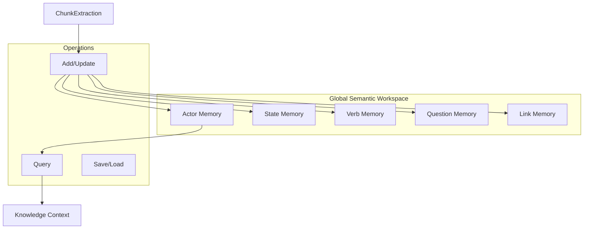
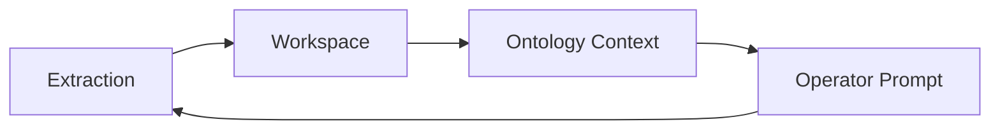

# Global Semantic Workspace (GSW)

The **Global Semantic Workspace** is the central memory system of Verridian AI, implementing actor-centric episodic memory based on neuroscience research.

## Overview

**Concept**: The GSW is analogous to the hippocampal complex in the brain - the central integration point for long-term memory consolidation.



## Key Concepts

### Actor-Centric Memory

Unlike traditional verb-centric NLP that uses `(Subject, Verb, Object)` triples, the GSW organizes information around **actors**:

```python
# Verb-Centric (Traditional)
("John", "married", "Jane")
("John", "filed", "Application")

# Actor-Centric (GSW)
Actor: {
    name: "John Smith",
    type: "PERSON",
    roles: ["applicant", "husband", "father"],
    states: [
        {"name": "MaritalStatus", "value": "married", "start": "2010"},
        {"name": "MaritalStatus", "value": "separated", "start": "2020"}
    ],
    links: ["Jane Smith", "Family Home", "Children"]
}
```

### Predictive Questions

The GSW tracks questions that could be asked about the situation - implementing the "predictive function" of episodic memory:

```python
questions = [
    {"text": "When did the parties separate?", "answered": True, "answer": "March 2020"},
    {"text": "What is the value of the matrimonial home?", "answered": False},
    {"text": "Who has primary care of the children?", "answered": True}
]
```

### Spatio-Temporal Links

Links bind entities that share the same temporal or spatial context:

```python
# All these entities are linked to "March 2010"
temporal_link = {
    "type": "TEMPORAL",
    "value": "March 2010",
    "entities": ["husband_id", "wife_id", "marriage_certificate_id"]
}
```

---

## Implementation

### GlobalWorkspace Class

**File**: `src/logic/gsw_schema.py`

```python
class GlobalWorkspace(BaseModel):
    """
    The Global Semantic Workspace - the central "memory" of the system.
    Analogous to the hippocampal complex in the brain.
    """
    # Core storage (id -> entity)
    actors: Dict[str, Actor] = {}
    states: Dict[str, State] = {}
    verb_phrases: Dict[str, VerbPhrase] = {}
    questions: Dict[str, PredictiveQuestion] = {}
    spatio_temporal_links: Dict[str, SpatioTemporalLink] = {}

    # Entity summaries (generated by Legal Summary)
    entity_summaries: Dict[str, str] = {}

    # Workspace metadata
    created_at: str
    last_updated: str
    chunk_count: int = 0
    document_count: int = 0
    domain: str = ""
```

### WorkspaceManager Class

**File**: `src/gsw/workspace.py`

The `WorkspaceManager` provides:
- Persistence (save/load to JSON)
- Statistics and reporting
- Ontology context extraction
- Querying capabilities

```python
from src.gsw.workspace import WorkspaceManager
from pathlib import Path

# Load existing workspace
manager = WorkspaceManager.load(Path("data/workspaces/family_law.json"))

# Get statistics
stats = manager.get_statistics()
print(f"Actors: {stats['total_actors']}")
print(f"Questions: {stats['total_questions']}")

# Query by role
applicants = manager.query_actors_by_role("applicant")

# Get ontology context (for feedback loop)
context = manager.get_ontology_context()

# Save workspace
manager.save()
```

---

## Key Operations

### 1. Add Actor

```python
actor = Actor(
    id="actor_001",
    name="John Smith",
    actor_type=ActorType.PERSON,
    roles=["Applicant", "Husband"]
)
workspace.add_actor(actor)
```

### 2. Add State

```python
state = State(
    entity_id="actor_001",
    name="MaritalStatus",
    value="separated",
    start_date="2020-03-15"
)
workspace.add_state(state)
```

### 3. Add Question

```python
question = PredictiveQuestion(
    question_text="When did the parties separate?",
    question_type=QuestionType.WHEN,
    answerable=True,
    answer_text="March 2020"
)
workspace.add_question(question)
```

### 4. Query Operations

```python
# Find actor by name
actor = workspace.find_actor_by_name("John Smith")

# Get unanswered questions
unanswered = workspace.get_unanswered_questions()

# Get entities at a specific time
entities = workspace.get_entities_at_time("2020-03-15")
```

---

## TOON Format

The GSW supports **TOON (Token-Oriented Object Notation)** for efficient LLM context injection:

```python
# Full TOON export
toon_context = workspace.to_toon()

# Summary TOON (for large workspaces)
toon_summary = workspace.to_toon_summary(max_actors=50)
```

TOON provides ~40% token reduction compared to JSON while preserving semantic content.

---

## Ontology Feedback Loop

The GSW implements Phase 4.5 from the research - a cybernetic feedback loop:



The `OntologyContext` captures:
- Frequency counts of extracted values
- Common roles, states, verbs
- Standard vocabulary learned over time

```python
context = manager.get_ontology_context()
prompt_injection = context.to_prompt_context()
# Returns vocabulary for consistent extraction
```

---

## Storage Format

Workspaces are persisted as JSON:

```json
{
  "metadata": {
    "created_at": "2024-01-15T10:30:00",
    "last_updated": "2024-01-15T12:45:00",
    "chunk_count": 156,
    "document_count": 12,
    "domain": "family"
  },
  "actors": { ... },
  "verb_phrases": { ... },
  "questions": { ... },
  "spatio_temporal_links": { ... },
  "entity_summaries": { ... }
}
```

---

## Related Pages

- [Backend-GSW-Module](Backend-GSW-Module) - Extraction pipeline
- [Data-Schemas](Data-Schemas) - Complete schema reference
- [Architecture-Overview](Architecture-Overview) - System design
- [Three-Layer-System](Three-Layer-System) - Cognitive layers
