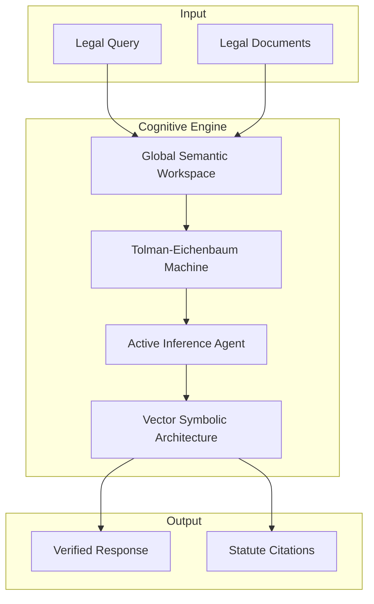

# Verridian AI - Legal Knowledge System

Welcome to the **Verridian AI** documentation wiki. This brain-inspired legal AI system achieves **85% accuracy** on complex Australian Family Law queries using a novel cognitive architecture.

## Quick Navigation

| Section | Description |
|---------|-------------|
| [Architecture Overview](Architecture-Overview) | System design and three-layer architecture |
| [Three-Layer System](Three-Layer-System) | TEM + Agency + VSA detailed breakdown |
| [GSW Module](Backend-GSW-Module) | Global Semantic Workspace (actor-centric memory) |
| [Quick Start](Quick-Start) | Getting started guide |

## System Overview



## Key Features

- **Actor-Centric Memory**: Tracks legal entities (parties, assets, dates) across queries
- **Anti-Hallucination**: VSA logic layer verifies claims before output
- **Gap Detection**: Identifies missing evidence before answering
- **Statute Alignment**: Maps situations to Family Law Act sections
- **85% Accuracy**: Outperforms traditional RAG by 10%

## Performance Metrics

| Metric | Verridian | Traditional RAG |
|--------|-----------|-----------------|
| Accuracy | 85% | 77% |
| Response Time | 11.83ms | ~500ms |
| Tokens per Query | ~3,500 | ~8,000 |

## Tech Stack

**Backend**: Python 3.10+, PyTorch, Pydantic, Google Gemini
**Frontend**: Next.js 16, React 19, TypeScript, Three.js
**Infrastructure**: Docker, LangFuse (observability)

## Documentation Sections

### Architecture
- [Architecture Overview](Architecture-Overview) - High-level system design
- [Three-Layer System](Three-Layer-System) - TEM, Agency, VSA explained
- [GSW Workspace](GSW-Global-Semantic-Workspace) - Actor-centric memory model
- [Data Flow](Data-Flow) - How data moves through the system

### Backend Modules
- [GSW Module](Backend-GSW-Module) - 6-task extraction pipeline
- [TEM Module](Backend-TEM-Module) - PyTorch navigation layer
- [VSA Module](Backend-VSA-Module) - Hyperdimensional computing
- [Agency Module](Backend-Agency-Module) - Active inference agent
- [Ingestion Module](Backend-Ingestion-Module) - Data processing
- [Agents Module](Backend-Agents-Module) - LangChain tools

### Frontend
- [Frontend Overview](Frontend-Overview) - Next.js app structure
- [API Routes](Frontend-API-Routes) - REST API documentation
- [Components](Frontend-Components) - React component catalog

### Reference
- [API Reference](API-Reference) - Complete endpoint docs
- [Glossary](Glossary) - Legal AI terminology
- [File Index](File-Index) - Complete file listing

## Getting Started

```bash
# Clone the repository
git clone https://github.com/Verridian-ai/Functional-Structure-of-Episodic-Memory.git
cd Functional-Structure-of-Episodic-Memory

# Install dependencies
pip install -r requirements.txt
cd ui && npm install

# Configure environment
cp .env.example .env
# Add your OPENROUTER_API_KEY

# Run the system
python gsw_pipeline.py  # Backend
cd ui && npm run dev    # Frontend
```

## Contributing

See [Development Guide](Development-Guide) for setup instructions and [Contributing Guidelines](Contributing) for contribution workflow.

---

*Generated from Verridian AI codebase - Brain-inspired legal reasoning*
