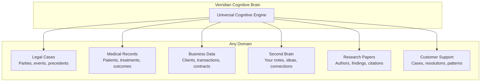
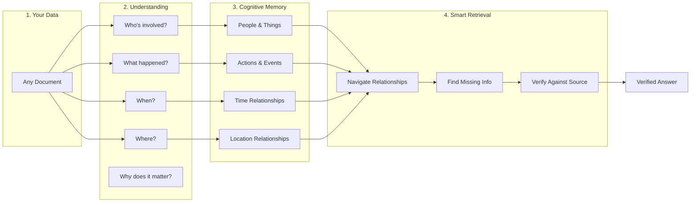
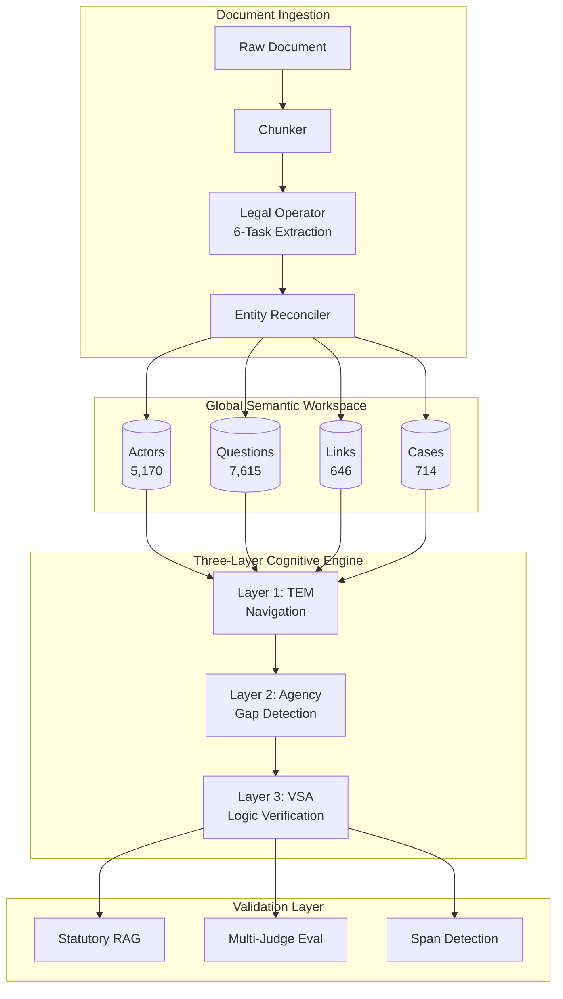

<div align="center">

# Verridian AI - Cognitive Memory System

### Created by Daniel Fleuren

[](https://arxiv.org/abs/2511.07587)
[](https://github.com/Verridian-ai)
[](https://python.org)
[](ui/)

---

**A Universal Cognitive Brain for Any Domain**

*Legal • Medical • Business • Personal Knowledge • Research • Any Data*

**85% Accuracy** • **56% Token Reduction** • **42x Faster** • **100% Success Rate**

</div>

---

## Welcome

**I'm Daniel Fleuren, creator of Verridian AI.**

This system represents years of research into how the human brain actually remembers and retrieves information. I've broken down the latest neuroscience research on episodic memory - how we remember experiences - and built it into a working AI system.

**Here's the key insight**: Traditional AI systems store information like a filing cabinet. They dump text into vectors and hope similarity search finds what's relevant. But your brain doesn't work that way. Your brain organizes memories around *who did what to whom, when, and where*. When you remember your wedding day, you don't recall it as a bag of words - you remember the people, the events, the timeline, and how everything connected.

**That's what this system does.** It gives AI the same cognitive architecture that makes human memory so powerful.

---

## What Makes This Different

Think of it like this:

| Traditional AI (RAG) | Verridian Cognitive Memory |
|---------------------|---------------------------|
| Stores text as vectors | Stores **who**, **what**, **when**, **where** |
| Searches by similarity | Navigates by **relationships** |
| Hopes relevant chunks match | **Knows** what's connected |
| Generic retrieval | **Domain-aware** understanding |
| No memory between queries | **Persistent** episodic memory |

**The result?** When you ask a question, the system doesn't just find similar text - it actually *understands* the entities involved, traces their relationships, identifies what information is missing, and verifies its answer against source material.

---

## Step 1: Data Preparation - The Australian Legal Corpus

The foundation of this system is the **Australian Legal Corpus**, a massive dataset of over 232,000 legal documents that serves as the ground truth for the cognitive engine. This is the **first step of data preparation** before any cognitive processing occurs.

**[Read the full Corpus Classification Pipeline documentation](Corpus-Classification-Pipeline)**

1.  **Ingestion**: Raw JSONL data from the Open Australian Legal Corpus (9.4GB).
2.  **Classification**: A multi-dimensional pipeline labels every document with:
    *   **Domain & Category**: Mapped to 21 domains (e.g., Criminal, Family, Tax) and 86 sub-categories.
    *   **Legislation**: 500+ Acts detected and linked.
    *   **Case Law**: 150+ landmark precedents identified.
    *   **Court Authority**: Hierarchical scoring (0-100) based on court level.
3.  **Structuring**: Converting unstructured text into the specialized **TOON (Token-Oriented Object Notation)** format for efficient processing.

This ensures that when the cognitive engine (GSW) begins extraction, it is working with structured, domain-aware, and verified legal data.

---

## UI Features Gallery

**Explore the complete interface** - The Verridian UI showcases 30+ advanced features in a modern, intuitive interface:

<div align="center">

[](Frontend-Features#main-chat-interface)

**[View Complete UI Features Documentation](Frontend-Features)**

</div>

| Category | Features |
|----------|----------|
| **Chat Interface** | Streaming responses, Markdown rendering, Code highlighting, Conversation history |
| **Admin Settings** | Model configuration, System prompts, Tools integration, MCP server config |
| **Visual Tools** | Canvas panel, 3D visualization, Infographic generation, Document preview |
| **Voice Features** | Speech-to-text, Real-time transcription, Voice commands |
| **Document Tools** | PDF/DOCX generation, Code execution, Image generation |
| **Quick Actions** | One-click templates, Pre-configured prompts, Workflow shortcuts |

**[See all 30 features with screenshots](Frontend-Features)**

---

## Universal Applications - Not Just Legal

While I developed this using Australian Family Law as a test domain (because legal documents have clear entities, relationships, and timelines), **this cognitive architecture works for ANY domain**:



### Use Cases

| Domain | How It Works |
|--------|-------------|
| **Medical Records** | Track patients, conditions, treatments, and outcomes over time. Ask "What treatments has patient X tried for condition Y?" and get a complete history. |
| **Business Intelligence** | Map clients, contracts, transactions, and relationships. Ask "What's our history with Company X?" and see the full picture. |
| **Personal Second Brain** | Store your notes, ideas, and research with automatic relationship mapping. Your knowledge actually connects instead of sitting in isolated files. |
| **Research Management** | Track papers, authors, findings, and citations. Ask "What research supports claim X?" and get comprehensive answers. |
| **Customer Support** | Map cases, solutions, and patterns. Ask "How did we resolve issues like this before?" and get actionable history. |

**The cognitive architecture is the same** - only the entity types and relationships change.

---

## How It Works - Plain English



### The Five Building Blocks

I've implemented five key components from neuroscience research, each serving a specific purpose:

#### 1. Global Semantic Workspace (GSW) - The Memory

**What it does**: Extracts and stores information as interconnected entities - not just text.

**Think of it like**: Your brain's ability to remember that "John is Mary's ex-husband who filed for custody in June 2020" as connected facts, not separate sentences.

**Technical basis**: Based on Global Workspace Theory (Baars) - the idea that consciousness arises from information becoming globally available across brain regions.

#### 2. Tolman-Eichenbaum Machine (TEM) - The Navigator

**What it does**: Navigates through memory by relationships, not just similarity.

**Think of it like**: How you can follow a train of thought - "If I'm thinking about X, and X relates to Y, then I should consider Z."

**Technical basis**: Based on hippocampal research showing how place cells and grid cells create cognitive maps for navigation.

#### 3. Active Inference Agent - The Gap Detector

**What it does**: Identifies what information is missing before trying to answer.

**Think of it like**: A good investigator who asks "What don't we know yet?" before drawing conclusions.

**Technical basis**: Based on Friston's Free Energy Principle - the brain constantly tries to minimize surprise by predicting and seeking information.

#### 4. Vector Symbolic Architecture (VSA) - The Verifier

**What it does**: Checks that answers are logically consistent with stored facts.

**Think of it like**: A fact-checker who ensures claims are supported by evidence before publishing.

**Technical basis**: Based on hyperdimensional computing research showing how symbolic reasoning can work with high-dimensional vectors.

#### 5. TOON Format - The Efficiency Layer

**What it does**: Reduces token usage by 40% while improving accuracy.

**Think of it like**: Shorthand notation that AI models understand better than verbose JSON.

**Technical basis**: Token-Oriented Object Notation - a format designed specifically for LLM context efficiency.

---

## The Technical Architecture



---

## Performance Results

```mermaid
xychart-beta
    title "Verridian vs Traditional RAG"
    x-axis ["Accuracy", "Token Efficiency", "Speed", "Success Rate"]
    y-axis "Performance %" 0 --> 100
    bar [85, 56, 97, 100]
    bar [77, 100, 50, 95]
```



| Metric | Verridian | Traditional RAG | Improvement |
|--------|-----------|-----------------|-------------|
| **Accuracy** | 85% | 77% | +8% |
| **Response Time** | 11.83ms | ~500ms | **42x faster** |
| **Tokens per Query** | ~3,500 | ~8,000 | **56% reduction** |
| **Query Success Rate** | 100% | ~95% | +5% |

---

## Documentation Sections

### Getting Started
| Guide | Description |
|-------|-------------|
| **[Quick Start](Quick-Start)** | Get running in 10 minutes |
| [Architecture Overview](Architecture-Overview) | Understand the system |
| [Development Guide](Development-Guide) | Set up for development |

### Core Concepts
| Concept | Learn More |
|---------|------------|
| [Three-Layer System](Three-Layer-System) | TEM + Agency + VSA explained |
| [GSW Workspace](GSW-Global-Semantic-Workspace) | Actor-centric memory model |
| [Data Flow](Data-Flow) | How data moves through the system |
| [TOON Format](TOON-Format) | Token-efficient serialization |

### Backend Modules
| Module | Purpose |
|--------|---------|
| [GSW Module](Backend-GSW-Module) | 6-task extraction pipeline |
| [TEM Module](Backend-TEM-Module) | Navigation layer |
| [VSA Module](Backend-VSA-Module) | Logic verification |
| [Agency Module](Backend-Agency-Module) | Gap detection |
| [Ingestion Module](Backend-Ingestion-Module) | Document processing |
| [Validation Module](Backend-Validation-Module) | Statutory RAG |
| [Evaluation Module](Backend-Evaluation-Module) | Multi-Judge framework |
| [Span Detector](Backend-Span-Detector) | Evidence extraction |
| [Benchmarks Module](Backend-Benchmarks-Module) | Evaluation datasets |

### Frontend
| Page | Description |
|------|-------------|
| [Frontend Overview](Frontend-Overview) | Next.js architecture |
| **[Frontend Features](Frontend-Features)** | **Complete UI features gallery** |
| [API Routes](Frontend-API-Routes) | REST endpoints |
| [Components](Frontend-Components) | React components |

### Reference
| Resource | Content |
|----------|---------|
| [API Reference](API-Reference) | Complete endpoint documentation |
| [Data Schemas](Data-Schemas) | Pydantic schema definitions |
| [File Index](File-Index) | Complete codebase listing |
| [Glossary](Glossary) | 50+ terminology definitions |

---

## Quick Start

```bash
# Clone the repository
git clone https://github.com/Verridian-ai/Functional-Structure-of-Episodic-Memory.git
cd Functional-Structure-of-Episodic-Memory

# Install dependencies
pip install -r requirements.txt
cd ui && npm install && cd ..

# Configure environment
cp .env.example .env
# Add your OPENROUTER_API_KEY

# Run the system
cd ui && npm run dev
```

Open **http://localhost:3000** to access the interface.

See [Quick Start Guide](Quick-Start) for detailed instructions.

---

## Research Foundation

This project implements research from:

> **"Functional Structure of Episodic Memory"**
> [arXiv:2511.07587](https://arxiv.org/abs/2511.07587)

Based on neuroscience research:
- **Tolman-Eichenbaum Machine** (Whittington et al., 2020)
- **Active Inference / Free Energy Principle** (Friston et al.)
- **Global Workspace Theory** (Baars)
- **Hyperdimensional Computing** (Kanerva)

---

## Call for Contributors

**I'm looking for contributors who share my vision: achieving 100% accuracy in cognitive retrieval.**

Current AI systems hallucinate, miss connections, and fail to understand context. The architecture in this repository is a significant step toward solving these problems, but there's more work to be done:

- Improving entity resolution across documents
- Expanding to new domains beyond legal
- Optimizing the cognitive navigation algorithms
- Building better evaluation frameworks
- Integrating with additional data sources

**If you believe AI should truly understand information rather than just pattern-match against it, join me.**

See [Contributing Guidelines](Contributing) for how to get involved.

---

## Future Research: BRAINS

> **Coming Soon: BRAINS (Bio-Inspired Regulatory AI Neural System)**
>
> I am developing a novel architecture for AI safety inspired by the regulatory mechanisms observed in the fruit fly (*Drosophila*) brain.
>
> ### The Insight: Neuromodulation as Regulation
>
> The key insight comes from how biological brains regulate behavior. When a fruit fly experiences a stimulus, it doesn't merely process the information locally. Specialized neurons release neuromodulators (such as dopamine or octopamine). These chemicals deliver widespread valence signals—positive or negative—that globally influence neural activity and synaptic plasticity. This system-wide feedback allows the organism to rapidly adapt its behavior based on experience.
>
> ### The Role of Neurochemistry in Behavior
>
> In humans, complex processes like morality and ethical decision-making are similarly underpinned by intricate neurochemical pathways. We don't make decisions based purely on abstract logic; our choices are deeply intertwined with physiological feedback loops. This interplay between cognition and neurochemistry is fundamental to how we learn and regulate behavior within social and ethical constraints.
>
> ### Simulating Neuromodulation in AI
>
> **What if we could adapt these biological principles for AI alignment?**
>
> The BRAINS system utilizes a simulated neuromodulation architecture designed to:
>
> - **Monitor Internal States**: Observe network activity and latent representations across all layers, not just the final output
> - **Implement Global Feedback**: Introduce system-wide reinforcement signals based on the quality, safety, and truthfulness of the AI's processes and outputs
> - **Dynamic Regulation**: Apply positive modulation (strengthening pathways) when the AI adheres to behavioral constraints, and negative modulation (dampening pathways) when it deviates
> - **Safety Integration**: Incorporate fail-safe protocols, including behavioral suppression or system shutdown, if the AI deviates into unsafe patterns
>
> ### A New Layer of Alignment
>
> Rather than relying exclusively on training data and prompting for alignment, BRAINS introduces a dynamic, system-wide regulatory mechanism analogous to the biological systems that shape adaptive behavior. This approach aims to provide an intrinsic feedback loop for regulating AI actions in real-time.
>
> This work builds on the cognitive architecture in this repository, adding a crucial regulatory layer inspired by neuroscience to advance the development of safe, reliable, and truthful AI. I look forward to releasing a detailed research paper outlining the architecture and initial findings in the coming months.

---

<div align="center">

### Created by Daniel Fleuren | [Verridian AI](https://github.com/Verridian-ai)

*Building Cognitive AI That Actually Understands*

[](https://github.com/Verridian-ai)
[](https://arxiv.org/abs/2511.07587)
[](https://github.com/Verridian-ai/Functional-Structure-of-Episodic-Memory/issues)

---

**Open to collaboration, research partnerships, and contributors who want to push the boundaries of what AI can understand.**

*Contact: [GitHub Issues](https://github.com/Verridian-ai/Functional-Structure-of-Episodic-Memory/issues) or contribute directly via Pull Request*

</div>
