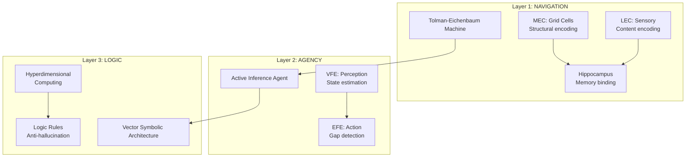
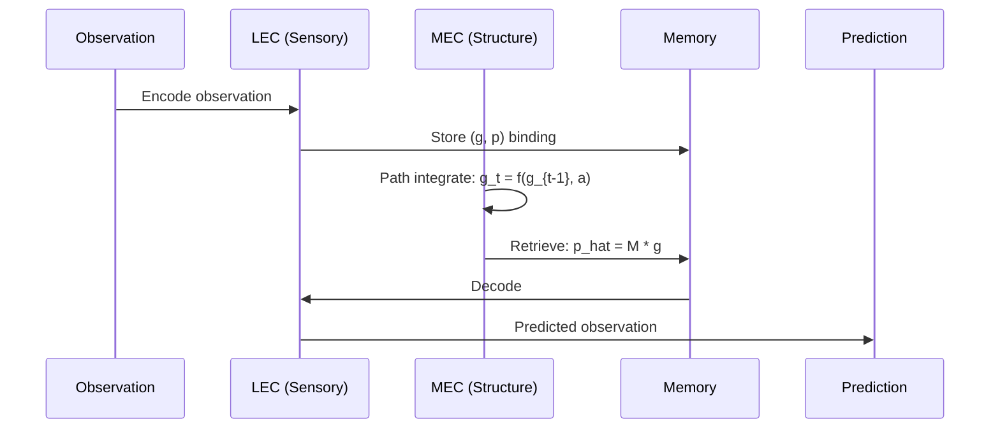
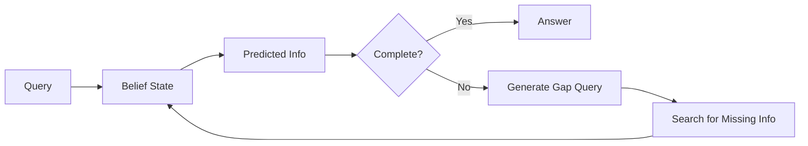
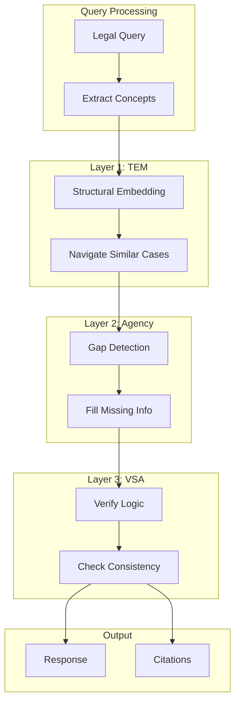

# Three-Layer Cognitive System

The Verridian cognitive engine consists of three specialized layers, each implementing a different aspect of human cognition based on neuroscience research.

## Overview



---

## Layer 1: Navigation (TEM)

### Purpose
Separates **structure** from **content** in legal cases, enabling pattern recognition across different cases with similar legal structure.

### Implementation
**File**: `src/tem/model.py`

```python
class TolmanEichenbaumMachine(nn.Module):
    def __init__(self, input_dim: int, hidden_dim: int, action_dim: int):
        self.mec = TransitionModule(hidden_dim, action_dim)  # Grid cells
        self.lec = SensoryModule(input_dim, hidden_dim)      # Sensory
        self.memory = MemoryModule(hidden_dim)               # Hippocampus
```

### Components

#### MEC (Medial Entorhinal Cortex) - Grid Cells
```python
class TransitionModule(nn.Module):
    """Models structural transitions in abstract space."""
    def forward(self, g_prev: torch.Tensor, action_indices: torch.Tensor):
        # g_t = W_a * g_{t-1}
        W_a = self.weights[action_indices]
        g_next = torch.bmm(W_a, g_prev.unsqueeze(2)).squeeze(2)
        return self.activation(g_next + self.bias)
```

#### LEC (Lateral Entorhinal Cortex) - Sensory Processing
```python
class SensoryModule(nn.Module):
    """Encodes observations into sensory embeddings."""
    def encode(self, x: torch.Tensor) -> torch.Tensor:
        return self.encoder(x)  # Document -> Embedding

    def decode(self, p: torch.Tensor) -> torch.Tensor:
        return self.decoder(p)  # Embedding -> Prediction
```

#### Hippocampus - Associative Memory
```python
class MemoryModule(nn.Module):
    """Binds structural and sensory representations."""
    def retrieve(self, g: torch.Tensor, M: torch.Tensor):
        # p_hat = M * g (retrieve sensory from structure)
        return torch.bmm(M, g.unsqueeze(2)).squeeze(2)

    def update(self, M: torch.Tensor, g: torch.Tensor, p: torch.Tensor):
        # Hebbian: M_new = M + eta * (p * g^T)
        return M + eta * torch.bmm(p.unsqueeze(2), g.unsqueeze(1))
```

### Forward Pass



---

## Layer 2: Agency (Active Inference)

### Purpose
Detects **information gaps** before answering and autonomously generates queries to fill missing evidence.

### Implementation
**File**: `src/agency/agent.py`

```python
class LegalResearchAgent:
    def __init__(self):
        self.A, self.B, self.C, self.D = build_generative_model()
        self.qs = self.D.copy()  # Belief state (posterior)
```

### Free Energy Minimization

#### Variational Free Energy (VFE) - Perception
```python
def infer_states(self, observation_idx: int):
    """Minimizes VFE - updates beliefs based on observation."""
    if self.t == 0:
        prior = self.D
    else:
        prior = self.B[:, :, last_action] @ self.qs

    likelihood = self.A[observation_idx, :]
    posterior = normalize(likelihood * prior)
    self.qs = posterior
```

#### Expected Free Energy (EFE) - Action Selection
```python
def infer_policies(self) -> int:
    """Minimizes EFE - selects action to reduce uncertainty."""
    for u in range(num_actions):
        # Predict future state
        qs_next = self.B[:, :, u] @ self.qs
        qo_next = self.A @ qs_next

        # Pragmatic value (utility)
        pragmatic = np.dot(qo_next, self.C)

        # Epistemic value (information gain)
        epistemic = calculate_info_gain(qo_next, qs_next)

        G[u] = pragmatic + epistemic

    return np.random.choice(num_actions, p=softmax(G))
```

### Gap Detection Flow



---

## Layer 3: Logic (VSA)

### Purpose
**Anti-hallucination** through hyperdimensional computing. Verifies semantic consistency before output.

### Implementation
**File**: `src/vsa/legal_vsa.py`

```python
class LegalVSA:
    def __init__(self, dimension: int = 10000):
        self.dimension = dimension
        self.memory: Dict[str, torch.Tensor] = {}  # Concept -> Hypervector
```

### Hyperdimensional Operations

#### Binding (Composition)
```python
def bind(self, v1: torch.Tensor, v2: torch.Tensor) -> torch.Tensor:
    """Element-wise multiplication. Creates new concept from two."""
    return v1 * v2  # Result dissimilar to both inputs
```

#### Bundling (Superposition)
```python
def bundle(self, vectors: List[torch.Tensor]) -> torch.Tensor:
    """Sum + sign. Result similar to all inputs."""
    sum_vec = torch.stack(vectors).sum(dim=0)
    return torch.sign(sum_vec)  # Majority rule
```

#### Permutation (Sequence)
```python
def permute(self, v: torch.Tensor, shifts: int = 1) -> torch.Tensor:
    """Cyclic shift. Encodes order/sequence."""
    return torch.roll(v, shifts=shifts, dims=0)
```

### Anti-Hallucination Verification

```python
def verify_no_hallucination(self, statement_concepts: List[str]) -> Dict:
    """Checks consistency against logic rules."""
    issues = []
    present = set(statement_concepts)

    for subj, rel, obj in LOGIC_RULES:
        if rel == "REQUIRES":
            if subj in present and obj not in present:
                issues.append(f"'{subj}' REQUIRES '{obj}', but missing")

        if rel == "CONTRADICTS":
            if subj in present and obj in present:
                issues.append(f"'{subj}' and '{obj}' cannot coexist")

    return {"valid": len(issues) == 0, "issues": issues}
```

### Logic Rules Example
```python
LOGIC_RULES = [
    ("PROPERTY_SETTLEMENT", "REQUIRES", "MARRIAGE"),
    ("SOLE_CUSTODY", "CONTRADICTS", "JOINT_CUSTODY"),
    ("DIVORCE", "REQUIRES", "12_MONTH_SEPARATION"),
]
```

---

## Layer Integration



## Performance Impact

| Layer | Function | Accuracy Improvement |
|-------|----------|---------------------|
| TEM | Structure/content separation | +5% |
| Agency | Gap detection | +3% |
| VSA | Anti-hallucination | +5% |
| **Combined** | **Full system** | **+8% vs RAG** |

## Related Pages

- [Backend-TEM-Module](Backend-TEM-Module) - Detailed TEM implementation
- [Backend-Agency-Module](Backend-Agency-Module) - Active inference details
- [Backend-VSA-Module](Backend-VSA-Module) - VSA operations reference
